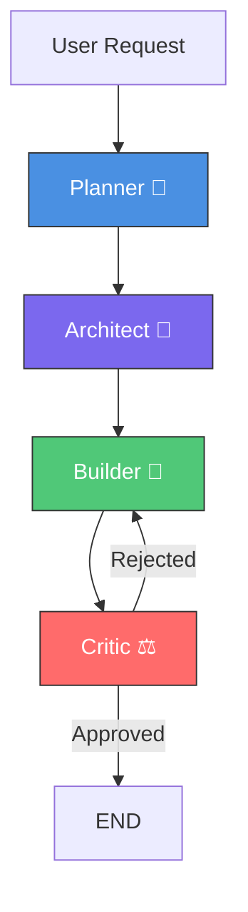
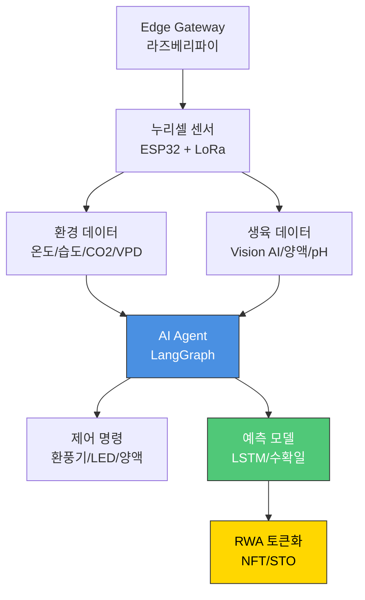

# CLAUDE.md - AI 개발 가이드

> NURI 프로젝트의 AI 에이전트 개발 및 유지보수를 위한 종합 가이드

## 프로젝트 개요

### 프로젝트 식별
- **프로젝트명**: NURI
- **코드**: 0001
- **카테고리**: 소셜벤처 (Social Venture)
- **설명**: AI 기반 장애인표준사업장 스마트팜 플랫폼

### 핵심 컨셉
NURI는 **BMAD Elite 4 Orchestrator** AI 시스템과 **누리셀(NuriCell) 3세대 지능형 스마트팜 기술**을 활용하여 장애인에게 안정적인 일자리를 제공하고, 스마트팜 생산성을 혁신하는 **컨소시엄형 장애인표준사업장**입니다.

**사업장 정보:**
- **1호 사업장**: NuriFarm 괴산점 (충청북도 괴산군 사리면 방축리 449, 531-1, 2, 3)
- **부지 면적**: 총 2,000평 (단일 필지가 아닌 4필지 집단화)
- **하우스 규모**: 500평 (3단계 구역 배치: 생산/가공/체험)
- **고용 계획**:
  - 1차년: 5명 시작 → 5차년: 55명 최종 (장애인 40명 + 작업지원인 10명 + 관리직 5명)
  - 장애인 고용률: 72.7%
  - **이후 추가 채용 없음** (안정기 운영)
- **재배 작물 포트폴리오**:
  - **상추류** (유러피안, 버터헤드): Cash Cow - 안정적 기본 수익원
  - **바질** (Basil): High Margin - 프리미엄 레스토랑 직거래
  - **허브류** (애플민트, 로즈마리, 딜, 루꼴라): Niche Market - 소포장 온라인 구독
  - **병풀** (센텔라 아시아티카/시카): **Future Value** - 화장품/제약 원료 계약재배 (연 매출 50~100억 목표)

### 사업 모델 특징
1. **컨소시엄형 표준사업장**: 누리팜(민간) + 괴산군(지자체) 협력
2. **정부 지원금**: 최대 20~30억 원 (한국장애인고용공단 공모 선정 목표)
3. **기술 파트너십**: Farm8(국내 1위 스마트팜 기업)과 R&D 협력 검증 완료
4. **핵심 차별화**: 3세대 AI 스마트팜 (Rule → Agent / Data → Knowledge Graph)
5. **지역 경제 효과**: 괴산군 소멸 위기 해결 + 바이오 소재 국산화

## 시스템 아키텍처

### BMAD Elite 4 에이전트 시스템



#### 에이전트 역할

1. **Planner (🧠 전략가)**
   - 역할: 프로젝트 기획 및 요구사항 분석
   - 모델: GPT-4-turbo
   - 주요 도구:
     - `search_trends`: 시장 트렌드 분석
     - `analyze_finance`: 재무 분석
     - `write_blog_post`: 콘텐츠 생성
     - `generate_ad_copy`: 광고 카피 생성

2. **Architect (📐 설계자)**
   - 역할: 시스템 아키텍처 설계 및 기술 스택 결정
   - 모델: GPT-4-turbo
   - 주요 도구:
     - `generate_api_spec`: OpenAPI/Swagger 스펙 생성
     - `optimize_db_schema`: 데이터베이스 최적화
     - `check_dependencies`: 의존성 관리
     - `manage_secrets`: 보안 키 관리
     - `deploy_service`: 배포 스크립트 실행

3. **Builder (🔨 개발자)**
   - 역할: 실제 코드 구현 및 에셋 생성
   - 모델: GPT-4-turbo
   - 주요 도구:
     - `refactor_code`: 코드 리팩토링
     - `generate_assets`: UI 이미지/아이콘 생성
     - `minify_files`: 파일 압축
     - `i18n_generate`: 다국어 번역
     - `video_clipper`: 비디오 클립 생성

4. **Critic (⚖️ 검증자)**
   - 역할: 품질 검증 및 보안 검사 (Quality Gate)
   - 모델: GPT-3.5-turbo (빠른 응답)
   - 주요 도구:
     - `run_linter`: 코드 스타일 검사
     - `run_security_scan`: 보안 취약점 스캔
     - `run_accessibility_check`: 웹 접근성 검사
     - `check_licenses`: 오픈소스 라이선스 검증
     - `parse_logs`: 에러 로그 분석

## 프로젝트 구조

```
0001_NURI/
├── nuri_rails/                        # Rails 메인 애플리케이션
│   ├── app/
│   │   ├── controllers/               # 컨트롤러
│   │   ├── models/                    # ActiveRecord 모델
│   │   ├── views/                     # ERB 뷰
│   │   ├── jobs/                      # 백그라운드 작업
│   │   └── services/                  # 비즈니스 로직
│   ├── config/
│   │   ├── database.yml               # SQLite 설정
│   │   └── routes.rb                  # 라우팅
│   ├── db/
│   │   ├── migrate/                   # 마이그레이션
│   │   └── development.sqlite3        # SQLite DB
│   └── Gemfile                        # Ruby 의존성
├── bmad/                              # BMAD Elite 4 AI 시스템 (Node.js)
│   ├── src/
│   │   ├── bmad_elite_4_orchestrator.ts
│   │   ├── bmad_elite_4_nodes.ts
│   │   └── index.ts                   # API 서버 (포트 3100)
│   ├── package.json
│   └── tsconfig.json
├── docs/
│   ├── epic.md                        # 프로젝트 비전 및 전략
│   ├── architecture.md                # 시스템 아키텍처
│   └── api/                           # API 문서
├── public/                            # 정적 웹사이트
│   ├── index.html                     # 메인 페이지
│   └── goesan.html                    # NuriFarm 괴산점 상세
├── .env                               # 환경 변수
├── CLAUDE.md                          # 본 문서
└── README.md                          # 프로젝트 개요
```

**주요 기술 스택:**
- **Backend**: Ruby on Rails 8.1.2 + SQLite 3
- **AI System**: BMAD Elite 4 (Node.js + LangChain/LangGraph)
- **Frontend**: ERB + Hotwire (Turbo/Stimulus) + Tailwind CSS (Salesforce SLDS 스타일)
- **Database**: SQLite 3
- **IoT/Smart Farm**: 누리셀(NuriCell) - ESP32 + LoRa 메시 네트워크
- **Deployment**: Docker + Railway/Heroku

## 누리셀(NuriCell) - 3세대 지능형 스마트팜 기술

### 왜 3세대인가?

누리셀은 기존 1~2세대 스마트팜의 단순 자동화를 넘어, **AI 에이전트 기반 자율 판단 시스템**입니다.

| 세대 | 핵심 구동 방식 | 비유 | 누리셀 |
|------|---------------|------|--------|
| 1세대 | 인간의 손 (원격 제어) | 리모컨 | ✅ 기본 포함 |
| 2세대 | 입력된 규칙 (자동화) | 타이머/온도계 | ✅ 기본 포함 |
| 3세대 | 데이터 기반 AI (지능) | 자율주행차 | ✅ **핵심 기술** |
| 3세대+ | 생성형 에이전트 (협업) | AI 농장장 | ✅ **누리셀의 지향점** |

### 4대 핵심 차별화 기술

#### 1. 규칙(Rule)이 아닌 판단(Agent) - The Brain
- **2세대**: "온도 30도면 팬 가동" (단순 조건문)
- **누리셀**: "온도 30도 + 외부 습도 높음 → 팬 대신 차광막 + 에어컨 가동" (상황 판단)
- **기술**: LangGraph 기반 Multi-Agent System (환경 제어 에이전트, 병해충 진단 에이전트 협업)

#### 2. 데이터(Data)가 아닌 지식(Knowledge Graph) - The Memory
- **2세대**: 온도/습도 데이터 로그만 저장
- **누리셀**: "작년 습도 80%일 때 흰가루병 발생" 인과관계 학습 → 예측 방제
- **기술**: GraphRAG (지식 그래프 기반 검색 증강 생성)

#### 3. 유선 통합이 아닌 분산형 무선망 - The Nerves
- **2세대**: 중앙 컴퓨터 + 유선 케이블 (확장성 제약)
- **누리셀**: ESP32 + LoRa 메시 네트워크 (Plug & Play)
- **기술**: IoT Micro-services Architecture (MSA) & LoRaWAN

#### 4. 사후 분석이 아닌 실시간 프로세스 최적화 - The Efficiency
- **2세대**: 수확 후 "왜 망했지?" 분석
- **누리셀**: 생육 과정을 비즈니스 프로세스로 정의 → 병목 구간 실시간 탐지/개선
- **기술**: MLOps & Process Mining (PM4Py)

### FarmIoT 아키텍처



## 코딩 컨벤션

### TypeScript 스타일 가이드

#### 1. 네이밍 규칙
```typescript
// ✅ Good
const userName: string = "John Doe";
function getUserProfile() {}
interface UserProfile {}
class StudentService {}
const API_ENDPOINT = "https://api.nuri.com";

// ❌ Bad
const user_name: string = "John Doe";
function get_user_profile() {}
interface user_profile {}
class student_service {}
```

#### 2. 함수 작성 원칙
- **순수 함수 우선**: 부수 효과를 최소화
- **단일 책임 원칙**: 하나의 함수는 하나의 역할만
- **명확한 타입 정의**: `any` 사용 지양

```typescript
// ✅ Good
async function fetchUserById(userId: string): Promise<User> {
    const response = await fetch(`/api/users/${userId}`);
    return response.json();
}

// ❌ Bad
async function getUser(id: any) {
    return fetch(`/api/users/${id}`).then(r => r.json());
}
```

#### 3. 에러 처리
```typescript
// ✅ Good
try {
    const data = await fetchData();
    processData(data);
} catch (error) {
    console.error("[NURI Error]", error);
    throw new AppError("Data fetch failed", { cause: error });
}

// ❌ Bad
try {
    const data = await fetchData();
} catch (e) {
    console.log(e);
}
```

### LangChain/LangGraph 특화 규칙

#### 1. 상태(State) 정의
```typescript
interface EliteState {
    messages: BaseMessage[];  // 대화 이력
    next?: string;            // 다음 노드 (선택적)
    metadata?: Record<string, any>;  // 추가 데이터
}
```

#### 2. 노드 함수 작성
- 반드시 `async` 함수로 작성
- 상태 객체를 받아 수정된 상태를 반환
- LangSmith 추적을 위한 `traceAgentRun` 호출

```typescript
async function planner_node(state: EliteState) {
    console.log("--- Planner Working ---");
    const result = await llm_high.bind({ tools: tools_for_planner }).invoke(state.messages);
    await traceAgentRun("Planner", state.messages, result);
    return { messages: [result] };
}
```

#### 3. 도구(Tool) 정의
- `DynamicStructuredTool` 사용
- Zod 스키마로 입력 검증
- 명확한 `description` 작성 (LLM이 참고)

```typescript
const refactor_code = new DynamicStructuredTool({
    name: "refactor_code",
    description: "Identify spaghetti code and perform refactoring.",
    schema: z.object({
        input: z.string().describe("Code segment or file path to refactor")
    }),
    func: async ({ input }) => {
        // 실제 리팩토링 로직
        return `Refactored: ${input}`;
    },
});
```

## 제약사항 및 주의사항

### 1. API 키 관리
- **절대 하드코딩 금지**: 모든 API 키는 `.env` 파일에 저장
- `.env` 파일은 `.gitignore`에 포함 (절대 커밋하지 않음)
- `.env.example` 파일로 필요한 환경 변수 문서화

```bash
# .env
OPENAI_API_KEY=sk-your-actual-key
LANGCHAIN_TRACING_V2=true
LANGCHAIN_API_KEY=lsv2-your-actual-key
LANGCHAIN_PROJECT=BMAD_ELITE_4_MONITOR
```

### 2. 비용 최적화
- **Planner/Architect**: GPT-4-turbo 사용 (고급 사고 필요)
- **Builder**: GPT-4-turbo 사용 (정확한 코드 생성)
- **Critic**: GPT-3.5-turbo 사용 (빠른 검증, 비용 절감)

### 3. 무한 루프 방지
현재 구현에서는 `Critic → END` 직통 엣지로 설정되어 있음:

```typescript
// 현재 (MVP)
workflow.addEdge("critic", END);

// 향후 (조건부 분기 활성화 시)
workflow.addConditionalEdges("critic", qualityGate, {
    end: END,
    builder: "builder"
});
```

**주의**: 조건부 분기 활성화 시, `Critic`이 무한 거부하지 않도록 재시도 제한 추가 필요

### 4. LangSmith 추적
- `LANGCHAIN_TRACING_V2=true` 설정 시 자동 추적
- 프로덕션 환경에서는 비활성화 고려 (성능 및 비용)

## 테스트 전략

### 1. 단위 테스트 (향후 구현)
```typescript
// src/__tests__/nodes.test.ts
describe("Planner Node", () => {
    it("should generate a project plan", async () => {
        const state = { messages: [new HumanMessage("Create a login system")] };
        const result = await planner_node(state);
        expect(result.messages).toHaveLength(1);
    });
});
```

### 2. 통합 테스트
현재 `test_run.ts`를 통해 전체 파이프라인 테스트:

```bash
npm test
```

### 3. 수동 테스트 체크리스트
- [ ] 각 에이전트가 올바른 도구를 호출하는가?
- [ ] LangSmith에 추적 데이터가 기록되는가?
- [ ] 에러 발생 시 적절한 메시지를 출력하는가?
- [ ] 환경 변수가 제대로 로드되는가?

## 배포 프로세스

### 1. 사전 체크
```bash
# 타입 체크
npx tsc --noEmit

# 린트 (향후 ESLint 추가)
# npm run lint

# 테스트
npm test
```

### 2. 환경 변수 설정
프로덕션 환경에 `.env` 파일 또는 환경 변수 주입:
```bash
export OPENAI_API_KEY=sk-prod-key
export LANGCHAIN_TRACING_V2=false  # 프로덕션에서는 비활성화
```

### 3. 빌드 및 실행
```bash
# 직접 실행 (개발)
npm start

# 프로덕션 빌드 (향후)
npm run build
node dist/index.js
```

### 4. 배포 대상
- **개발 환경**: 로컬 또는 개발 서버
- **스테이징**: AWS EC2 / Vercel / Railway
- **프로덕션**: AWS ECS / Kubernetes (향후)

## 모니터링 및 디버깅

### 1. LangSmith 대시보드
- URL: https://smith.langchain.com/
- 프로젝트: `BMAD_ELITE_4_MONITOR`
- 각 에이전트 실행 추적, 토큰 사용량, 응답 시간 확인

### 2. 로그 관리
```typescript
// 구조화된 로깅
console.log("[Planner]", "Processing user request...");
console.error("[Critic]", "Validation failed:", error);
```

### 3. 디버깅 팁
- LangSmith에서 각 노드의 입력/출력 확인
- `console.log`로 상태 객체 출력
- 개별 노드를 독립적으로 테스트

## 확장 가이드

### 1. 새로운 에이전트 추가
1. `bmad_elite_4_nodes.ts`에 노드 함수 추가
2. `bmad_elite_4_orchestrator.ts`에 노드 등록
3. 엣지 연결 및 조건부 로직 구현

### 2. 새로운 도구 추가
```typescript
const new_tool = new DynamicStructuredTool({
    name: "tool_name",
    description: "Clear description for LLM",
    schema: z.object({ param: z.string() }),
    func: async ({ param }) => {
        // 실제 로직
        return "result";
    },
});

// 적절한 에이전트에 바인딩
const tools_for_builder = [...existing_tools, new_tool];
```

### 3. 외부 API 연동
```typescript
// 예시: 채용공고 크롤링
const fetch_job_postings = new DynamicStructuredTool({
    name: "fetch_job_postings",
    description: "Fetch job postings from external API",
    schema: z.object({ keyword: z.string() }),
    func: async ({ keyword }) => {
        const response = await fetch(`https://api.jobs.com/search?q=${keyword}`);
        return response.json();
    },
});
```

## FAQ

### Q1. GPT-4 비용이 너무 높아요
**A**: `Critic` 노드를 GPT-3.5-turbo로 전환 (이미 적용됨). 추가로 캐싱 활용 고려.

### Q2. 에이전트가 잘못된 도구를 호출해요
**A**: 도구의 `description`을 더 명확하게 작성. LLM은 설명에 크게 의존함.

### Q3. LangSmith 추적이 안 돼요
**A**: `.env`에서 `LANGCHAIN_TRACING_V2=true`, `LANGCHAIN_API_KEY` 확인.

### Q4. 무한 루프가 발생해요
**A**: 현재는 `critic → END` 직통. 조건부 분기 활성화 전에 재시도 카운터 추가 필요.

## 병풀(센텔라 아시아티카) 사업 전략

### 시장 기회
- **글로벌 시장**: 약 9,000억 원 규모 (K-뷰티 시카 열풍)
- **국내 수입 규모**: 연간 500~600억 원 (수입 의존도 95%)
- **누리팜 목표**: 수입 대체 10% → **연 매출 50~100억 원**

### 타겟 고객사
1. **화장품 대기업**: 아모레퍼시픽, LG생활건강, 한국콜마, 코스맥스
2. **제약사**: 동국제약(마데카솔), 대웅제약
3. **건강기능식품**: KGC인삼공사, 한국야쿠르트

### 핵심 영업 전략: 연계고용 감면 제도
```
병풀 원료 10억 원 구매 시
→ 장애인 고용 부담금 5억 원 감면
→ 실질 원료비 50% 할인 효과
+ ESG 경영 실적 확보
+ 공공기관 우선구매 가점
```

### 차별화 포인트
- **무농약 청정 재배**: 중금속 걱정 없는 스마트팜산 생초(Fresh)
- **성분 균일화**: AI 제어를 통한 유효 성분(마데카소사이드) 함량 2~3배 향상
- **공급망 안정성**: 수입 리스크 제로 (괴산 → 당일 배송)
- **ESG 마케팅**: "장애인이 키운 시카" 스토리텔링

## 컨소시엄형 표준사업장 추진 전략

### 정부 지원 규모
- **일반 표준사업장**: 최대 10억 원
- **컨소시엄형**: 최대 20~30억 원 (지자체 매칭 시)

### 역할 분담
| 구분 | 누리팜 (민간) | 괴산군 (지자체) |
|------|----------------|----------------|
| **제공 자원** | 부지 4필지 확보 완료<br/>누리셀 기술<br/>Farm8 파트너십 | 행정 지원<br/>예산 매칭<br/>유기농 브랜드 |
| **기대 효과** | 초기 투자비 절감<br/>공공 신뢰도 확보 | 장애인 일자리 창출<br/>지역 경제 활성화 |

### 추진 일정 (예상)
1. **2026년 Q1**: 괴산군청 MOU 체결 (일자리경제과 협의)
2. **2026년 Q2**: 한국장애인고용공단 공모 신청 (상반기 공모 대응)
3. **2026년 Q3**: 선정 및 법인 설립 (컨소시엄 조합 구성)
4. **2026년 Q4**: 시설 투자 착수 (누리셀 스마트팜 구축)
5. **2027년 Q1**: 인력 채용 및 시범 재배 (장애인 40명 고용)
6. **2027년 Q2**: 정식 운영 및 표준사업장 인증

### 지역 경제 파급 효과
- **직접 효과**: 근로자 55명 급여 → 연간 수십억 원 지역 소비
- **간접 효과**: 병풀 국산화 → "괴산 = K-뷰티 바이오 소재 메카" 브랜드화
- **행정적 가치**: 지자체 장애인 고용 부담금 절감 + 정책 성과

## 기술 파트너십

### Farm8 (국내 1위 스마트팜 기업)
- **관계**: 스마트팜 환경 제어 알고리즘 공동 연구 파트너
- **검증 내용**: 데이터 기반 정밀 농업 유효성 실증 (논문 공동 발표)
- **전략적 의미**: "업계 1위가 인정한 핵심 기술 파트너"
- **활용 포인트**:
  - 기술보증기금 평가 시 기술력 검증 증명
  - 벤처기업 인증 '혁신성장유형' 가산점
  - 투자자/심사위원 대상 신뢰도 극대화

### Farm8 대비 누리팜 경쟁 우위
| 구분 | Farm8 | 누리팜 |
|------|-------|--------|
| **기술** | H/W 중심 (자동화 설비) | S/W & AI 중심 (3세대 지능형) |
| **인력** | 일반 근로자 + 로봇 | 장애인 표준사업장 |
| **작물** | 저가 샐러드 (버터헤드) | 고가 원료 (병풀, 바질) |
| **비즈니스** | B2B 대량 유통 | 로컬 + 체험 + RWA 토큰 |
| **혜택** | 일반 사업자 | ESG + 고용부담금 감면 |

## 참고 자료

### 기술 문서
- [LangChain 공식 문서](https://python.langchain.com/docs/)
- [LangGraph 가이드](https://langchain-ai.github.io/langgraph/)
- [OpenAI API 문서](https://platform.openai.com/docs/)
- [LangSmith 문서](https://docs.smith.langchain.com/)
- [TypeScript 공식 문서](https://www.typescriptlang.org/docs/)

### 사업 관련
- [한국장애인고용공단](https://www.kead.or.kr/) - 표준사업장 지원 제도
- [농림축산식품부 스마트팜 정책](https://www.mafra.go.kr/)
- [괴산군청](https://www.goesan.go.kr/) - 일자리경제과/장애인복지과

## 특허 출원 현황

### 출원 완료 (2024.11.14)
1. **AI 비전 기반 스마트 식물 재배용 IOT 시스템**
   - 출원번호: 10-2024-0161602
   - 핵심: 누리셀의 두뇌(Brain) - AI 에이전트 기반 자율 제어
   - 기술: 비전 AI 작물 모니터링 + IoT 센서 연동 + 클라우드 분석

2. **실리콘 모종 지지대**
   - 출원번호: 10-2024-0161601
   - 핵심: 재사용 가능한 유니버설 디자인 (장애인 작업 편의성 극대화)
   - 전략: 시스템 판매 + 소모품 별도 판매 (지속적 수익 모델)

### 출원 예정
1. **AI 에이전트 및 지식 그래프 기반 자율형 스마트팜 제어 시스템**
   - 핵심 청구항:
     - LLM 기반 멀티 에이전트 (환경/병해충/설비 에이전트 협업)
     - GraphRAG 기반 의사결정 (과거 재배 이력 맥락 이해)
     - LoRa 초연결 무선 메시 네트워크
     - 프로세스 마이닝 기반 생육 최적화

2. **FarmIoT - 스마트팜 데이터 자산화 시스템**
   - 핵심 기능:
     - 로컬 재배 현황 모니터링 (Edge Computing + Grafana)
     - 작물 재배 현황 (Vision AI 생육 판단 + VPD 제어)
     - 식재 & 출하 예측 모델 (LSTM 기반 수확일 예측)
     - RWA 토큰화 (NFT 파종 증명서 + STO 조각 투자)

## 버전 이력

| 버전 | 날짜 | 변경 내용 |
|------|------|-----------|
| 1.0 | 2026-02-10 | 초기 문서 작성 |
| 1.1 | 2026-02-10 | 백서 내용 통합 (누리셀, 병풀, 컨소시엄 전략) |

---

**작성자**: Gagahoho, Inc.
**대표**: 강승식
**최종 업데이트**: 2026-02-10
**문의**: 프로젝트 관리자

## 관련 문서
- `docs/whitepaper_goesan.md` - 누리팜 괴산점 백서 (전체 버전)
- `docs/epic.md` - 프로젝트 비전 및 3개년 로드맵
- `docs/nuricell_spec.md` - 누리셀 기술 스펙 상세
- `docs/centella_business_plan.md` - 병풀 사업 계획서
- `docs/consortium_proposal.md` - 컨소시엄형 표준사업장 제안서
