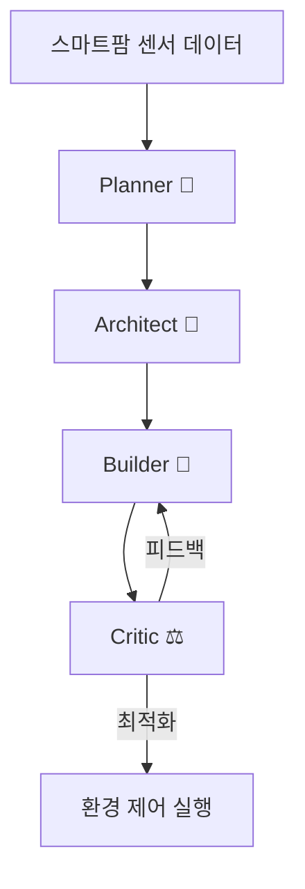

# NURI - AI 기반 장애인표준사업장 스마트팜 플랫폼

> **"기술로 만드는 포용적 농업 생태계"**
>
> BMAD Elite 4 AI 오케스트레이션과 누리셀 적층형 재배 시스템으로 장애인 일자리를 창출하는 혁신적인 스마트팜 플랫폼

[](https://rubyonrails.org/)
[](https://www.ruby-lang.org/)
[](https://www.sqlite.org/)
[](LICENSE)

---

## 📌 프로젝트 개요

### NURI란?

**NURI**는 대한민국의 **장애인표준사업장** (인증후보업체)으로, AI 기술과 스마트팜을 결합하여 장애인에게 안정적인 일자리를 제공하고 농업 생산성을 혁신하는 소셜벤처입니다.

```yaml
브랜드명: NURI
사업장 유형: 장애인표준사업장 (컨소시엄형)
1호 사업장: NuriFarm 괴산점
위치: 충청북도 괴산군 사리면 방축리 499외 3필지
부지: 2,000평 | 하우스: 500평
고용 목표: 장애인 40명 + 일반직원 15명 = 55명
핵심 기술: BMAD Elite 4 AI + 누리셀 적층형 시스템
```

### 사회적 가치

- ✅ **장애인 일자리 창출**: 72.7% 장애인 고용률 (40명/55명)
- ✅ **컨소시엄 파트너십**: 공공기관·기업의 ESG 경영 지원
- ✅ **지속 가능한 농업**: AI 기반 무농약·저농약 스마트팜
- ✅ **지역 경제 활성화**: 괴산 지역 농업 기술 허브

---

## 🌱 NuriFarm 괴산점 (1호 사업장)

### 재배 작물
- **병풀나물**: 약용·건강 기능성 채소
- **바질**: 허브, 요리용
- **쌈채소**: 상추, 청경채 등

### 판매처
- **주요 파트너**: Farm8 (MOU 체결)
- **타겟**: 대형마트, 로컬푸드 직매장, 급식업체

### 확장 계획
- **2호점**: 2026년 하반기 목표
- **3호점**: 2027년 계획
- **최종 목표**: 전국 5개 사업장 (2028년까지)

---

## 🤖 핵심 기술: BMAD Elite 4 + 누리셀

### 1. BMAD Elite 4 AI 오케스트레이션

4개의 전문화된 AI 에이전트가 스마트팜을 자동으로 운영합니다.



#### 에이전트 역할

| 에이전트 | 역할 | AI 모델 | 주요 기능 |
|---------|------|---------|----------|
| **Planner (🧠)** | 전략 기획 | GPT-4 | 생육 계획, 수확 예측, 시장 분석 |
| **Architect (📐)** | 시스템 설계 | GPT-4 | 환경 제어 로직, 센서 네트워크 설계 |
| **Builder (🔨)** | 실행 | GPT-4 | 자동화 스크립트, 데이터 수집 |
| **Critic (⚖️)** | 품질 검증 | GPT-3.5 | 병충해 조기 진단, 이상 탐지 |

#### AI 활용 영역
- ✅ **작물 생육 모니터링**: 실시간 성장 데이터 분석
- ✅ **병충해 조기 진단**: 이미지 인식 기반 자동 탐지
- ✅ **환경 제어 자동화**: 온도·습도·CO2·조도 자동 조절
- ✅ **수확량 예측**: 출하 계획 및 재고 관리 지원

### 2. 누리셀 (NURI Cell) - 적층형 랙 재배 시스템

**독자 개발 기술**로 생산성을 3~5배 향상시키는 혁신적인 재배 시스템입니다.

#### 핵심 특징
- **수직 적층 구조**: 한정된 면적에서 최대 생산량
- **모듈형 설계**: 작물별 맞춤 환경 조성
- **장애인 친화 설계**: 휠체어 접근 가능, 높이 조절 가능
- **자동화 통합**: 관수·양액·조명 자동 공급

#### 경쟁 우위

| 항목 | 일반 스마트팜 | NURI 스마트팜 |
|------|--------------|--------------|
| 생산성 | 표준 | **3~5배 향상** |
| AI 활용 | 부분적 | **BMAD Elite 4 전면 적용** |
| 장애인 고용 | 제한적 | **40명 (72.7%)** |
| 사회적 가치 | 낮음 | **매우 높음** |

---

## 🛠️ 기술 스택

### Backend (Rails)
```yaml
Framework: Ruby on Rails 8.1.2
Language: Ruby 3.3+
Database: SQLite 3 (개발/운영)
API: RESTful + GraphQL (향후)
Authentication: Devise
Background Jobs: Sidekiq
```

### Frontend
```yaml
Template Engine: ERB / Hotwire (Turbo + Stimulus)
CSS Framework: Tailwind CSS (Salesforce Lightning 스타일)
Charts: Chart.js / ApexCharts
Map: Leaflet (사업장 위치 표시)
```

### AI/ML Integration
```yaml
AI Orchestration: BMAD Elite 4 (LangChain/LangGraph)
LLM: OpenAI GPT-4 / GPT-3.5
Monitoring: LangSmith
Python Integration: PyCall (Ruby ↔ Python)
```

### Infrastructure
```yaml
Deployment: Docker + Railway / Heroku
Storage: AWS S3 (이미지/파일)
Monitoring: New Relic / Sentry
CI/CD: GitHub Actions
```

---

## 📁 프로젝트 구조

```
0001_NURI/
├── app/                        # Rails 애플리케이션
│   ├── controllers/            # 컨트롤러
│   ├── models/                 # 모델 (ActiveRecord)
│   ├── views/                  # 뷰 (ERB 템플릿)
│   ├── jobs/                   # 백그라운드 작업
│   └── services/               # 비즈니스 로직
│       └── bmad/               # BMAD Elite 4 통합
├── config/                     # 설정 파일
│   ├── database.yml            # SQLite 설정
│   ├── routes.rb               # 라우팅
│   └── initializers/           # 초기화 스크립트
├── db/                         # 데이터베이스
│   ├── migrate/                # 마이그레이션
│   ├── seeds.rb                # 시드 데이터
│   └── development.sqlite3     # SQLite DB
├── docs/                       # 문서
│   ├── epic.md                 # 프로젝트 비전
│   ├── architecture.md         # 아키텍처
│   └── api/                    # API 문서
├── public/                     # 정적 파일
│   ├── index.html              # 메인 페이지
│   └── goesan.html             # 괴산점 상세 페이지
├── spec/                       # RSpec 테스트
├── Gemfile                     # Ruby 의존성
├── Dockerfile                  # Docker 설정
└── README.md                   # 본 문서
```

---

## 🚀 시작하기

### 사전 요구사항
```bash
Ruby 3.3+ 설치
Rails 8.1.2 설치
SQLite 3 설치
```

### 설치 및 실행

```bash
# 1. 저장소 클론
git clone https://github.com/gagahoho/0001_NURI.git
cd 0001_NURI

# 2. 의존성 설치
bundle install

# 3. 데이터베이스 설정
rails db:create
rails db:migrate
rails db:seed

# 4. 환경 변수 설정
cp .env.example .env
# .env 파일에 OpenAI API 키 등 설정

# 5. 개발 서버 실행
rails server
# http://localhost:3000 접속
```

### 환경 변수 (.env)

```bash
# OpenAI API (BMAD Elite 4)
OPENAI_API_KEY=sk-your-openai-key-here

# LangSmith Monitoring
LANGCHAIN_TRACING_V2=true
LANGCHAIN_API_KEY=lsv2-your-langsmith-key-here
LANGCHAIN_PROJECT=NURI_SMARTFARM_MONITOR

# Database
DATABASE_URL=sqlite3:db/production.sqlite3

# AWS S3 (이미지 저장)
AWS_ACCESS_KEY_ID=your-access-key
AWS_SECRET_ACCESS_KEY=your-secret-key
AWS_REGION=ap-northeast-2
AWS_BUCKET=nuri-farm-assets
```

---

## 🎯 주요 기능 (MVP)

### Phase 1: 웹사이트 및 정보 제공 (2026년 Q1)

- [x] 메인 페이지: NURI 소개 및 사회적 가치
- [x] NuriFarm 괴산점 상세 페이지
- [ ] 컨소시엄 파트너십 신청 폼
- [ ] 생산물 소개 및 주문 문의
- [ ] 채용 정보 (장애인 일자리)

### Phase 2: 관리자 대시보드 (2026년 Q2)

- [ ] 스마트팜 실시간 모니터링
  - 온도, 습도, CO2, 조도 데이터
  - 작물 생육 단계 추적
- [ ] BMAD Elite 4 AI 제어 인터페이스
  - 환경 자동 제어 설정
  - 병충해 알림 시스템
- [ ] 생산 관리
  - 재배 계획, 수확 기록
  - 출하 및 재고 관리
- [ ] 인사 관리
  - 근로자 출퇴근 기록
  - 급여 및 복리후생

### Phase 3: B2B 플랫폼 (2026년 Q3-Q4)

- [ ] 컨소시엄 파트너 포털
  - 의무고용률 실시간 확인
  - 납품 계약 관리
- [ ] 온라인 주문 시스템
  - B2B 대량 주문
  - 정기 배송 구독
- [ ] 데이터 분석 대시보드
  - 생산성 리포트
  - ESG 임팩트 리포트

---

## 📊 데이터베이스 스키마 (주요 테이블)

```ruby
# app/models/
Farm            # 사업장 (괴산점, 2호점 등)
Crop            # 재배 작물
Worker          # 근로자 정보
Production      # 생산 기록
Order           # 주문
Partner         # 컨소시엄 파트너
SensorData      # IoT 센서 데이터
AiLog           # BMAD Elite 4 로그
```

---

## 🔄 BMAD Elite 4 워크플로우

### 사용 예시: 병충해 조기 진단

```ruby
# app/services/bmad/disease_detection_service.rb

class Bmad::DiseaseDetectionService
  def analyze(crop_id)
    crop = Crop.find(crop_id)

    # BMAD Elite 4 실행
    result = BmadOrchestrator.invoke(
      messages: [
        {
          role: "user",
          content: "#{crop.name} 작물의 최근 이미지를 분석하여 병충해 여부를 진단해주세요."
        }
      ],
      tools: [:image_recognition, :disease_database, :treatment_guide]
    )

    # 결과 저장
    AiLog.create!(
      crop: crop,
      agent: "Critic",
      action: "disease_detection",
      result: result
    )

    # 알림 발송 (병충해 발견 시)
    send_alert(crop, result) if result[:disease_detected]

    result
  end
end
```

---

## 🧪 테스트

```bash
# RSpec 실행
bundle exec rspec

# 커버리지 확인
open coverage/index.html

# 특정 테스트만 실행
bundle exec rspec spec/models/crop_spec.rb
```

---

## 🎯 KPI 및 성공 지표

### 사회적 가치 지표

| 구분 | 단기 (6개월) | 중기 (1년) | 장기 (2년) |
|------|-------------|-----------|-----------|
| **장애인 고용** | 20명 | 40명 | 100명 |
| **컨소시엄 파트너** | 3개 기관 | 10개 기관 | 30개 기관 |
| **근로자 정착률** | 70% | 85% | 90% |

### 경제적 지표

| 구분 | 단기 (6개월) | 중기 (1년) | 장기 (2년) |
|------|-------------|-----------|-----------|
| **월 매출** | 3,000만 원 | 5,000만 원 | 1.5억 원 |
| **연 매출** | - | 5억 원 | 20억 원 |
| **영업이익률** | 손익분기점 | 15% | 25% |

### 기술 혁신 지표

| 구분 | 단기 (6개월) | 중기 (1년) | 장기 (2년) |
|------|-------------|-----------|-----------|
| **AI 예측 정확도** | 80% | 85% | 90% |
| **에너지 효율 개선** | 20% | 30% | 40% |
| **특허 출원** | - | 1건 | 3건 |

---

## 📚 관련 문서

- [Epic 문서](./docs/epic.md) - 프로젝트 비전 및 전략
- [아키텍처 문서](./docs/architecture.md) - 시스템 설계
- [API 문서](./docs/api/) - RESTful API 레퍼런스
- [BMAD Elite 4 가이드](./docs/bmad/) - AI 오케스트레이션 매뉴얼

---

## 🤝 컨소시엄 파트너십

### 타겟 파트너
- **공공기관**: 한국전력, 지역 공사/공단
- **대기업**: ESG 경영 중시 기업
- **중견기업**: 장애인 고용 부담금 절감 니즈

### 제안 가치
- ✅ 장애인 의무고용률 준수 지원
- ✅ 안정적인 고품질 농산물 공급
- ✅ ESG 보고서 활용 가능한 사회공헌 스토리
- ✅ 브랜드 가치 향상

### 문의
- **이메일**: partnership@nuri.farm
- **전화**: 043-XXX-XXXX
- **주소**: 충청북도 괴산군 사리면 방축리 499

---

## 🌍 비전

> **"2030년까지 대한민국 10개 지역에 NURI 스마트팜을 구축하여,
> 1,000명의 장애인에게 일자리를 제공하고,
> AI 농업 기술을 전 세계에 수출하는 글로벌 소셜벤처로 성장한다."**

---

## 📄 라이선스

MIT License

Copyright (c) 2026 NURI / Gagahoho, Inc.

---

## 👥 팀

- **Gagahoho, Inc.** - 프로젝트 기획 및 개발
- **Mary (Business Analyst)** - 사업 전략 및 문서화

---

**Powered by BMAD Elite 4 & Ruby on Rails**
**Last Updated**: 2026-02-10
**Version**: 2.0 (Rails 전환)
