# NURI 시스템 아키텍처

> BMAD Elite 4 Orchestrator 기반 학생-기업 매칭 및 산학 협력 플랫폼 아키텍처

## 목차
1. [전체 시스템 아키텍처](#1-전체-시스템-아키텍처)
2. [BMAD Elite 4 에이전트 시스템](#2-bmad-elite-4-에이전트-시스템)
3. [데이터 모델](#3-데이터-모델)
4. [주요 컴포넌트](#4-주요-컴포넌트)
5. [워크플로우](#5-워크플로우)
6. [외부 의존성](#6-외부-의존성)
7. [배포 아키텍처](#7-배포-아키텍처)

---

## 1. 전체 시스템 아키텍처

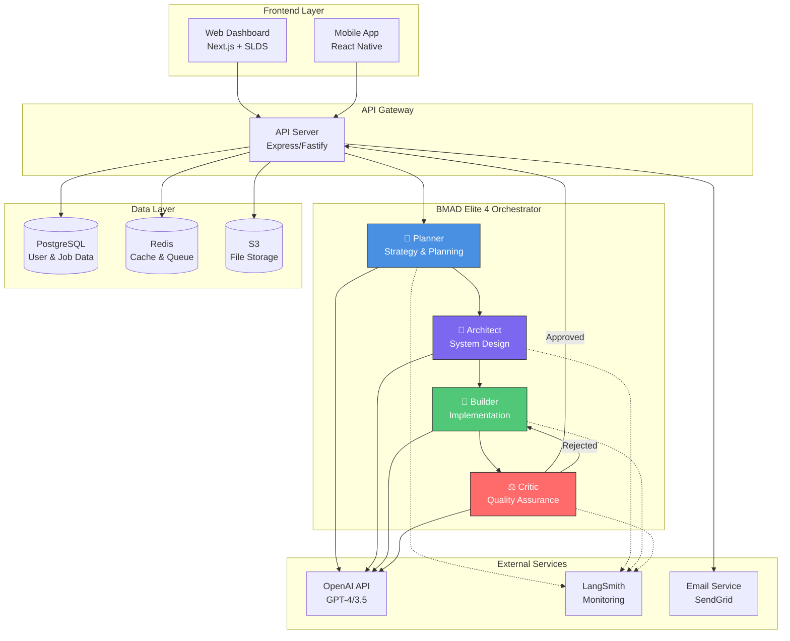

## 2. BMAD Elite 4 에이전트 시스템

### 2.1 에이전트 워크플로우

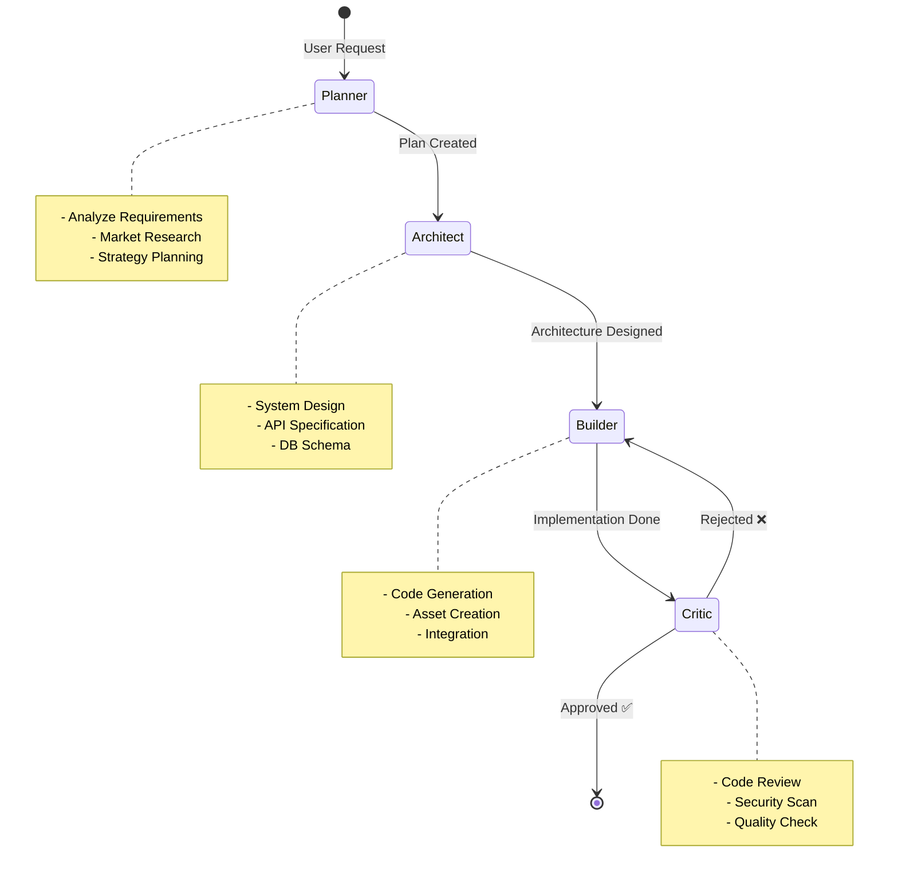

### 2.2 에이전트별 도구 매핑

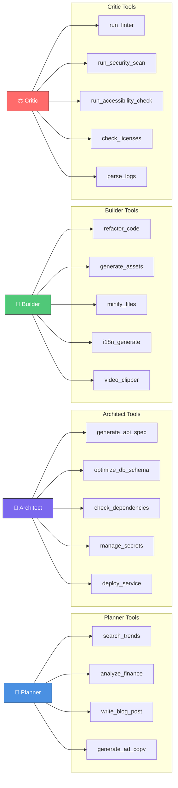

### 2.3 LangGraph 상태 관리

```mermaid
graph TD
    subgraph "EliteState (Shared Memory)"
        MESSAGES[messages: BaseMessage[]]
        NEXT[next?: string]
        META[metadata?: Record<string, any>]
    end

    USER[User Input] -->|HumanMessage| MESSAGES
    MESSAGES --> GRAPH[StateGraph Workflow]
    GRAPH --> PLANNER_OUT[Planner Output]
    PLANNER_OUT -->|AIMessage| MESSAGES
    MESSAGES --> ARCH_OUT[Architect Output]
    ARCH_OUT -->|AIMessage| MESSAGES
    MESSAGES --> BUILD_OUT[Builder Output]
    BUILD_OUT -->|AIMessage| MESSAGES
    MESSAGES --> CRITIC_OUT[Critic Output]
    CRITIC_OUT -->|AIMessage| MESSAGES

    style MESSAGES fill:#FFD700,stroke:#333
```

## 3. 데이터 모델

### 3.1 핵심 엔티티

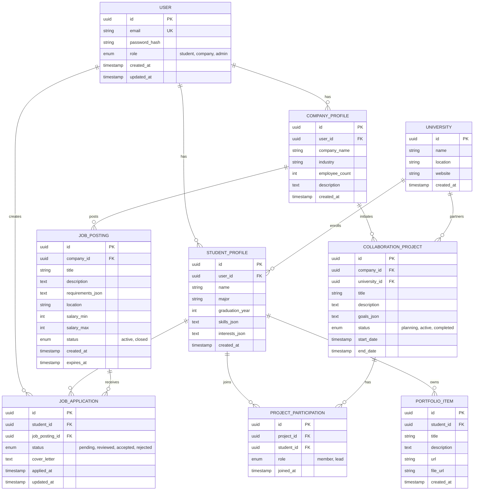

### 3.2 AI 에이전트 실행 이력

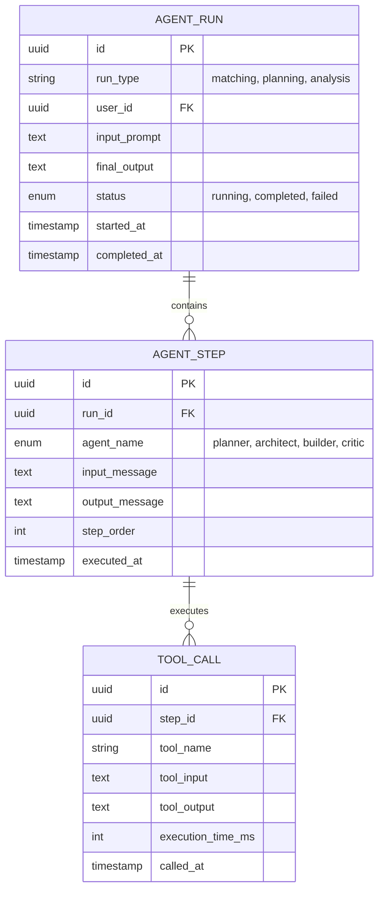

## 4. 주요 컴포넌트

### 4.1 백엔드 컴포넌트 구조

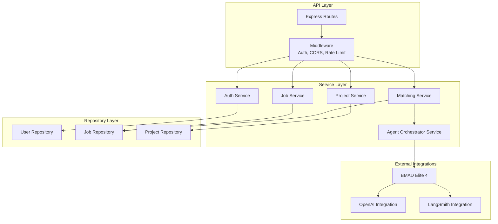

### 4.2 프론트엔드 컴포넌트 구조 (향후)

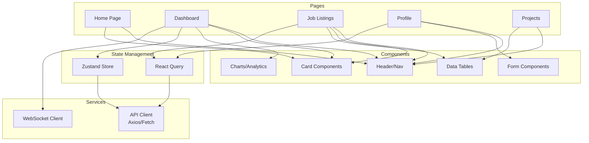

## 5. 워크플로우

### 5.1 학생-기업 매칭 워크플로우

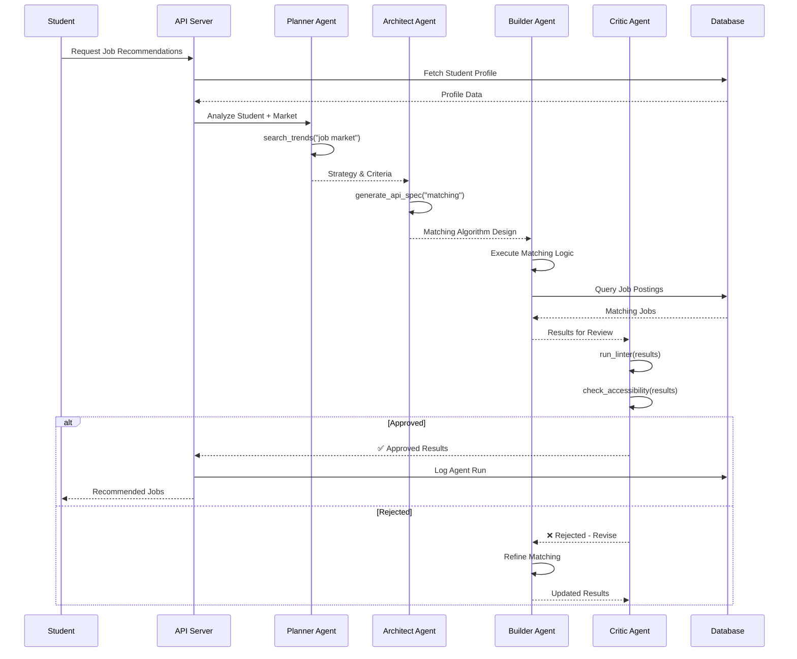

### 5.2 R&D 프로젝트 자동 기획 워크플로우

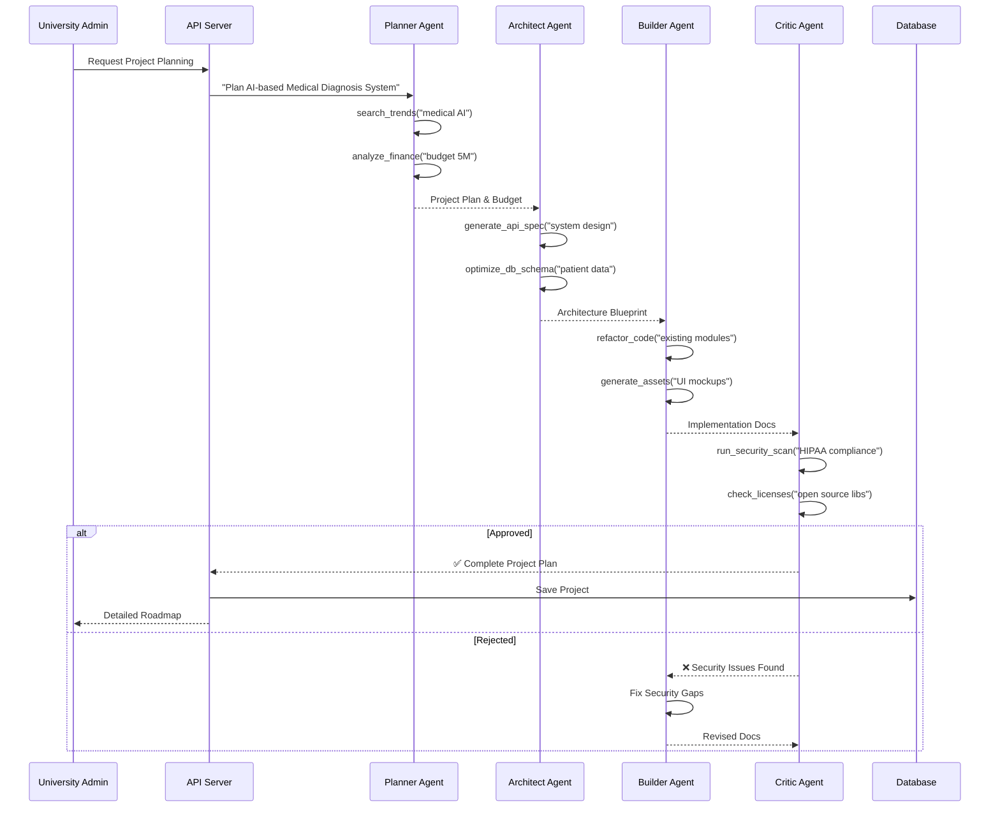

### 5.3 산학 협력 매칭 워크플로우

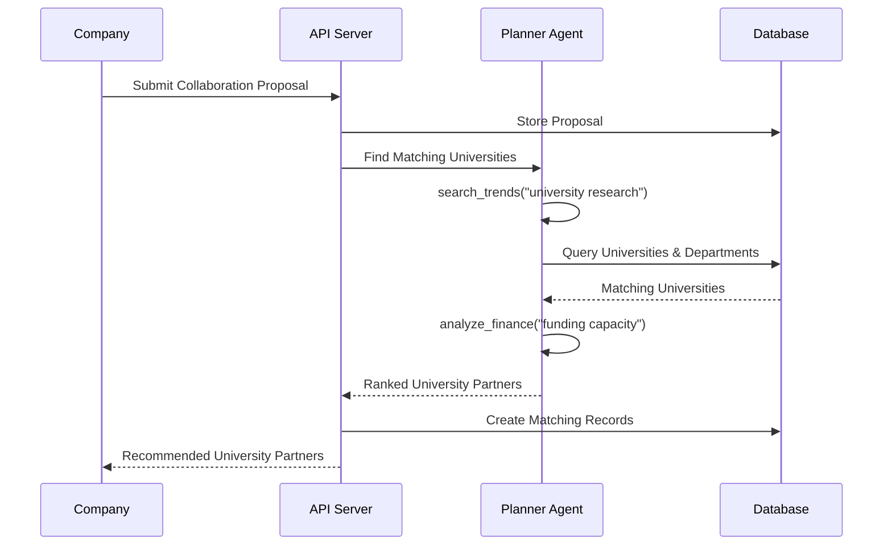

## 6. 외부 의존성

### 6.1 핵심 의존성

```mermaid
graph TB
    NURI[NURI Platform]

    subgraph "AI & ML"
        OPENAI[OpenAI API<br/>GPT-4, GPT-3.5]
        LANGCHAIN[LangChain<br/>v0.1.x]
        LANGGRAPH[LangGraph<br/>v0.0.1]
        LANGSMITH[LangSmith<br/>Monitoring & Tracing]
    end

    subgraph "Data & Storage"
        PG[PostgreSQL 15+]
        REDIS_EXT[Redis 7+]
        S3_EXT[AWS S3]
    end

    subgraph "Communication"
        SENDGRID[SendGrid<br/>Email Service]
        TWILIO[Twilio<br/>SMS (Optional)]
    end

    subgraph "DevOps & Monitoring"
        SENTRY[Sentry<br/>Error Tracking]
        DATADOG[Datadog<br/>APM (Optional)]
    end

    NURI --> OPENAI
    NURI --> LANGCHAIN
    NURI --> LANGGRAPH
    NURI -.-> LANGSMITH

    NURI --> PG
    NURI --> REDIS_EXT
    NURI --> S3_EXT

    NURI --> SENDGRID
    NURI -.-> TWILIO

    NURI -.-> SENTRY
    NURI -.-> DATADOG
```

### 6.2 기술 스택 버전

| 카테고리 | 기술 | 버전 | 용도 |
|---------|------|------|------|
| **런타임** | Node.js | 20.x+ | 서버 실행 환경 |
| | TypeScript | 5.3+ | 타입 안전성 |
| **프레임워크** | LangChain | 0.1.x | LLM 애플리케이션 프레임워크 |
| | LangGraph | 0.0.1 | 멀티 에이전트 오케스트레이션 |
| | Express | 4.18+ (향후) | API 서버 |
| | Next.js | 14+ (향후) | 프론트엔드 |
| **AI 모델** | OpenAI GPT-4-turbo | - | Planner, Architect, Builder |
| | OpenAI GPT-3.5-turbo | - | Critic |
| **데이터베이스** | PostgreSQL | 15+ (향후) | 메인 DB |
| | Redis | 7+ (향후) | 캐시 & 세션 |
| **모니터링** | LangSmith | - | AI 에이전트 추적 |
| | Sentry | 7+ (향후) | 에러 추적 |
| **검증** | Zod | 3.25+ | 런타임 타입 검증 |
| **배포** | Docker | 24+ (향후) | 컨테이너화 |
| | Kubernetes | 1.28+ (향후) | 오케스트레이션 |

## 7. 배포 아키텍처

### 7.1 개발/스테이징/프로덕션 환경

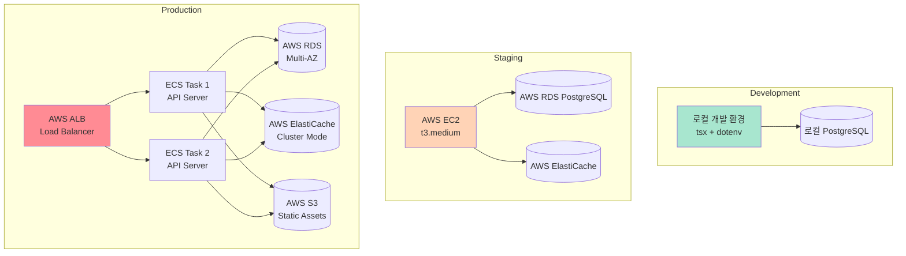

### 7.2 CI/CD 파이프라인 (향후)

```mermaid
graph LR
    GIT[Git Push] --> GH_ACTIONS[GitHub Actions]
    GH_ACTIONS --> LINT[Lint & Type Check]
    LINT --> TEST[Run Tests]
    TEST --> BUILD[Build Docker Image]
    BUILD --> ECR[Push to AWS ECR]
    ECR --> DEPLOY_STAGE[Deploy to Staging]
    DEPLOY_STAGE --> SMOKE_TEST[Smoke Tests]
    SMOKE_TEST -->|Pass| APPROVE[Manual Approval]
    APPROVE --> DEPLOY_PROD[Deploy to Production]
    DEPLOY_PROD --> MONITOR[Monitor with Sentry]

    style GIT fill:#A8E6CF
    style DEPLOY_PROD fill:#FF8B94
```

### 7.3 보안 아키텍처

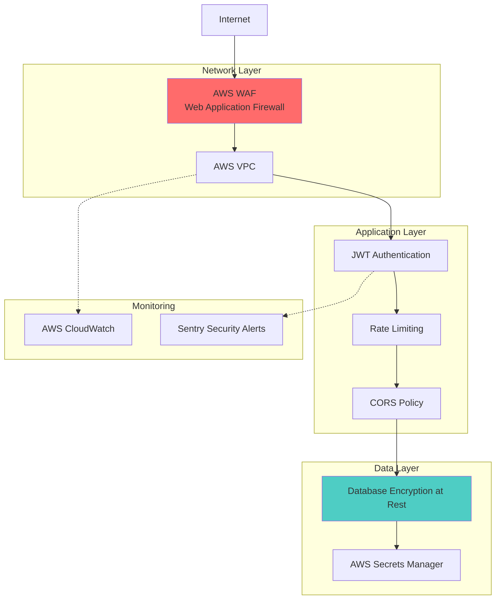

## 8. 성능 및 확장성

### 8.1 예상 부하 및 대응

| 지표 | 목표 | 대응 방안 |
|------|------|-----------|
| **동시 접속자** | 1,000+ | 수평 확장 (ECS 오토스케일링) |
| **API 응답 시간** | < 500ms (P95) | Redis 캐싱, DB 인덱싱 |
| **AI 에이전트 처리** | < 30초 | 비동기 처리, 결과 큐잉 |
| **데이터베이스 처리량** | 10,000 TPS | RDS Read Replica, Connection Pooling |
| **파일 업로드** | 100 MB | S3 Direct Upload, Presigned URL |

### 8.2 캐싱 전략

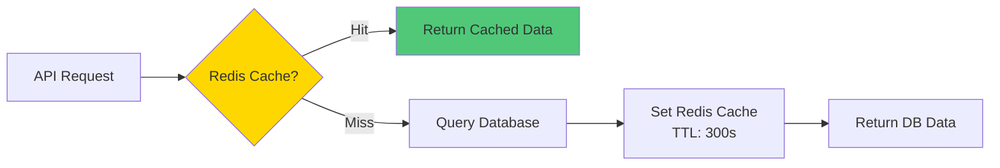

---

## 참고 자료

- [CLAUDE.md](../CLAUDE.md) - AI 개발 가이드
- [Epic 문서](./epic.md) - 프로젝트 비전 및 목표
- [LangGraph 공식 문서](https://langchain-ai.github.io/langgraph/)
- [PostgreSQL 공식 문서](https://www.postgresql.org/docs/)

---

**작성자**: Gagahoho, Inc.
**최종 업데이트**: 2026-02-10
**버전**: 1.0
