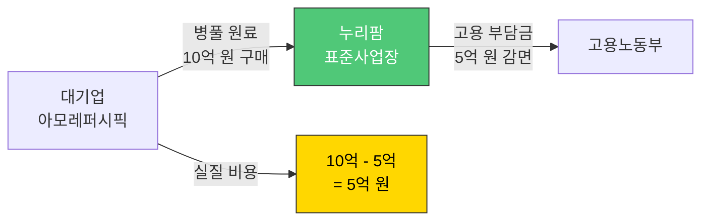

# 병풀(센텔라 아시아티카) 사업 계획서

> **수입 대체 국산화 전략 - 누리팜의 게임 체인저**

---

## 목차

1. [사업 개요](#사업-개요)
2. [시장 분석](#시장-분석)
3. [영업 전략](#영업-전략)
4. [재배 계획](#재배-계획)
5. [수익 모델](#수익-모델)
6. [타겟 고객사](#타겟-고객사)
7. [리스크 관리](#리스크-관리)
8. [로드맵](#로드맵)

---

## 사업 개요

### 병풀(센텔라 아시아티카)이란?

**학명**: *Centella asiatica*
**별명**: 호랑이풀, 시카(Cica), 병풀나물

**주요 성분**:
- **마데카소사이드** (Madecassoside): 피부 진정, 상처 치유
- **아시아티코사이드** (Asiaticoside): 항염증, 재생 촉진
- **센텔라 아시아티카 추출물** (Centella Asiatica Extract): 화장품 원료

### 왜 병풀인가?

#### 1. 시장 기회

```
글로벌 병풀 시장: 약 9,000억 원
국내 수입 규모: 연 500~600억 원
수입 의존도: 95%

누리팜 목표: 수입 대체 10% → 연 매출 50~100억 원
```

#### 2. K-뷰티 시카 열풍

- **트렌드**: 시카(Cica) 화장품 폭발적 성장 (2020~현재)
- **대표 제품**: 시카페어 크림, 시카 토너 패드, 마데카솔
- **소비자 니즈**: 민감성 피부 진정, 여드름 케어

#### 3. 수입 문제점 (Pain Point)

| 문제 | 영향 |
|------|------|
| **품질 불균일** | 노지 채취 → 유효 성분 함량 들쑥날쑥 |
| **오염 리스크** | 토양 중금속 검출 우려 |
| **건조 상태** | 대부분 말린 건초 → 신선한 생초 구하기 어려움 |
| **공급 불안정** | 마다가스카르/인도 기후 의존 |

#### 4. 누리팜 솔루션

```
스마트팜 무농약 재배
→ 중금속 걱정 없는 청정 생초
→ AI 제어로 유효 성분 함량 2~3배 향상
→ 국내 안정적 공급 (괴산 → 당일 배송)
```

---

## 시장 분석

### 글로벌 시장

#### 시장 규모

| 구분 | 금액 |
|------|------|
| 글로벌 병풀 추출물 시장 | 약 7억 달러 (약 9,000억 원, 2023년 기준) |
| 완제품 포함 (화장품/의약품) | 수십조 원 규모 |
| 연평균 성장률 (CAGR) | 7~9% |

#### 주요 소비국

1. **한국**: K-뷰티 시카 종주국 (시카페어 등)
2. **미국**: 더마 코스메틱 시장 확대
3. **유럽**: 천연 화장품 선호 트렌드
4. **중국**: K-뷰티 수입 급증

### 국내 시장

#### 수입 현황

- **수입 규모**: 연간 500~600억 원 (추정)
- **주요 수입국**:
  - 마다가스카르: 최상급 원료 (동국제약 마데카솔)
  - 인도: 저가형 대량 수입
  - 중국: 가공품 형태

#### 주요 용도별 시장

| 용도 | 시장 규모 | 주요 제품 |
|------|----------|----------|
| **화장품 원료** (최대) | 약 400억 원 | 시카 크림, 앰플, 마스크팩, 토너 패드 |
| **의약품/의약외품** | 약 150억 원 | 마데카솔, 센시아(하지정맥류) |
| **건강기능식품** (신규) | 약 50억 원 | 인지 기능 개선, 병풀 라떼, 떡 |

### 경쟁 환경

#### 공급자 분석

| 구분 | 공급원 | 강점 | 약점 |
|------|--------|------|------|
| **수입산** | 마다가스카르/인도 | 저렴한 가격 (대량) | 품질 불균일, 오염 리스크 |
| **국내 노지** | 제주/남해 일부 농가 | 국산 | 소량 생산, 계절 제약 |
| **누리팜** | 괴산 스마트팜 | **청정 무농약, 균일 품질, 연중 생산** | 신규 진입 (브랜드 인지도) |

---

## 영업 전략

### 핵심 무기: 연계고용 감면 제도 ⭐

**장애인표준사업장**의 가장 강력한 B2B 영업 무기입니다.

#### 작동 원리



#### 감면 규모

| 구매 금액 | 감면 금액 (최대 50%) | 실질 비용 |
|----------|---------------------|----------|
| 10억 원 | 5억 원 | **5억 원** |
| 20억 원 | 10억 원 | **10억 원** |
| 50억 원 | 25억 원 | **25억 원** |

**영업 메시지**:
> "병풀 원료를 누리팜에서 구매하시면, 실질적으로 **50% 할인** 효과를 누리실 수 있습니다."

### 추가 혜택

#### 1. ESG 경영 실적 (S 점수 향상)

- **스토리**: "장애인이 키운 시카 원료"
- **활용**: ESG 보고서, 브랜드 마케팅, IR 자료
- **효과**: 소비자 호감도 상승 (사회적 가치 소비 트렌드)

#### 2. 공공기관 우선구매 가점

- **대상**: 공공기관 납품 실적이 중요한 제약사
- **혜택**: 장애인표준사업장 생산품 구매 실적 = 입찰 가점

#### 3. 공급망 리스크 해소

- **문제**: 마다가스카르 기후 변화, 물류 대란 → 수급 불안
- **해결**: 괴산에서 당일 배송 → 물류 리스크 제로

---

## 재배 계획

### 재배 환경

#### 병풀의 특성

- **기후**: 온난 다습 (아열대성)
- **생육 온도**: 20~30°C (최적 25°C)
- **습도**: 70~80% (과습 주의)
- **토양**: 배수 양호한 사질양토 (수경재배 적합!)
- **생육 기간**: 파종 후 60~90일

#### 누리셀 스마트팜 장점

| 항목 | 노지 재배 | 누리셀 스마트팜 |
|------|----------|----------------|
| **재배 기간** | 연 1~2회 (계절 제약) | **연중 무휴 (3~4회)** |
| **품질 균일성** | 낮음 (날씨 영향) | **높음 (AI 제어)** |
| **유효 성분 함량** | 표준 | **2~3배 향상** (스트레스 제어) |
| **오염 리스크** | 높음 (토양 중금속) | **제로** (수경재배) |
| **수확량** | 표준 | **3~5배** (다단식 적층) |

### 재배 계획 (괴산점 500평 기준)

#### Zone 배분

| Zone | 면적 | 작물 | 목적 |
|------|------|------|------|
| Zone A | 300평 | 상추/바질 | Cash Cow (기본 수익) |
| **Zone B** | **150평** | **병풀** | **Future Value (고수익)** |
| Zone C | 50평 | 허브 | Niche Market |

#### 병풀 생산 계획 (150평)

**수직 적층 시스템 (누리셀)**:
- 3단 적층 → 유효 재배 면적 450평
- 평당 생초 수확량: 10kg/회
- 연 4회 수확

**연간 생산량**:
```
450평 × 10kg × 4회 = 18,000kg (18톤/년)
```

---

## 수익 모델

### 판매 단가 전략

#### 수입산 대비 가격 (프리미엄 전략)

| 구분 | 수입산 건초 | 누리팜 생초 |
|------|------------|------------|
| **단가** | 10,000원/kg | **30,000원/kg** (3배) |
| **품질** | 불균일 | 균일 (유효 성분 보증) |
| **신선도** | 건조 상태 | 생초 (Fresh) |
| **청정성** | 중금속 우려 | 무농약 GAP |

**프리미엄 정당화 논리**:
1. 유효 성분(마데카소사이드) 함량 2~3배
2. 뿌리까지 사용 가능 (전초 whole plant)
3. 연계고용 감면 → 실질 가격은 동등 또는 저렴

### 매출 시뮬레이션

#### 시나리오 1: 보수적 (시장 점유율 5%)

| 항목 | 값 |
|------|-----|
| 국내 수입 시장 | 500억 원 |
| 목표 점유율 | **5%** |
| 예상 매출 | **25억 원** |
| 연간 생산량 | 18톤 |
| 필요 단가 | 약 14만 원/kg |

**평가**: 달성 가능 (프리미엄 원료로 포지셔닝)

#### 시나리오 2: 목표 (시장 점유율 10%)

| 항목 | 값 |
|------|-----|
| 국내 수입 시장 | 500억 원 |
| 목표 점유율 | **10%** |
| 예상 매출 | **50억 원** |
| 연간 생산량 | 18톤 |
| 필요 단가 | 약 28만 원/kg |

**평가**: 도전적이지만 달성 가능 (화장품사 전량 계약재배 시)

#### 시나리오 3: 공격적 (2호점 확장 + 점유율 20%)

| 항목 | 값 |
|------|-----|
| 국내 수입 시장 | 500억 원 |
| 목표 점유율 | **20%** (2호점 포함) |
| 예상 매출 | **100억 원** |
| 필요 생산량 | 36톤 (2호점 추가) |

**평가**: 2028년 목표 (2호점 구축 후)

### 수익 구조 (연 50억 원 기준)

| 타겟 | 용도 | 비중 | 매출 |
|------|------|------|------|
| **화장품 대기업** | 시카 크림, 토너, 앰플 원료 | 40% | 20억 원 |
| **제약사** | 마데카솔, 상처 치료 연고 | 40% | 20억 원 |
| **건강식품/식품** | 병풀 라떼, 떡, 이너뷰티 | 20% | 10억 원 |

---

## 타겟 고객사

### 1군: 화장품 대기업 & ODM

#### 아모레퍼시픽

- **니즈**: 시카 라인 원료 (시카페어, 설화수 등)
- **구매 예상량**: 연 5~10톤
- **영업 포인트**: ESG 경영 + 부담금 감면 (수십억 원 절감)

#### LG생활건강

- **니즈**: 더마 코스메틱 라인 (CNP, 빌리프)
- **구매 예상량**: 연 3~5톤
- **영업 포인트**: 공급망 안정성 (수입 리스크 제로)

#### 한국콜마, 코스맥스 (ODM)

- **니즈**: 다양한 브랜드에 원료 공급
- **구매 예상량**: 연 5~10톤
- **영업 포인트**: 균일 품질 보증 (유효 성분 함량 일정)

### 2군: 제약사

#### 동국제약

- **대표 제품**: 마데카솔 (상처 치료 연고), 센텔리안24 (화장품)
- **니즈**: 고순도 마데카소사이드 원료
- **구매 예상량**: 연 3~5톤
- **영업 포인트**: "약용 재배" 계약 (유효 성분 3% 이상 보증)

#### 대웅제약

- **니즈**: 하지정맥류 치료제, 더마 코스메틱
- **구매 예상량**: 연 2~3톤

### 3군: 건강기능식품 & 식품

#### KGC인삼공사

- **니즈**: 병풀 건강기능식품 (인지 기능 개선)
- **구매 예상량**: 연 1~2톤

#### 카페/식품 브랜드

- **니즈**: 병풀 라떼, 병풀 떡, 샐러드용 (쓴맛 개량종)
- **구매 예상량**: 소량 다빈도

---

## 리스크 관리

### 주요 리스크 및 대응

| 리스크 | 발생 가능성 | 영향도 | 대응 방안 |
|--------|------------|--------|----------|
| **시장 진입 실패** | 중간 | 높음 | 파일럿 계약 먼저 체결 (소량 테스트) |
| **재배 실패** | 낮음 | 높음 | 전문가 자문 + AI 제어 시스템 |
| **가격 경쟁** | 중간 | 중간 | 프리미엄 전략 (품질 차별화) |
| **수요 예측 실패** | 중간 | 중간 | 계약재배 우선 (Pre-order) |

### 대응 전략

#### 1. 파일럿 프로그램

**전략**: 소량 공급 → 품질 검증 → 대량 계약

```
1차: 100kg 공급 (품질 테스트)
→ 고객사 내부 평가
→ 2차: 1톤 계약 (시범 생산)
→ 품질 확인 후 연간 계약 체결
```

#### 2. 계약재배 (Contract Farming)

**예시**:
> "동국제약과 3년 장기 공급 계약 체결: 연 5톤, 단가 고정, 유효 성분 함량 3% 보증"

**장점**:
- 매출 예측 가능
- 재고 리스크 제로
- 고객사도 안정적 원료 확보

#### 3. 2차 가공 전략

**목표**: 원료 공급을 넘어 부가가치 극대화

| 제품 | 형태 | 단가 배율 |
|------|------|----------|
| 생초 (Fresh) | 그대로 | 1배 |
| 건조 분말 (Powder) | 가공 | 3배 |
| 추출물 (Extract) | 고농도 | **10배** |

**예시**:
- 생초 3만 원/kg → 추출물(10:1 농축) 30만 원/kg

---

## 로드맵

### Phase 1: 파일럿 재배 (2026 Q3~Q4)

**목표**: 재배 기술 확립 + 품질 검증

- [ ] 병풀 모종 입수 (제주 또는 인도 수입)
- [ ] 누리셀 시스템에 재배 환경 세팅
- [ ] AI 제어 알고리즘 최적화 (온도/습도/VPD)
- [ ] 1차 수확 (500kg 목표)
- [ ] 성분 분석 (유효 성분 함량 검증)

**마일스톤**:
- 유효 성분(마데카소사이드) 2% 이상 달성
- 중금속 검출 제로 확인

### Phase 2: 시범 계약 (2027 Q1~Q2)

**목표**: 파일럿 고객사 확보

- [ ] 아모레퍼시픽/동국제약 제안서 제출
- [ ] 소량 테스트 공급 (100~500kg)
- [ ] 품질 평가 통과
- [ ] 1개사 이상 연간 계약 체결 (목표 1톤+)

**마일스톤**:
- 연간 공급 계약 1건 이상 체결
- 매출 5억 원 돌파

### Phase 3: 본격 확장 (2027 Q3~Q4)

**목표**: 생산량 증대 + 고객사 다각화

- [ ] Zone B 병풀 재배 면적 확대 (150평 → 200평)
- [ ] 화장품사 3개사 이상 계약
- [ ] 제약사 1개사 이상 계약
- [ ] 연 매출 20억 원 달성

### Phase 4: 스케일 업 (2028)

**목표**: 2호점 추가 + 수입 대체 10% 달성

- [ ] 2호점 구축 (경기/강원)
- [ ] 누적 생산량 36톤 (괴산 18톤 + 2호점 18톤)
- [ ] 시장 점유율 10% 달성
- [ ] **연 매출 50~100억 원 달성** ⭐

---

## 영업 제안서 예시

### 제목: 귀사의 장애인 고용 부담금, '누리팜 병풀'로 50% 돌려받으십시오

#### 제안 배경

안녕하십니까, 스마트팜 장애인 표준사업장 **누리팜**입니다.

현재 귀사에서 사용 중인 수입산 병풀 원료를 **누리팜의 '스마트팜 재배 국산 병풀'**로 대체 제안 드립니다.

#### Why Nuri Farm?

##### 1. Cost Save (비용 절감)
- 구매액의 **최대 50%**를 장애인 고용 부담금 감면 혜택으로 돌려드립니다.
- 예: 10억 원 구매 → 5억 원 부담금 감면 = **실질 원가 50% 절감**

##### 2. ESG Value (사회적 가치)
- "장애인이 키운 시카 원료" 스토리로 귀사의 브랜드 가치를 높여드립니다.
- ESG 보고서 'S(Social)' 섹션 채우기 완료

##### 3. High Quality (품질 보증)
- 3세대 AI 스마트팜(누리셀)이 키워낸 **균일한 품질**
- 유효 성분(마데카소사이드) 함량 **2~3배** (수입산 대비)
- 중금속 걱정 없는 **무농약 GAP** 인증

##### 4. Supply Chain (공급망 안정)
- 괴산에서 **당일 배송** → 물류 리스크 제로
- 계약재배로 **연간 물량 보장**

#### 제안 조건

| 항목 | 내용 |
|------|------|
| **공급 형태** | 생초(Fresh) 또는 건조 분말 |
| **최소 계약 물량** | 연 1톤 이상 |
| **단가** | 협의 (시장가 대비 경쟁력 있게) |
| **계약 기간** | 3년 장기 공급 계약 권장 |
| **품질 보증** | 유효 성분 함량 보증서 제공 |

#### 파일럿 프로그램

**1차 테스트**: 100kg 무상 샘플 제공 (품질 검증용)
→ 귀사 R&D 팀 평가
→ **2차 계약**: 품질 만족 시 연간 공급 계약 체결

#### 문의

- **회사명**: 주식회사 가가호호 (누리팜 괴산점)
- **대표**: 강승식
- **이메일**: [이메일 주소]
- **전화**: [전화번호]

**불안정한 수입망 대신, 괴산에서 당일 배송되는 누리팜과 함께 원가 절감과 ESG 경영 두 마리 토끼를 잡으십시오.**

---

## 결론

병풀(센텔라 아시아티카) 사업은 누리팜의 **게임 체인저**입니다.

### 핵심 성공 요인 3가지

1. **시장 기회**: 수입 의존도 95% → 국산화 니즈 명확
2. **경쟁 우위**: 스마트팜 청정 재배 + 연계고용 감면 혜택
3. **높은 수익성**: 상추 대비 단가 10배+ (부가가치 극대화)

### 목표 재확인

```
2027년: 연 매출 20억 원 (시장 점유율 5%)
2028년: 연 매출 50~100억 원 (시장 점유율 10%)
```

**병풀이 누리팜을 단순한 스마트팜을 넘어, 바이오 소재 기업으로 도약시킬 것입니다.**

---

**작성**: 2026-02-10
**작성자**: Gagahoho, Inc. AI 에이전트
**버전**: 1.0
**관련 문서**: `docs/whitepaper_goesan.md`, `docs/epic.md`
