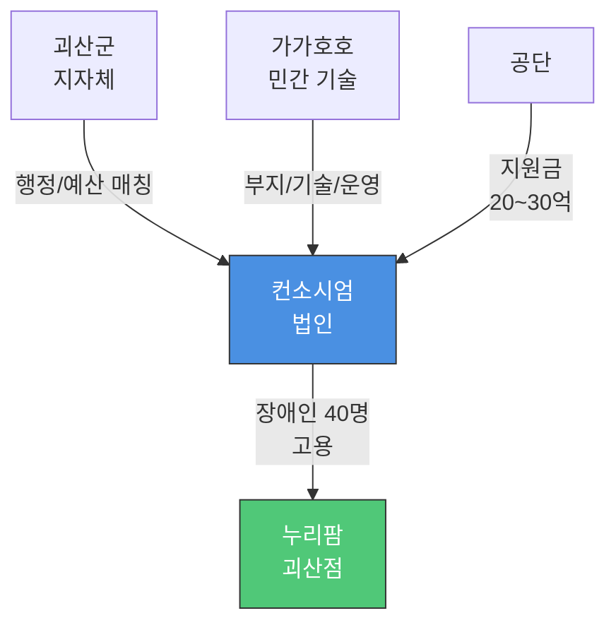
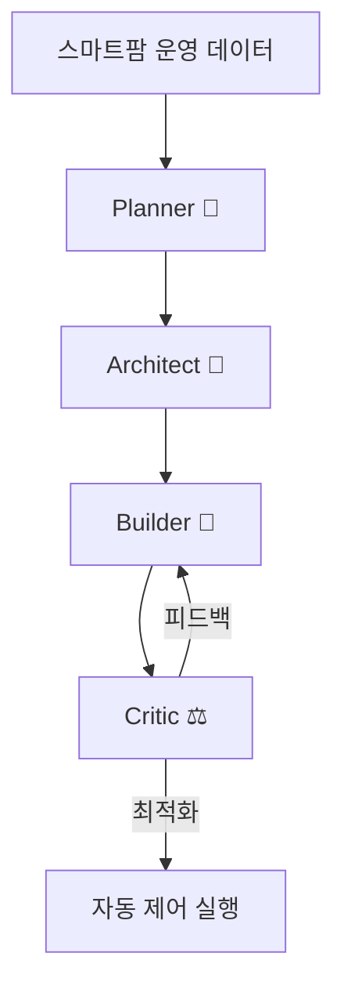
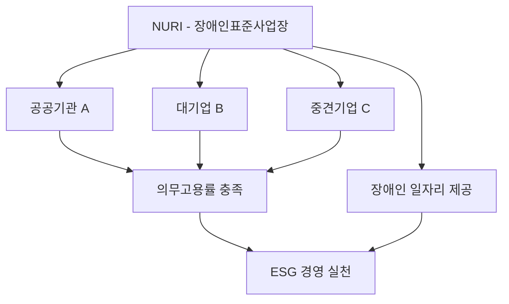

# Epic: NURI - AI 기반 장애인표준사업장 스마트팜 플랫폼

## 비전

**"기술로 만드는 포용적 농업 생태계"**

장애인에게 안정적이고 지속 가능한 일자리를 제공하고, AI와 스마트팜 기술로 농업 생산성을 혁신하는 대한민국 대표 장애인표준사업장을 구축한다.

## 사명 (Mission)

NURI는 장애인표준사업장으로서 다음을 실현한다:

1. **사회적 가치 창출**: 장애인 고용을 통한 사회 통합과 자립 지원
2. **기술 혁신**: BMAD Elite 4 AI 오케스트레이션과 누리셀 적층형 재배 시스템으로 스마트팜 고도화
3. **지속 가능한 성장**: 경제적 자립과 사업 확장을 통한 더 많은 일자리 창출
4. **산업 생태계 선도**: 공공기관·기업과의 협력으로 장애인 일자리 모델 확산

## 핵심 가치 제안

### 장애인 근로자에게
- **안정적 일자리**: 정규직 고용과 적정 임금 보장
- **최적화된 근무 환경**: 누리셀 적층형 시스템으로 신체적 부담 최소화
- **성장 기회**: 스마트팜 기술 교육 및 역량 개발
- **사회적 자립**: 경제적 독립과 사회 참여 확대

### 공공기관 및 기업에게
- **ESG 경영 실천**: 장애인 의무고용 이행 및 사회적 책임 수행
- **우수 농산물 공급**: AI 관리로 안정적 품질의 신선 채소 납품
- **파트너십 가치**: 컨소시엄형 사업장 연계를 통한 지속 가능한 협력
- **브랜드 가치 향상**: 사회공헌 스토리를 통한 기업 이미지 제고

### 소비자에게
- **안전한 먹거리**: 무농약·저농약 재배, AI 기반 품질 관리
- **사회적 가치 소비**: 구매를 통한 장애인 일자리 창출 기여
- **신선도 보장**: 스마트팜 직송 시스템

### 정부 및 지자체에게
- **장애인 고용 증대**: 지역 내 양질의 장애인 일자리 창출
- **농업 혁신 모델**: AI + 스마트팜 선도 사례
- **지역 경제 활성화**: 괴산 지역 농업 기술 허브 구축

## 타겟 이해관계자

### Primary Stakeholders
1. **장애인 구직자**
   - 장애 유형: 지체·발달·청각·시각장애 등
   - 연령: 20-60세
   - 니즈: 안정적 일자리, 적절한 근무 환경, 사회 참여

2. **공공기관 및 대기업**
   - 니즈: 장애인 의무고용률 충족, ESG 경영 실천
   - 타겟: 공공기관, 대기업, 사회적 책임 중시 기업
   - 목표: 컨소시엄형 사업장 연계 계약

3. **급식·유통업체 (B2B 고객)**
   - Farm8 (MOU 체결)
   - 대형마트, 로컬푸드 직매장
   - 학교·기업 급식 납품업체

### Secondary Stakeholders
4. **투자자 및 파트너**
   - 사회적 기업 투자자
   - 스마트팜 기술 협력사
   - 농업 R&D 기관

5. **정부/지자체**
   - 고용노동부 (장애인표준사업장 인증)
   - 괴산군청 (지역 협력 및 지원)
   - 농림축산식품부 (스마트팜 사업)

6. **일반 소비자**
   - 건강 지향적 식품 선호층
   - 사회적 가치 소비자 (Conscious Consumer)

## 사업 개요

### 법인 정보
- **브랜드명**: NURI
- **운영 법인**: 주식회사 가가호호 (Gagahoho, Inc.)
- **대표**: 강승식
- **사업장 유형**: **컨소시엄형 장애인표준사업장** (인증후보업체)
- **인증 진행**: 고용노동부 장애인표준사업장 신청 중
- **정부 지원**: 한국장애인고용공단 공모 준비 (목표 지원금 20~30억 원)

### 1호 사업장: NuriFarm 괴산점

#### 기본 정보
```yaml
위치: 충청북도 괴산군 사리면 방축리 449, 531-1, 2, 3 (4필지 집단화)
부지 면적: 2,000평 (부지 확보 완료 - 강승식 대표 소유)
하우스 면적: 500평 (3Zone 구획: 생산/가공/체험)
사업장 형태: 3세대 AI 스마트팜 (누리셀 NuriCell 시스템)
입지 강점: 증평IC 15분 → 청주/세종/수도권 당일 배송 가능
```

#### 재배 작물 포트폴리오 (전략적 다각화)

| 작물 | 역할 | 목표 시장 | 예상 단가 |
|------|------|-----------|----------|
| **상추류** (유러피안, 버터헤드) | Cash Cow | B2B 대량 납품 (프랜차이즈/급식) | 기준 |
| **바질** (Basil) | High Margin | 프리미엄 레스토랑 직거래 | **3~5배** |
| **허브류** (민트, 로즈마리, 딜) | Niche Market | 소포장 온라인 구독 | 2~3배 |
| **병풀** (센텔라 아시아티카) | **Future Value** | **화장품/제약 원료 계약재배** | **10배+** |

#### 병풀(시카) 전략적 중요성 ⭐

**시장 기회**:
- 글로벌 병풀 시장: 약 9,000억 원 (K-뷰티 시카 열풍)
- 국내 수입 규모: 연 500~600억 원 (수입 의존도 95%)
- **누리팜 목표**: 수입 대체 10% → **연 매출 50~100억 원**

**타겟 고객**:
- 화장품: 아모레퍼시픽, LG생활건강, 한국콜마, 코스맥스
- 제약: 동국제약(마데카솔), 대웅제약
- 건강식품: KGC인삼공사, 한국야쿠르트

**핵심 영업 무기: 연계고용 감면 제도**
```
병풀 원료 10억 구매 → 고용 부담금 5억 감면 = 실질 50% 할인
+ ESG 경영 실적 + 공공기관 우선구매 가점
```

#### 고용 계획
```yaml
장애인 근로자: 40명 (전체의 72.7%)
일반 직원: 15명 (관리·기술 인력)
총 인원: 55명
```

#### 판매처
- **주요 파트너**: Farm8 (국내 1위 스마트팜, MOU 체결 + 공동 연구)
- **병풀 원료**: 화장품/제약 대기업 직거래 (아모레, 동국제약 등)
- **일반 채소**: 대형마트, 로컬푸드, 급식업체

#### 기술 파트너십: Farm8
- **위상**: 국내 최대 스마트팜 (연 매출 600~900억), 코스닥 상장 준비
- **협력 내용**: 스마트팜 환경 제어 알고리즘 공동 연구 (논문 발표)
- **전략적 의미**: "업계 1위가 인정한 핵심 기술 파트너" → 투자자/심사위원 신뢰도 극대화

### 컨소시엄형 표준사업장 전략

#### 민관 협력 구조



#### 역할 분담

| 구분 | 괴산군 (지자체) | 가가호호 (민간) |
|------|----------------|----------------|
| **제공** | • 행정 인허가 지원<br/>• 예산 매칭 (선택)<br/>• 지역 네트워크 | • **부지 4필지 확보 완료** ⭐<br/>• 누리셀 3세대 기술<br/>• Farm8 파트너십 |
| **혜택** | • 장애인 일자리 창출<br/>• 지역 경제 활성화 | • 초기 투자비 절감<br/>• 공공 신뢰도 확보 |

#### 강점: 역제안(Reverse Proposal) 전략

**일반 컨소시엄**: "지자체야, 땅 줘"
**누리팜 전략**: "괴산군님, 제가 땅 있어요. 대신 예산/행정 지원 주세요" → **협상력 극대화**

### 확장 계획 (3개년 로드맵)

#### 2026년: 괴산점 안정화
- Q1: 괴산군청 MOU 체결
- Q2: 공단 공모 신청 및 선정
- Q3: 법인 설립 + 시설 투자
- Q4: 장애인 20명 채용 + 시범 재배

#### 2027년: 본격 운영 + 확장 준비
- Q1: 장애인 40명 완료 + 표준사업장 인증
- Q2: 병풀 화장품사 계약 체결
- Q3: 2호점 부지 선정 (경기/강원)
- Q4: 연 매출 10억 돌파

#### 2028년: 전국 확산
- 2호점 오픈
- 병풀 매출 본격화 (연 50억 목표)
- 3~4호점 기획
- 기술 라이선싱 사업 시작

## 기술 혁신: BMAD Elite 4 + 누리셀

### 1. BMAD Elite 4 AI 오케스트레이션 시스템

#### 4개 AI 에이전트 협업


- **Planner (전략 기획)**: 생육 계획, 수확 예측, 시장 분석
- **Architect (시스템 설계)**: 환경 제어 로직, 센서 네트워크 설계
- **Builder (실행)**: 자동화 스크립트 구현, 데이터 수집
- **Critic (품질 검증)**: 이상 탐지, 병충해 조기 진단, 품질 평가

#### AI 활용 영역
1. **작물 생육 모니터링**
   - 실시간 생장 데이터 분석
   - 성장 단계별 최적 환경 제안

2. **병충해 조기 진단**
   - 이미지 인식 기반 병해 자동 탐지
   - 예방적 대응 알림 시스템

3. **환경 제어 자동화**
   - 온도, 습도, CO2, 조도 자동 조절
   - 에너지 효율 최적화

4. **수확량 예측**
   - 과거 데이터 기반 수확 시기 예측
   - 출하 계획 및 재고 관리 지원

### 2. 누리셀 (NuriCell) - 3세대 지능형 스마트팜 기술

#### 왜 3세대 이상의 스마트팜인가?

누리셀은 **Software Defined Farm (SDF)** - 소프트웨어가 정의하는 농장입니다.

| 세대 | 핵심 구동 방식 | 비유 | 누리셀 |
|------|---------------|------|--------|
| 1세대 | 원격 제어 (Remote Control) | 리모컨 | ✅ 포함 |
| 2세대 | 데이터 기반 자동화 | 타이머/온도계 | ✅ 포함 |
| 3세대 | AI + 로봇 완전 자동화 | 자율주행차 | ✅ **핵심** |
| 3세대+ | 생성형 AI 협업 | **AI 농장장** | ✅ **지향점** |

#### 4대 핵심 차별화 기술

##### 1. 규칙(Rule) → 판단(Agent) | The Brain

| 구분 | 2세대 | 누리셀 (3세대+) |
|------|-------|----------------|
| 로직 | "온도 30도면 팬 가동" | "온도 30도 + 외부 습도 높음 → 팬 대신 차광막 + 에어컨" |
| 기술 | Rule-based | **LangGraph Multi-Agent System** |

**에이전트 협업**: 환경 제어 + 병해충 진단 + 설비 관리 에이전트가 서로 협의하여 최적 판단

##### 2. 데이터(Data) → 지식(Knowledge Graph) | The Memory

| 구분 | 2세대 | 누리셀 (3세대+) |
|------|-------|----------------|
| 저장 | 온도/습도 로그만 | 인과관계 지식 그래프 |
| 활용 | 사후 조회 | **예측 방제** |

**예시**: "작년 습도 80%일 때 흰가루병 발생" → "오늘 패턴 유사 → 미리 방제" (GraphRAG)

##### 3. 유선 통합 → 분산형 무선망 | The Nerves

| 구분 | 2세대 | 누리셀 (3세대+) |
|------|-------|----------------|
| 구조 | 중앙 컴퓨터 + 유선 | **ESP32 + LoRa 메시** |
| 확장성 | 기술자 방문 필요 | **Plug & Play** |

**기술**: IoT MSA (Micro-services) + LoRaWAN

##### 4. 사후 분석 → 실시간 프로세스 최적화 | The Efficiency

| 구분 | 2세대 | 누리셀 (3세대+) |
|------|-------|----------------|
| 분석 | 수확 후 "왜 망했지?" | **생육 병목 실시간 탐지** |
| 기술 | 로그 분석 | **MLOps + Process Mining** |

#### FarmIoT 4대 핵심 기능

1. **Edge Monitoring**: 라즈베리파이 + Grafana 실시간 대시보드
2. **Bio-Data Sensing**: Vision AI 생육 판단 + VPD 제어
3. **AI Prediction**: LSTM 수확일 예측 + What-If 시뮬레이션
4. **RWA 토큰화**: NFT 파종 증명서 + STO 조각 투자 + 선물 거래

#### 장애인 근로자 친화 설계
- **허리 굽힘 최소화**: 작업대 높이 조절 (수직 적층 구조)
- **이동 부담 감소**: 좁은 동선, 전동 카트 지원
- **단순화된 작업**: AI 보조로 복잡도 낮춤

### 경쟁 우위

| 항목 | 일반 스마트팜 | Farm8 (1위) | **누리팜 (NURI)** |
|------|--------------|-------------|------------------|
| 기술 | H/W 자동화 | H/W 중심 | **S/W & AI (3세대)** |
| 생산성 | 표준 | 표준 | **3~5배** (누리셀) |
| 작물 | 일반 채소 | 저가 샐러드 | **고가 원료** (병풀) |
| 인력 | 일반 근로자 | 일반 + 로봇 | **장애인 72.7%** |
| 혜택 | 없음 | 없음 | **ESG + 부담금 감면** |
| 비즈니스 | B2B 유통 | 대량 유통 | **로컬 + 토큰 + 체험** |

## 성공 지표 (KPIs)

### 사회적 가치 지표

#### 단기 목표 (6개월, 2026년 상반기)
- ✅ 장애인표준사업장 정식 인증 획득
- ✅ NuriFarm 괴산점 정식 오픈
- 장애인 근로자 20명 이상 채용
- 컨소시엄 파트너 기업/기관 3개 이상 확보

#### 중기 목표 (1년, 2026년 말)
- 장애인 근로자 40명 정규직 고용
- 근로자 정착률 85% 이상
- 컨소시엄 파트너 10개 이상
- 고용노동부 우수 사업장 선정

#### 장기 목표 (2년, 2027년 말)
- 2~3호 사업장 추가 오픈
- 누적 장애인 고용 100명 이상
- 전국 모범 사례로 확산 (5개 지역)

### 경제적 지표

#### 단기 목표 (6개월)
- 월 매출 3,000만 원 이상
- Farm8 납품 계약 체결
- 생산량 월 2톤 이상

#### 중기 목표 (1년)
- 연 매출 5억 원 이상
- 영업이익률 15% 이상
- B2B 거래처 10개 이상

#### 장기 목표 (2년)
- 연 매출 20억 원 이상
- 2호점 손익분기점 달성
- 자체 브랜드 론칭

### 기술 혁신 지표

#### 단기 목표
- BMAD Elite 4 시스템 안정화
- 누리셀 1차 모듈 10기 운영
- 병충해 조기 탐지율 90% 이상

#### 중기 목표
- AI 기반 수확량 예측 정확도 85% 이상
- 에너지 효율 30% 개선
- 누리셀 2.0 버전 개발

#### 장기 목표
- 스마트팜 특허 출원 3건 이상
- 기술 라이선싱 사업 시작
- 국내외 스마트팜 전시회 참가

## MVP 범위 및 로드맵

### Phase 1: NuriFarm 괴산점 개소 (2026년 Q1-Q2)

**핵심 과제**
1. ✅ 부지 확보 및 하우스 시공 (2,000평)
2. ✅ 누리셀 시스템 설치 (1차 10기)
3. 장애인 근로자 채용 및 교육 (20명)
4. 초기 작물 재배 시작 (병풀나물, 바질, 쌈채소)
5. Farm8 납품 계약 실행

**기술 구현**
- BMAD Elite 4 기본 모니터링 시스템
- 환경 센서 네트워크 구축
- 자동 관수·양액 시스템

**목표**
- 장애인표준사업장 정식 인증
- 월 매출 3,000만 원
- 생산량 안정화

### Phase 2: 사업 안정화 및 확장 준비 (2026년 Q3-Q4)

**핵심 과제**
1. 추가 근로자 채용 (40명 달성)
2. 컨소시엄 파트너 확대 (10개 기관)
3. B2B 거래처 다각화
4. 2호점 부지 선정 및 기획

**기술 고도화**
- AI 병충해 조기 진단 시스템 고도화
- 수확량 예측 모델 정교화
- 누리셀 2.0 프로토타입 개발

**목표**
- 연 매출 5억 원
- 근로자 정착률 85%
- 기술 특허 출원 1건

### Phase 3: 전국 확산 (2027년)

**핵심 과제**
1. 2호점 오픈 (경기/강원 지역 검토)
2. 3호점 기획 착수
3. 자체 브랜드 출시
4. 기술 라이선싱 사업 모델 수립

**기술 확장**
- BMAD Elite 4 멀티사이트 관리 시스템
- 클라우드 기반 통합 모니터링
- 누리셀 양산 체계 구축

**목표**
- 누적 고용 100명
- 연 매출 20억 원
- 정부 우수 사례 선정

## 리스크 및 대응 방안

### 사회적 리스크

| 리스크 | 영향도 | 대응 방안 |
|--------|--------|-----------|
| 장애인 근로자 채용 난항 | 높음 | 장애인 고용공단 협력, 맞춤형 채용 프로그램 |
| 근로자 정착률 저조 | 높음 | 근무 환경 개선, 멘토링 제도, 복리후생 강화 |
| 컨소시엄 파트너 확보 어려움 | 중간 | 공공기관 우선 접촉, ESG 가치 어필 |

### 경영 리스크

| 리스크 | 영향도 | 대응 방안 |
|--------|--------|-----------|
| 초기 자금 부족 | 높음 | 정부 지원금, 사회적 기업 투자 유치 |
| 농산물 가격 변동 | 중간 | B2B 계약으로 안정적 판로 확보 |
| 계절별 수요 불균형 | 중간 | 다품종 재배, 저장 시설 확보 |

### 기술 리스크

| 리스크 | 영향도 | 대응 방안 |
|--------|--------|-----------|
| AI 시스템 오작동 | 중간 | 수동 백업 시스템, 단계적 자동화 |
| 누리셀 기술 안정성 | 중간 | 파일럿 운영 후 점진적 확대 |
| 사이버 보안 위협 | 낮음 | 보안 시스템 구축, 정기 점검 |

## 파트너십 전략

### 컨소시엄형 사업장 모델



### 타겟 파트너
1. **공공기관**: 한국전력, 지역 공사/공단
2. **대기업**: ESG 경영 중시 기업
3. **중견기업**: 장애인 고용 부담금 절감 니즈

### 제안 가치
- 의무고용률 준수 지원
- 안정적 고품질 농산물 공급
- ESG 보고서 활용 가능한 사회공헌 스토리

## 마케팅 및 브랜딩

### 브랜드 아이덴티티
- **브랜드 미션**: "기술로 만드는 포용적 농업"
- **핵심 가치**: 혁신, 포용, 지속가능성
- **타겟 메시지**:
  - 공공/기업: "함께 만드는 사회적 가치"
  - 소비자: "건강한 먹거리, 따뜻한 선택"

### 마케팅 채널
1. **B2B 채널**
   - 공공기관 설명회 및 제안
   - 기업 ESG 담당자 미팅
   - 산업박람회 참가

2. **B2C 채널**
   - 로컬푸드 직매장
   - 온라인 스토어 (Farm8 플랫폼)
   - SNS 마케팅 (스토리텔링)

3. **PR 채널**
   - 정부/지자체 협력 보도자료
   - 소셜 임팩트 미디어 기고
   - 우수 사례 공모전 참가

## 조직 구조 (NuriFarm 괴산점 기준)

```
대표
├── 운영본부 (일반 직원 10명)
│   ├── 생산관리팀 (5명)
│   ├── 품질관리팀 (3명)
│   └── 영업/마케팅팀 (2명)
├── 기술개발본부 (일반 직원 5명)
│   ├── AI/스마트팜팀 (3명)
│   └── 시설관리팀 (2명)
└── 생산현장 (장애인 근로자 40명)
    ├── 재배팀 (25명)
    ├── 수확/포장팀 (10명)
    └── 품질검사팀 (5명)
```

## 재무 계획 (요약)

### 초기 투자 (Phase 1)
- 부지 및 시설: 5억 원
- 누리셀 시스템: 2억 원
- AI 시스템 개발: 1억 원
- 운영 자금: 2억 원
- **총 투자**: 10억 원

### 수익 구조
- **B2B 납품**: 전체 매출의 70%
- **B2C 직판**: 20%
- **기술 라이선싱** (Phase 3~): 10%

### 손익분기점
- 1호점: 운영 12개월차 (2026년 말)
- 2호점: 운영 8개월차 (경험 활용)

## 사회적 임팩트 측정

### 측정 지표
1. **고용 임팩트**: 장애인 일자리 창출 수
2. **경제적 임팩트**: 장애인 근로자 총 임금
3. **사회 통합 임팩트**: 근로자 만족도, 지역사회 인식 개선
4. **환경 임팩트**: 탄소 배출 절감, 물 사용 효율

### 목표 (2027년 기준)
- 장애인 일자리 100개 창출
- 연간 총 급여 30억 원 지급
- 근로자 만족도 4.5/5.0
- 탄소 배출 30% 절감 (일반 농법 대비)

---

## 결론

NURI는 단순한 스마트팜 사업이 아닌, **기술 혁신과 사회적 가치를 동시에 추구하는 통합 플랫폼**입니다.

### 핵심 차별화 요소
1. ✅ **장애인표준사업장**: 사회적 책임과 수익성의 균형
2. ✅ **BMAD Elite 4 AI**: 세계 최고 수준의 스마트팜 자동화
3. ✅ **누리셀 시스템**: 독자 기술로 생산성 3~5배 향상
4. ✅ **컨소시엄 모델**: 공공/기업과의 Win-Win 협력

### 최종 비전

> "2030년까지 대한민국 10개 지역에 NURI 스마트팜을 구축하여,
> 1,000명의 장애인에게 일자리를 제공하고,
> AI 농업 기술을 전 세계에 수출하는 글로벌 소셜벤처로 성장한다."

---

---

## 특허 출원 현황 (기술 보호 전략)

### 출원 완료 (2024.11.14)

1. **AI 비전 기반 스마트 식물 재배용 IOT 시스템** (10-2024-0161602)
   - 핵심: 누리셀의 Brain - AI 에이전트 자율 제어
   - 활용: 기술보증기금 평가, 벤처 인증 가산점

2. **실리콘 모종 지지대** (10-2024-0161601)
   - 핵심: 유니버설 디자인 (장애인 작업 편의)
   - 전략: 시스템 + 소모품 별도 판매

### 출원 예정

1. **AI 에이전트 및 지식 그래프 기반 자율형 스마트팜 제어 시스템**
   - LangGraph Multi-Agent + GraphRAG + LoRa 메시 + 프로세스 마이닝

2. **FarmIoT - 스마트팜 데이터 자산화 시스템**
   - Edge Monitoring + Vision AI + LSTM 예측 + RWA 토큰화

---

## 지역 경제 파급 효과 (괴산군 소멸 위기 해결)

### 직접 효과
- **급여 지급**: 55명 × 연 3,000만 = **연 16.5억 원** 지역 소비
- **세수 증대**: 법인세, 지방세 납부 (초기 감면 종료 후)

### 간접 효과
- **병풀 국산화**: "괴산 = K-뷰티 바이오 소재 메카" 브랜드화
- **관광/체험**: 치유농업 체험장 → 방문객 유입
- **공급망 연계**: 지역 포장재, 물류, 식자재 업체 동반 성장

### 행정적 가치
- **정책 성과**: 괴산군 장애인 고용률 급상승
- **부담금 절감**: 군청 자체 부담금 감소 (누리팜 연계고용 활용)
- **소멸 위기 해결**: 70명 상주 + 가족 이주 → 인구 유입

---

**마지막 업데이트**: 2026-02-10
**작성자**: Gagahoho, Inc. AI 에이전트 (BMAD Elite 4)
**버전**: 3.0 (백서 통합 대폭 개정)
**관련 문서**: `docs/whitepaper_goesan.md` (전체 백서), `docs/nuricell_spec.md` (기술 상세)
**다음 리뷰 예정**: 2026년 Q2 (괴산군 MOU 체결 후)
