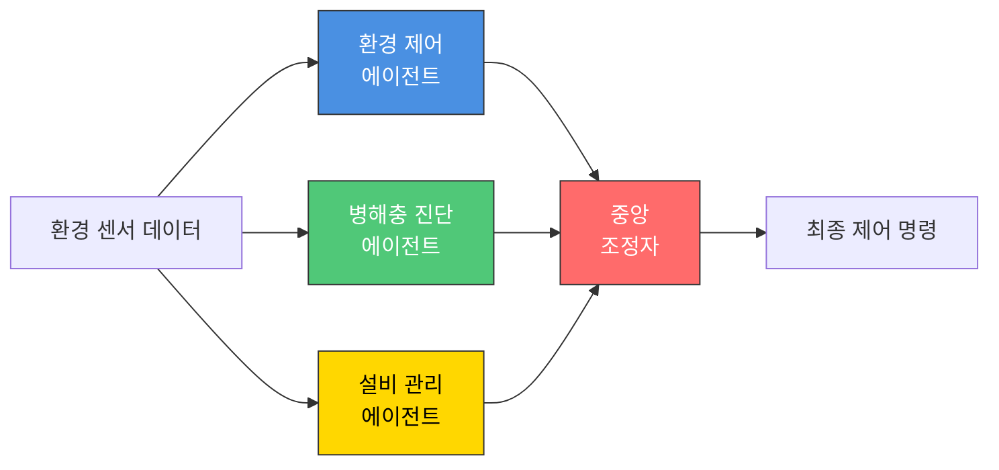
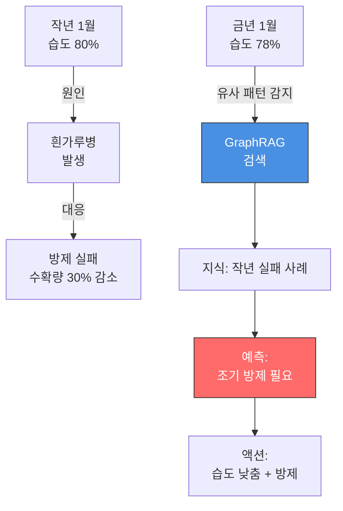
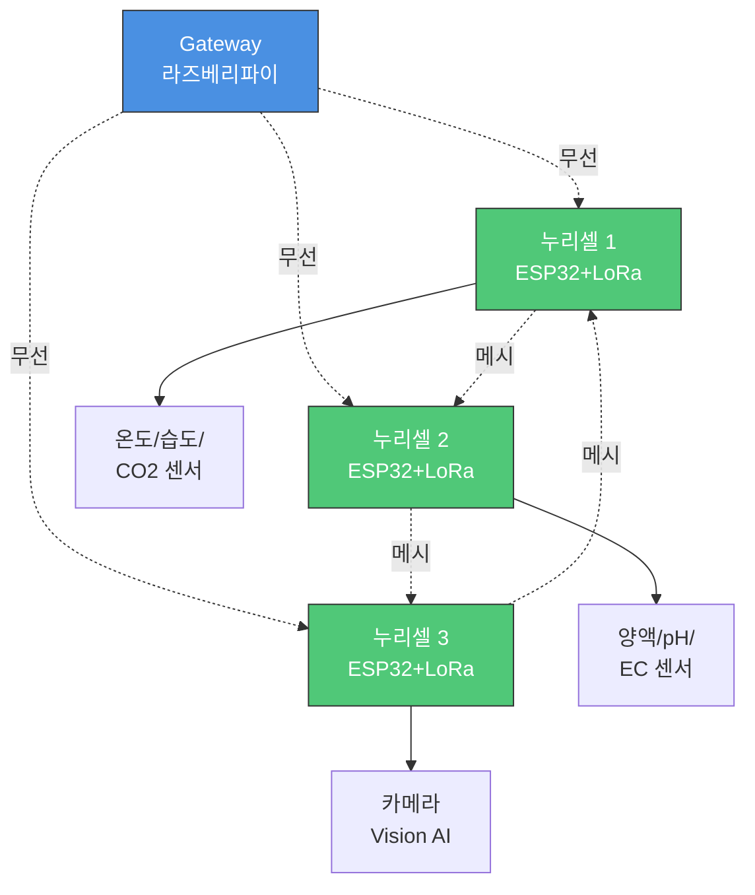
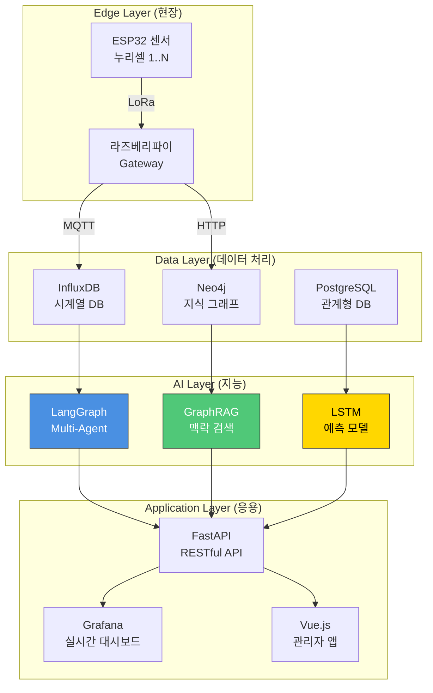

# 누리셀(NuriCell) 기술 스펙

> **3세대 지능형 스마트팜 시스템 - 소프트웨어가 정의하는 농장 (Software Defined Farm)**

---

## 목차

1. [개요](#개요)
2. [왜 3세대 이상인가](#왜-3세대-이상인가)
3. [4대 핵심 차별화 기술](#4대-핵심-차별화-기술)
4. [FarmIoT 아키텍처](#farmiot-아키텍처)
5. [특허 기술](#특허-기술)
6. [기술 스택](#기술-스택)
7. [성능 지표](#성능-지표)
8. [로드맵](#로드맵)

---

## 개요

### 누리셀이란?

**누리셀(NuriCell)**은 기존 1~2세대 스마트팜의 단순 자동화를 넘어, **AI 에이전트 기반 자율 판단**과 **지식 그래프 학습**을 통해 스스로 생각하고 최적화하는 **3세대 지능형 스마트팜 시스템**입니다.

### 핵심 철학

```
하드웨어(H/W)가 아닌 소프트웨어(S/W)가 농장을 정의한다.
데이터(Data)가 아닌 지식(Knowledge)이 의사결정을 한다.
규칙(Rule)이 아닌 에이전트(Agent)가 판단한다.
```

### 개발 배경

- **문제 인식**: 기존 스마트팜은 "온도 30도면 팬 가동" 같은 단순 조건문(Rule-based)으로 작동
- **한계**: 복합적 환경 변화(습도 높은데 비 오는 중 등)에 유연 대처 불가
- **해결**: LLM 기반 Multi-Agent System + GraphRAG로 **상황 판단 능력** 구현

---

## 왜 3세대 이상인가?

### 세대별 스마트팜 비교

| 세대 | 핵심 구동 방식 | 기술 | 비유 | 누리셀 |
|------|---------------|------|------|--------|
| **1세대** | 인간의 손<br/>(원격 제어) | 스마트폰 앱으로<br/>창문 개폐 | 리모컨 | ✅ 기본 포함 |
| **2세대** | 입력된 규칙<br/>(자동화) | 온도 센서 →<br/>자동 환풍기 가동 | 타이머/<br/>온도계 | ✅ 기본 포함 |
| **3세대** | 데이터 기반 AI<br/>(지능) | 생육 데이터 분석 →<br/>최적 환경 설정 | 자율주행차 | ✅ **핵심 기술** |
| **3세대+** | 생성형 에이전트<br/>(협업) | 여러 AI가 협의하여<br/>의사결정 | **AI 농장장** | ✅ **누리셀의 지향점** |

### 정부 정책 기준 (농림축산식품부)

한국 정부는 스마트팜을 3단계로 분류:
- 1세대: 편의성 증진
- 2세대: 생산성 향상
- **3세대**: **지능형/무인화** ← 누리셀이 여기에 해당

---

## 4대 핵심 차별화 기술

### 1. 규칙(Rule) → 판단(Agent) | The Brain 🧠

#### 문제점 (2세대)
```python
# 2세대 스마트팜의 단순 조건문
if temperature > 30:
    fan.on()  # 무조건 팬 가동
```

**한계**: 외부 습도가 높아서 환기하면 곰팡이 위험이 있어도 무조건 팬을 킨다.

#### 누리셀의 해법 (3세대+)

```python
# AI Agent가 상황 판단
context = {
    "온도": 30,
    "외부_습도": 85,
    "날씨": "비 오는 중",
    "작물_상태": "습해 취약 단계"
}

# LangGraph Multi-Agent System
decision = await agent_collaborate(context)
# 결과: "팬 대신 차광막 치고 에어컨 가동"
```

#### 기술 구현

**LangGraph 기반 Multi-Agent System**



**에이전트 역할**:
- **환경 제어 에이전트**: 온도/습도/CO2/조도 최적화
- **병해충 진단 에이전트**: Vision AI로 잎 상태 분석 → 조기 방제
- **설비 관리 에이전트**: "환풍기 돌아가는데 온도 안 떨어짐" → 고장 감지

---

### 2. 데이터(Data) → 지식(Knowledge Graph) | The Memory 🧠

#### 문제점 (2세대)
```sql
-- 단순 시계열 데이터만 저장
SELECT temperature, humidity FROM sensor_log
WHERE timestamp BETWEEN '2025-01-01' AND '2025-01-31';
```

**한계**: 데이터 간 **인과관계**를 모른다. "왜 지난달에 흰가루병이 발생했지?"

#### 누리셀의 해법 (3세대+)

**GraphRAG (Knowledge Graph + Retrieval Augmented Generation)**



**구현 기술**:
- Neo4j 또는 NetworkX로 지식 그래프 구축
- OpenAI Embeddings로 벡터화
- 유사 상황 검색 → LLM에게 맥락 제공

---

### 3. 유선 통합 → 분산형 무선망 | The Nerves ⚡

#### 문제점 (2세대)

```
[중앙 컴퓨터]
    |--- 유선 --- [센서 1]
    |--- 유선 --- [센서 2]
    |--- 유선 --- [센서 3]
```

**한계**:
- 케이블 공사 복잡 (비용 증가)
- 센서 추가 시 기술자 방문 필수
- 확장성 제약

#### 누리셀의 해법 (3세대+)

**ESP32 + LoRa 메시 네트워크 (Plug & Play)**



**기술 스택**:
- **하드웨어**: ESP32 (WiFi + Bluetooth 내장, 저전력)
- **통신**: LoRa (저전력 장거리 통신, 최대 10km)
- **프로토콜**: LoRaWAN (메시 네트워크 - 센서끼리도 통신)
- **아키텍처**: IoT Micro-services Architecture (MSA)

**장점**:
- 센서 추가 → 그냥 꽂기만 하면 자동 인식
- 케이블 불필요 → 시공비 **70% 절감**
- 한 센서 고장 → 다른 센서가 메시로 우회 전송 (자가 치유)

---

### 4. 사후 분석 → 실시간 프로세스 최적화 | The Efficiency 📊

#### 문제점 (2세대)

```
수확 완료 → 데이터 분석 → "아, 양액 공급이 늦었구나" → 다음 재배 때 개선
```

**한계**: 이미 지나간 일, **손실 발생 후 깨달음**

#### 누리셀의 해법 (3세대+)

**MLOps + Process Mining (PM4Py)**

작물의 생육을 하나의 **'비즈니스 프로세스'**로 정의:

```
파종 → 발아 → 생장 → 개화 → 수확
```

각 단계의 **병목 구간**을 실시간으로 탐지:


**탐지 예시**:
- "개화 단계가 예상보다 2일 지연 → 원인 분석: 야간 온도 낮음 → 액션: 난방 강화"

**구현 기술**:
- **MLflow**: 생육 모델 버전 관리 및 실험 추적
- **PM4Py**: 프로세스 마이닝 (병목, 이탈 구간 자동 탐지)
- **LSTM**: 시계열 예측 (수확일 예측 정확도 85%+)

---

## FarmIoT 아키텍처

### 전체 시스템 구조



### 4대 핵심 기능

#### 1. 로컬 재배 현황 모니터링 (Edge Monitoring)

**목표**: 클라우드 서버가 죽어도 농장은 돌아가야 한다.

**기술**:
- **엣지 컴퓨팅**: 라즈베리파이가 로컬에서 1차 데이터 가공
- **Grafana 대시보드**: 구역별/선반별 히트맵 시각화
- **이상 감지**: Anomaly Detection (예: "환풍기 ON인데 온도 안 떨어짐" → 고장 알림)

**화면 예시**:
```
[Zone A - 상추]  [Zone B - 바질]  [Zone C - 병풀]
🟢 22°C 60%     🟡 25°C 70%      🔴 28°C 85%
                                  ⚠️ 습도 과다 경고
```

#### 2. 작물 재배 현황 (Bio-Data Sensing)

**목표**: 환경 데이터(온도) + 생육 데이터(작물 상태) 결합 → **디지털 트윈**

**기술**:
- **양액 관리**: pH/EC 센서 → 생육 주기별 최적 레시피 자동 공급
- **VPD 제어**: 수증기압포차 계산 → 식물 증산 작용 최적화
- **Vision AI**: 카메라로 잎 면적/색상 분석 → "성숙도 85%, 3일 후 수확 적기"

**VPD (Vapor Pressure Deficit) 제어 예시**:
```python
# 단순 습도가 아닌 식물의 '목마름' 측정
VPD = (1 - RH/100) * SVP(T)  # kPa
# 최적 VPD: 0.8~1.2 kPa (작물별 상이)
```

#### 3. 식재 & 출하 예측 모델 (AI Prediction)

**목표**: 미래를 예측하여 **경영 안정성 확보**

**기술**:
- **LSTM 생육 모델**: 과거 성공 재배 데이터 학습 → 수확량/수확일 예측
- **What-If 시뮬레이션**: "온도 1도 올리면?" → ROI 계산
- **SCM 연동**: 예측 출하일을 유통사 ERP 연동 → **선주문(Pre-order)** 확정

**예측 정확도 목표**:
- 수확일: ±2일 이내 (정확도 85%+)
- 수확량: ±10% 이내 (정확도 80%+)

#### 4. RWA 토큰화 (Asset Tokenization)

**목표**: 농산물을 **실물 연계 자산(Real World Asset)**으로 만들기

**기술**:
- **데이터 오라클**: 센서 데이터를 블록체인에 위변조 방지 기록
- **NFT (파종 증명서)**: Rack A-1 상추 1,000포기 권리 NFT 발행
  - 메타데이터: 파종일, 예상 수확일, 실시간 생육 데이터
- **STO (조각 투자)**: 스마트팜 구축 비용 토큰 펀딩 → 수확 수익 배당
- **선물 거래**: "3주 뒤 A등급 상추" 예측 기반 토큰 거래

**예시**:
```json
{
  "nft_id": "NURI-LETTUCE-A1-20260215",
  "작물": "유러피안 상추",
  "수량": "1000포기",
  "파종일": "2026-02-01",
  "예상_수확일": "2026-03-01",
  "실시간_성숙도": "45%",
  "블록체인": "Polygon",
  "소유자": "0x742d35Cc6..."
}
```

---

## 특허 기술

### 출원 완료 (2024.11.14)

#### 1. AI 비전 기반 스마트 식물 재배용 IOT 시스템
- **출원번호**: 10-2024-0161602
- **핵심 기술**:
  - 카메라 기반 작물 생육 자동 모니터링
  - IoT 센서 연동 자율 제어
  - 클라우드 데이터 분석 및 처방 도출

#### 2. 실리콘 모종 지지대
- **출원번호**: 10-2024-0161601
- **핵심 기술**:
  - 재사용 가능한 실리콘 소재
  - 유니버설 디자인 (장애인 작업 편의)
- **비즈니스 모델**: 시스템 판매 + 소모품 별도 판매 (지속 수익)

### 출원 예정

#### 1. AI 에이전트 및 지식 그래프 기반 자율형 스마트팜 제어 시스템

**청구항**:
1. **LLM 기반 멀티 에이전트 시스템**
   - 환경 제어, 병해충 진단, 설비 관리 에이전트가 협업
   - LangGraph를 활용한 상태 관리 및 의사결정

2. **GraphRAG 기반 의사결정**
   - 센서 데이터 + 농업 지식을 지식 그래프로 저장
   - 맥락(Context) 기반 추론: "작년 유사 상황에서 병 발생 → 예방"

3. **LoRa 초연결 무선 메시 네트워크**
   - 유선 없이 센서들이 그물망 연결
   - Plug & Play 확장성

4. **프로세스 마이닝 기반 최적화**
   - 생육 과정을 비즈니스 프로세스로 정의
   - 병목 구간 실시간 탐지 및 개선

#### 2. FarmIoT - 스마트팜 데이터 자산화 시스템

**청구항**:
1. Edge Monitoring (라즈베리파이 + Grafana)
2. Vision AI 생육 판단 + VPD 제어
3. LSTM 수확일 예측 + 시뮬레이션
4. RWA 토큰화 (NFT/STO/선물 거래)

---

## 기술 스택

### 하드웨어 (Hardware)

| 구성 요소 | 모델 | 사양 | 역할 |
|----------|------|------|------|
| **Gateway** | 라즈베리파이 4B | 4GB RAM | 엣지 컴퓨팅, MQTT 브로커 |
| **센서 노드** | ESP32 | 듀얼 코어 240MHz | LoRa 통신, 센서 데이터 수집 |
| **통신 모듈** | LoRa SX1276 | 10km 장거리 | 무선 메시 네트워크 |
| **환경 센서** | DHT22, SCD30 | 온도/습도/CO2 | 환경 데이터 |
| **양액 센서** | pH/EC 센서 | - | 영양 상태 측정 |
| **카메라** | 라즈베리파이 카메라 v2 | 8MP | Vision AI 생육 판단 |

### 소프트웨어 (Software)

#### Edge Layer

| 기술 | 버전 | 용도 |
|------|------|------|
| **Raspbian OS** | Bullseye | 라즈베리파이 OS |
| **Arduino (ESP32)** | 2.0+ | 센서 노드 펌웨어 |
| **MQTT** | Mosquitto | 센서 데이터 전송 |

#### Backend

| 기술 | 버전 | 용도 |
|------|------|------|
| **Python** | 3.11+ | AI 모델, 데이터 처리 |
| **FastAPI** | 0.110+ | RESTful API 서버 |
| **LangChain** | 0.1.0+ | LLM 오케스트레이션 |
| **LangGraph** | 0.0.40+ | Multi-Agent 워크플로우 |

#### Database

| 기술 | 버전 | 용도 |
|------|------|------|
| **InfluxDB** | 2.7+ | 시계열 데이터 (센서 로그) |
| **Neo4j** | 5.0+ | 지식 그래프 (GraphRAG) |
| **PostgreSQL** | 15+ | 관계형 데이터 (사용자, 작물) |

#### AI/ML

| 기술 | 버전 | 용도 |
|------|------|------|
| **OpenAI GPT-4** | - | LLM 에이전트 두뇌 |
| **TensorFlow** | 2.15+ | Vision AI, LSTM 모델 |
| **MLflow** | 2.10+ | 모델 버전 관리 |
| **PM4Py** | 2.7+ | 프로세스 마이닝 |

#### Frontend

| 기술 | 버전 | 용도 |
|------|------|------|
| **Grafana** | 10.0+ | 실시간 대시보드 |
| **Vue.js** | 3.4+ | 관리자 웹 앱 |
| **Tailwind CSS** | 3.4+ | UI 스타일링 |

---

## 성능 지표

### 목표 성능 (KPI)

#### 정확도 (Accuracy)

| 지표 | 목표 | 현재 (2026.02) |
|------|------|----------------|
| 수확일 예측 정확도 | ±2일 이내 (85%+) | 개발 중 |
| 수확량 예측 정확도 | ±10% 이내 (80%+) | 개발 중 |
| 병해충 조기 탐지율 | 90%+ | 개발 중 |

#### 효율성 (Efficiency)

| 지표 | 목표 | 현재 |
|------|------|------|
| 에너지 효율 개선 | 30% 절감 (일반 농법 대비) | 파일럿 운영 예정 |
| 물 사용 효율 | 50% 절감 (수경재배) | 설계 완료 |
| 노동 시간 절감 | 40% 절감 (AI 자동화) | 예상치 |

#### 안정성 (Reliability)

| 지표 | 목표 | 현재 |
|------|------|------|
| 시스템 가동률 (Uptime) | 99.5%+ | - |
| 센서 고장 자가 치유 | 메시 네트워크 우회 전송 | 설계 완료 |
| 데이터 손실률 | 0.1% 이하 | - |

---

## 로드맵

### Phase 1: MVP 개발 (2026 Q1~Q2)

**목표**: 기본 모니터링 + 자동 제어

- [x] 하드웨어 설계 (ESP32 + LoRa)
- [ ] 센서 네트워크 구축
- [ ] MQTT 데이터 수집 파이프라인
- [ ] Grafana 대시보드 (온도/습도/CO2)
- [ ] 기본 자동 제어 (환풍기/양액)

### Phase 2: AI 고도화 (2026 Q3~Q4)

**목표**: Multi-Agent + GraphRAG

- [ ] LangGraph Multi-Agent 시스템 개발
- [ ] Neo4j 지식 그래프 구축
- [ ] Vision AI 병해충 진단 모델 (YOLOv8)
- [ ] LSTM 수확일 예측 모델 (정확도 85%+)

### Phase 3: 스케일 업 (2027)

**목표**: 다중 농장 관리 + 토큰화

- [ ] 멀티사이트 통합 모니터링
- [ ] 클라우드 마이그레이션 (AWS/GCP)
- [ ] RWA 토큰화 시스템 (NFT/STO)
- [ ] 기술 라이선싱 사업 모델 수립

---

## 경쟁 우위 요약

### Farm8 (국내 1위) vs 누리팜

| 구분 | Farm8 | **누리팜 (누리셀)** |
|------|-------|-------------------|
| **핵심 기술** | H/W 자동화 | **S/W & AI (3세대)** |
| **생산성** | 표준 | **3~5배** (누리셀 적층) |
| **작물** | 저가 샐러드 | **고가 원료** (병풀) |
| **AI 활용** | 부분적 | **Multi-Agent 전면** |
| **통신** | 유선 중심 | **LoRa 무선 메시** |
| **데이터** | 로그 저장 | **지식 그래프** |
| **확장성** | 기술자 필요 | **Plug & Play** |
| **사회적 가치** | 일반 | **장애인 고용 72.7%** |

---

## 결론

누리셀(NuriCell)은 단순한 **자동화 시스템**이 아닌, **AI가 생각하고 학습하며 스스로 최적화하는 3세대 지능형 스마트팜**입니다.

### 핵심 차별화 3요소

1. **AI Brain**: LangGraph Multi-Agent가 상황 판단
2. **Knowledge Memory**: GraphRAG가 과거 경험 학습
3. **Wireless Nerves**: LoRa 메시 네트워크로 무한 확장

### 비즈니스 임팩트

- **생산성**: 3~5배 향상 (수직 적층 + AI 최적화)
- **비용 절감**: 시공비 70% 감소 (무선 네트워크)
- **사회적 가치**: 장애인 일자리 창출 (표준사업장)

---

**작성**: 2026-02-10
**작성자**: Gagahoho, Inc. AI 에이전트
**버전**: 1.0
**관련 문서**: `docs/epic.md`, `docs/whitepaper_goesan.md`
