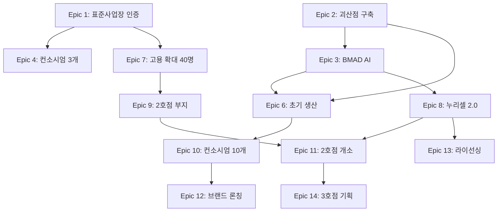

# NURI 프로젝트 Epic 기획

> **Ultra Work Mode**: BMAD 방법론 기반 Epic 도출
>
> 작성일: 2026-02-10
> 작성자: BMAD Elite 4 Planning Agent

---

## Epic 도출 방법론

### Epic 정의 원칙
1. **가치 중심**: 사용자 또는 비즈니스에 명확한 가치 제공
2. **측정 가능**: 완료 여부를 객관적으로 측정 가능
3. **Phase 정렬**: 각 Epic은 특정 Phase의 목표에 기여
4. **독립성**: Epic 간 의존성 최소화

### Epic 우선순위 매트릭스

```
높은 가치 │ E1, E2, E3 │ E7, E8
         │            │
─────────┼────────────┼─────────
낮은 가치 │ E5, E6     │ E9, E10
         │            │
         낮은 난이도   높은 난이도
```

---

## Phase 1: Foundation Epics (6개월)

### Epic 1: 장애인표준사업장 인증 획득
**우선순위**: P0 (최고)
**비즈니스 가치**: 매우 높음
**기술 난이도**: 낮음

#### 목표
고용노동부로부터 장애인표준사업장 정식 인증을 받아 법적 지위 확보 및 정부 지원 수혜

#### 성공 기준
- [ ] 장애인 근로자 20명 이상 채용
- [ ] 장애인 고용률 60% 이상 달성
- [ ] 고용노동부 심사 통과
- [ ] 인증서 발급

#### User Stories (7개)
1. As a **인사담당자**, I want to 장애인 채용 공고를 게시하고 지원자를 관리할 수 있다
2. As a **인사담당자**, I want to 장애 유형별 근무 환경을 설계할 수 있다
3. As a **인사담당자**, I want to 4대 보험 가입 절차를 자동화할 수 있다
4. As a **법무팀**, I want to 표준사업장 인증 서류를 준비할 수 있다
5. As a **시설관리자**, I want to 장애인 친화 시설(경사로, 엘리베이터)을 구축할 수 있다
6. As a **대표**, I want to 고용노동부 심사 일정을 관리할 수 있다
7. As a **대표**, I want to 인증 획득 후 정부 지원금을 신청할 수 있다

#### 예상 기간
3개월 (2026년 2월 ~ 4월)

---

### Epic 2: NuriFarm 괴산점 스마트팜 구축
**우선순위**: P0 (최고)
**비즈니스 가치**: 매우 높음
**기술 난이도**: 높음

#### 목표
괴산점 부지에 누리셀 적층형 스마트팜을 구축하고 AI 시스템 통합

#### 성공 기준
- [ ] 부지 2,000평 확보 및 인허가 완료
- [ ] 하우스 500평 시공 완료
- [ ] 누리셀 1차 모듈 10기 설치
- [ ] BMAD Elite 4 센서 네트워크 구축
- [ ] 초기 작물 재배 시작 (병풀나물, 바질, 쌈채소)

#### User Stories (12개)
1. As a **시설관리자**, I want to 부지 매입 및 등기 절차를 완료할 수 있다
2. As a **시설관리자**, I want to 농업시설 인허가를 신청할 수 있다
3. As a **건축담당자**, I want to 하우스 설계도를 작성할 수 있다
4. As a **건축담당자**, I want to 하우스 시공을 감리할 수 있다
5. As a **기술팀**, I want to 누리셀 모듈을 설계하고 제작할 수 있다
6. As a **기술팀**, I want to 누리셀을 하우스 내부에 설치할 수 있다
7. As a **AI팀**, I want to 온도·습도·CO2 센서를 설치할 수 있다
8. As a **AI팀**, I want to BMAD Elite 4 시스템을 서버에 배포할 수 있다
9. As a **AI팀**, I want to 센서 데이터를 실시간으로 수집할 수 있다
10. As a **생산관리자**, I want to 초기 작물 종자를 파종할 수 있다
11. As a **생산관리자**, I want to 관수·양액 시스템을 테스트할 수 있다
12. As a **품질관리자**, I want to 작물 생육 상태를 모니터링할 수 있다

#### 예상 기간
4개월 (2026년 2월 ~ 5월)

---

### Epic 3: BMAD Elite 4 AI 시스템 개발 및 통합
**우선순위**: P0 (최고)
**비즈니스 가치**: 높음
**기술 난이도**: 매우 높음

#### 목표
4개 AI 에이전트를 개발하고 스마트팜 운영에 통합

#### 성공 기준
- [ ] Planner, Architect, Builder, Critic 에이전트 개발
- [ ] 센서 데이터 자동 수집 파이프라인 구축
- [ ] 환경 제어 자동화 (온도, 습도, CO2, 조도)
- [ ] 병충해 조기 진단 시스템 (이미지 인식)
- [ ] LangSmith 모니터링 연동

#### User Stories (10개)
1. As a **AI 개발자**, I want to Planner 에이전트를 개발할 수 있다
2. As a **AI 개발자**, I want to Architect 에이전트를 개발할 수 있다
3. As a **AI 개발자**, I want to Builder 에이전트를 개발할 수 있다
4. As a **AI 개발자**, I want to Critic 에이전트를 개발할 수 있다
5. As a **AI 개발자**, I want to LangGraph 워크플로우를 구축할 수 있다
6. As a **DevOps**, I want to AI 시스템을 AWS/클라우드에 배포할 수 있다
7. As a **생산관리자**, I want to AI가 제안한 환경 설정을 확인하고 적용할 수 있다
8. As a **품질관리자**, I want to AI가 탐지한 병충해 알림을 받을 수 있다
9. As a **대표**, I want to AI 시스템 성능 대시보드를 볼 수 있다
10. As a **대표**, I want to LangSmith에서 AI 실행 이력을 추적할 수 있다

#### 예상 기간
5개월 (2026년 2월 ~ 6월)

---

### Epic 4: 컨소시엄 파트너십 확보 (3개 기관)
**우선순위**: P1 (높음)
**비즈니스 가치**: 매우 높음
**기술 난이도**: 낮음

#### 목표
공공기관 또는 대기업과 컨소시엄형 사업장 계약 체결

#### 성공 기준
- [ ] 파트너 타겟 리스트 30개 작성
- [ ] 제안서 발송 및 미팅 10회 이상
- [ ] 계약 체결 3개 기관
- [ ] 연간 납품 계약 (농산물 또는 고용 연계)

#### User Stories (6개)
1. As a **영업팀**, I want to 파트너 후보 리스트를 작성할 수 있다
2. As a **영업팀**, I want to 컨소시엄 제안서를 작성할 수 있다
3. As a **영업팀**, I want to 파트너 미팅 일정을 관리할 수 있다
4. As a **법무팀**, I want to 컨소시엄 계약서를 검토할 수 있다
5. As a **대표**, I want to 계약 체결 현황을 대시보드에서 볼 수 있다
6. As a **영업팀**, I want to 파트너에게 월간 활동 보고서를 제출할 수 있다

#### 예상 기간
6개월 (2026년 2월 ~ 7월, 지속)

---

### Epic 5: 웹사이트 및 브랜딩 구축
**우선순위**: P2 (중간)
**비즈니스 가치**: 중간
**기술 난이도**: 중간

#### 목표
NURI 공식 웹사이트 구축 및 브랜드 아이덴티티 확립

#### 성공 기준
- [ ] Rails 기반 웹사이트 런칭
- [ ] 메인 페이지, 괴산점 상세 페이지, 파트너십 페이지 완성
- [ ] 로고, CI/VI 디자인 완료
- [ ] SEO 최적화 (검색 노출)
- [ ] 월 방문자 1,000명 이상

#### User Stories (8개)
1. As a **개발자**, I want to Rails 프로젝트를 초기화할 수 있다
2. As a **개발자**, I want to 메인 페이지를 개발할 수 있다
3. As a **개발자**, I want to 괴산점 상세 페이지를 개발할 수 있다
4. As a **디자이너**, I want to 로고 및 CI를 디자인할 수 있다
5. As a **마케터**, I want to SEO 키워드를 설정할 수 있다
6. As a **마케터**, I want to Google Analytics를 연동할 수 있다
7. As a **콘텐츠 작성자**, I want to 블로그 포스트를 작성할 수 있다
8. As a **방문자**, I want to 파트너십 문의 폼을 제출할 수 있다

#### 예상 기간
2개월 (2026년 2월 ~ 3월)

---

### Epic 6: 초기 생산 및 Farm8 납품 시작
**우선순위**: P1 (높음)
**비즈니스 가치**: 높음
**기술 난이도**: 중간

#### 목표
병풀나물, 바질, 쌈채소 첫 수확 및 Farm8에 납품 시작

#### 성공 기준
- [ ] 첫 수확 완료 (파종 후 45~60일)
- [ ] Farm8 MOU 체결
- [ ] 초기 납품 월 1톤 달성
- [ ] 품질 검사 통과 (무농약 인증 준비)

#### User Stories (7개)
1. As a **생산관리자**, I want to 작물별 생육 계획을 수립할 수 있다
2. As a **생산관리자**, I want to 수확 시기를 AI로 예측할 수 있다
3. As a **품질관리자**, I want to 수확물 품질을 검사할 수 있다
4. As a **포장팀**, I want to 수확물을 포장할 수 있다
5. As a **영업팀**, I want to Farm8과 MOU를 체결할 수 있다
6. As a **물류팀**, I want to 출하 스케줄을 관리할 수 있다
7. As a **대표**, I want to 월 매출을 대시보드에서 확인할 수 있다

#### 예상 기간
3개월 (2026년 4월 ~ 6월)

---

## Phase 2: Growth Epics (6개월)

### Epic 7: 괴산점 고용 확대 (40명 달성)
**우선순위**: P0 (최고)
**비즈니스 가치**: 매우 높음
**기술 난이도**: 중간

#### 목표
장애인 근로자 20명 추가 채용 및 조직 안정화

#### 성공 기준
- [ ] 장애인 근로자 40명 채용
- [ ] 근로자 정착률 85% 이상
- [ ] 팀 조직화 (재배팀, 수확팀, 품질관리팀)
- [ ] 중간관리자 3명 임명

#### 예상 기간
6개월 (2026년 8월 ~ 2027년 1월)

---

### Epic 8: 누리셀 2.0 개발 및 특허 출원
**우선순위**: P1 (높음)
**비즈니스 가치**: 높음
**기술 난이도**: 매우 높음

#### 목표
누리셀 1.0 개선 버전 개발 및 기술 특허 확보

#### 성공 기준
- [ ] 누리셀 2.0 프로토타입 완성
- [ ] 생산성 3~5배 검증 (실험 데이터)
- [ ] 특허 출원 1건
- [ ] 파일럿 운영 (괴산점 일부 적용)

#### 예상 기간
6개월 (2026년 8월 ~ 2027년 1월)

---

### Epic 9: 2호점 부지 선정 및 착공
**우선순위**: P0 (최고)
**비즈니스 가치**: 매우 높음
**기술 난이도**: 중간

#### 목표
2호점 위치 선정, 부지 확보, 인허가 및 착공

#### 성공 기준
- [ ] 후보지 3곳 검토 (경기, 강원, 충남)
- [ ] 부지 확보 (최소 1,500평)
- [ ] 인허가 완료
- [ ] 착공 시작

#### 예상 기간
6개월 (2026년 8월 ~ 2027년 1월)

---

### Epic 10: 컨소시엄 파트너 10개 기관 달성
**우선순위**: P1 (높음)
**비즈니스 가치**: 매우 높음
**기술 난이도**: 낮음

#### 목표
컨소시엄 파트너를 3개에서 10개로 확대

#### 성공 기준
- [ ] 신규 파트너 7개 계약 체결
- [ ] 기존 파트너 만족도 4.0/5.0 이상
- [ ] 연간 납품 계약 총 5억 원 이상

#### 예상 기간
6개월 (2026년 8월 ~ 2027년 1월)

---

## Phase 3: Scale Epics (12개월)

### Epic 11: 2호점 개소 및 운영 시작
**우선순위**: P0 (최고)
**비즈니스 가치**: 매우 높음
**기술 난이도**: 높음

#### 목표
2호점 시설 완공, 장애인 근로자 30명 채용, 생산 시작

#### 성공 기준
- [ ] 2호점 시설 완공
- [ ] 장애인 근로자 30명 채용
- [ ] 누리셀 2.0 정식 적용
- [ ] 월 매출 5,000만 원 달성

#### 예상 기간
6개월 (2027년 2월 ~ 7월)

---

### Epic 12: 자체 브랜드 론칭
**우선순위**: P1 (높음)
**비즈니스 가치**: 높음
**기술 난이도**: 중간

#### 목표
NURI 자체 농산물 브랜드 론칭 및 B2C 판매 시작

#### 성공 기준
- [ ] 브랜드 네이밍 및 패키지 디자인 완료
- [ ] 온라인 스토어 오픈
- [ ] 대형마트 입점 1곳 이상
- [ ] 월 B2C 매출 1,000만 원 이상

#### 예상 기간
6개월 (2027년 2월 ~ 7월)

---

### Epic 13: 기술 라이선싱 사업 모델 구축
**우선순위**: P2 (중간)
**비즈니스 가치**: 중간
**기술 난이도**: 낮음

#### 목표
누리셀 + BMAD Elite 4 기술을 타 스마트팜에 라이선싱

#### 성공 기준
- [ ] 라이선스 계약서 템플릿 작성
- [ ] 타겟 고객 리스트 30개 작성
- [ ] 라이선스 계약 1건 체결
- [ ] 라이선싱 수익 5,000만 원 이상

#### 예상 기간
6개월 (2027년 2월 ~ 7월)

---

### Epic 14: 3호점 기획 착수
**우선순위**: P1 (높음)
**비즈니스 가치**: 높음
**기술 난이도**: 중간

#### 목표
3호점 위치 선정 및 사업 계획 수립

#### 성공 기준
- [ ] 후보지 3곳 검토
- [ ] 사업 타당성 분석 완료
- [ ] 부지 옵션 계약 체결

#### 예상 기간
6개월 (2027년 8월 ~ 2028년 1월)

---

## Epic 우선순위 요약

### P0 (최고 우선순위) - 반드시 완료
- Epic 1: 장애인표준사업장 인증 획득
- Epic 2: NuriFarm 괴산점 스마트팜 구축
- Epic 3: BMAD Elite 4 AI 시스템 개발
- Epic 7: 괴산점 고용 확대 (40명)
- Epic 9: 2호점 부지 선정 및 착공
- Epic 11: 2호점 개소 및 운영 시작

### P1 (높음) - 가능한 한 완료
- Epic 4: 컨소시엄 파트너십 확보
- Epic 6: 초기 생산 및 Farm8 납품
- Epic 8: 누리셀 2.0 개발 및 특허
- Epic 10: 컨소시엄 파트너 10개 달성
- Epic 12: 자체 브랜드 론칭
- Epic 14: 3호점 기획 착수

### P2 (중간) - 선택적 완료
- Epic 5: 웹사이트 및 브랜딩 구축
- Epic 13: 기술 라이선싱 사업 모델

---

## Epic 간 의존성 다이어그램



---

**문서 버전**: 1.0
**다음 단계**: User Story 및 Task 분해 (tasks.md)
