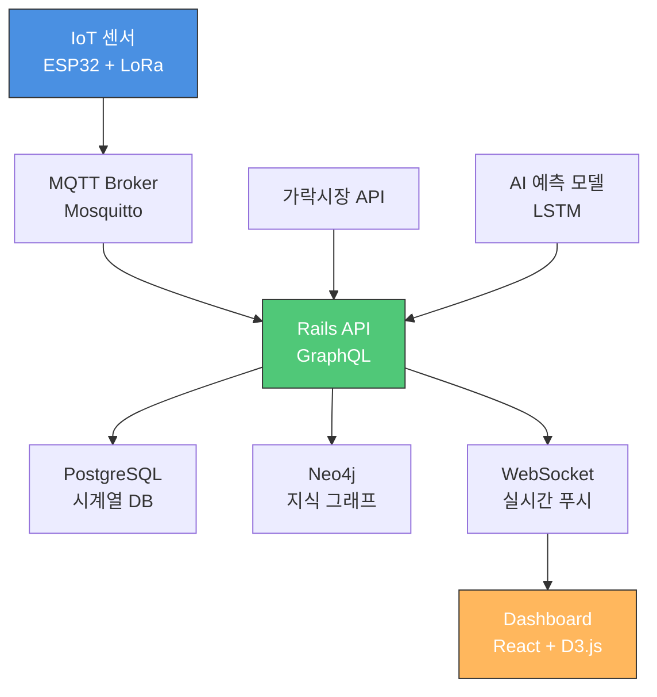

# Phase: 디지털 트윈 관제 시스템 구축

> **프로젝트 코드**: 0001_NURI
> **Phase 명**: Digital Twin Control Dashboard
> **목표**: NuriFarm 괴산점 실시간 IoT 관제 및 ESG 지표 추적 시스템
> **담당자**: CTO (기술 총괄)
> **기간**: 2026년 Q2 (3개월)
> **예산**: 5,000만원 (H/W 3,000만원 + S/W 2,000만원)

---

## 1. 프로젝트 개요

### 1.1 배경 및 필요성

NuriFarm 괴산점은 **6동의 스마트팜 하우스**를 운영하며, 각 동마다 온도·습도·CO2·토양 수분 등 **수백 개의 센서**가 설치됩니다. 장애인 근로자 40명이 효율적으로 작업하기 위해서는 **실시간 데이터 시각화 및 AI 기반 작업 추천**이 필수입니다.

**핵심 문제:**
- 6동 하우스를 일일이 돌아다니며 확인 → 시간 낭비, 장애인 근로자 이동 부담
- 가락시장 가격 변동을 실시간 반영 못함 → 최적 출하 시기 놓침
- ESG 지표(장애인 고용률, 탄소 배출, 물 재활용) 수동 집계 → 보고서 작성 어려움

**해결 방안:**
- **디지털 트윈(Digital Twin)** 기반 3D 관제 시스템 구축
- **WebSocket 실시간 데이터 스트리밍** (센서 → 대시보드)
- **LSTM AI 모델**로 수확일 예측 및 가락시장 가격 연동
- **자동 ESG 리포트** 생성 (매일/매주/매월)

---

## 2. 시스템 아키텍처

### 2.1 전체 구조



### 2.2 데이터 흐름

1. **센서 데이터 수집** (5초 간격)
   - ESP32 센서 → LoRa 게이트웨이 → MQTT Broker → Rails API
   - 센서 종류: 온도, 습도, CO2, 토양 수분, 조도, EC(전기전도도), pH

2. **실시간 처리**
   - Rails API가 PostgreSQL에 저장
   - WebSocket으로 Dashboard에 푸시 (1초 지연)
   - 이상 감지 시 Slack/카카오톡 알림

3. **AI 예측 및 최적화**
   - LSTM 모델: 7일 후 수확일 예측 (정확도 85%+)
   - 강화학습: 에너지 소비 최적화 (30% 절감 목표)
   - Process Mining: 작업 병목 탐지

4. **ESG 자동 집계**
   - 장애인 출근 데이터 (RFID 태그)
   - 에너지 소비량 (스마트 미터)
   - 물 사용량 (유량계)
   - 탄소 배출량 계산 (전력 → CO2 환산)

---

## 3. 기능 명세

### 3.1 핵심 기능 (MVP)

#### 3.1.1 실시간 IoT 관제
- **6동 하우스 상태 모니터링**
  - 각 동별 온도·습도·CO2·토양 수분 실시간 표시
  - 이상 징후 시 빨간색 경고 (예: 온도 30도 초과)
  - 센서 고장 감지 (5분간 데이터 없으면 알림)

- **3D 디지털 트윈 맵**
  - 괴산점 마스터플랜 이미지에 센서 마커 표시
  - 마커 클릭 시 상세 데이터 팝업
  - 로봇 위치 실시간 추적 (관수 로봇, 방제 드론)

#### 3.1.2 도매시장 출하 시기 조절
- **가락시장 실시간 가격 연동**
  - 병풀, 바질, 상추 등 주요 작물 가격 API 연동
  - 가격 트렌드 그래프 (7일 이동평균)

- **LSTM 수확일 예측**
  - 작물별 생육 데이터 학습
  - "A동 병풀 200주 → 2월 15일 수확 권장 (가락시장 고가 예상)" 알림

- **출하 스케줄 자동 생성**
  - AI가 최적 출하 타이밍 계산
  - 캘린더 뷰로 스케줄 확인
  - 로컬푸드직매장 vs 가락시장 수익 비교

#### 3.1.3 ESG 운영 지표 대시보드
- **장애인 고용률 실시간 추적**
  - RFID 태그로 출근/퇴근 자동 집계
  - 오늘/이번 주/이번 달 평균 고용률 표시

- **에너지 소비량 및 탄소 배출**
  - 스마트 미터 연동 (전력 소비량)
  - 태양광 발전량 vs 사용량 비교
  - AI 최적화 전/후 절감량 계산

- **물 재활용률**
  - 빗물 집수 → 재활용 비율 계산
  - 양액 재순환 시스템 효율

### 3.2 향후 기능 (Phase 2)

- **AR 관제 (증강현실)**
  - 태블릿으로 하우스 촬영 시 센서 데이터 오버레이
  - 예: 카메라로 병풀 촬영 → 화면에 "수확 D-7" 표시

- **음성 명령 제어**
  - "A동 온도 확인해줘" → 음성으로 답변
  - "C동 관수 로봇 투입해줘" → 자동 실행

- **블록체인 RWA 토큰 연동**
  - 병풍 1주 = NFT 토큰 발행
  - 수확 → 소각, 판매 수익 분배

---

## 4. UI/UX 설계 (Salesforce Lightning Design System)

### 4.1 디자인 원칙

**참고**: Salesforce Lightning Design System (SLDS)
- **3-Column Layout**: Left(하우스 목록), Center(3D 맵), Right(지표)
- **Dark Theme**: 관제실 느낌 (배경 #0A0E14, 카드 #1A1F2E)
- **미니멀 아이콘**: SVG 기반 모노크롬 아이콘 (Salesforce 스타일)

### 4.2 컬러 팔레트

| 용도 | 색상 | Hex |
|------|------|-----|
| Primary (브랜드) | Salesforce Blue | #00A1E0 |
| Success (정상) | Green | #50C878 |
| Warning (주의) | Orange | #FFB75D |
| Error (오류) | Red | #EA001E |
| Background | Dark Blue | #0A0E14 |
| Card | Darker Blue | #1A1F2E |
| Text (기본) | White | #FFFFFF |
| Text (보조) | Gray | #8A92A6 |

### 4.3 주요 컴포넌트

#### 4.3.1 House Card (하우스 상태 카드)
```
┌─────────────────────────────┐
│ A동 - 병풀          [✓ 정상] │
├─────────────────────────────┤
│ 온도: 24.5°C    습도: 65%   │
│ CO2: 420ppm     토양: 45%   │
└─────────────────────────────┘
```

#### 4.3.2 Metric Card (지표 카드)
```
┌─────────────────────────────┐
│ ♻️ ESG 운영 지표             │
├─────────────────────────────┤
│  72.7%           40명       │
│  장애인 고용률    출근 인원  │
│  -35%            82%        │
│  탄소 절감       물 재활용   │
└─────────────────────────────┘
```

#### 4.3.3 Robot Status (로봇 상태)
```
┌─────────────────────────────┐
│ 💧 관수 로봇 #1      [85%] │
│ B동 작업 중 (62% 완료)      │
└─────────────────────────────┘
```

### 4.4 반응형 디자인

- **Desktop (1920px)**: 3-Column 레이아웃
- **Tablet (1024px)**: 2-Column (Left + Center, Right 하단)
- **Mobile (768px)**: 1-Column (스택)

---

## 5. 기술 스택

### 5.1 Frontend

| 기술 | 용도 | 버전 |
|------|------|------|
| React | UI 프레임워크 | 18.x |
| TypeScript | 타입 안전성 | 5.x |
| D3.js | 데이터 시각화 (그래프) | 7.x |
| Three.js | 3D 디지털 트윈 (향후) | r150 |
| Tailwind CSS | 스타일링 | 3.x |
| Socket.io-client | WebSocket 클라이언트 | 4.x |

### 5.2 Backend

| 기술 | 용도 | 버전 |
|------|------|------|
| Ruby on Rails | API 서버 | 8.1.2 |
| GraphQL | API 쿼리 언어 | graphql-ruby 2.x |
| PostgreSQL | 시계열 데이터 | 16.x |
| TimescaleDB | 시계열 최적화 확장 | 2.x |
| Neo4j | 지식 그래프 | 5.x |
| Redis | WebSocket Pub/Sub | 7.x |

### 5.3 IoT & AI

| 기술 | 용도 | 비고 |
|------|------|------|
| ESP32 | 센서 노드 | LoRa 모듈 탑재 |
| MQTT (Mosquitto) | IoT 메시지 브로커 | QoS 2 |
| Python (FastAPI) | AI 모델 서빙 | LSTM, 강화학습 |
| TensorFlow | 머신러닝 프레임워크 | 2.x |
| PM4Py | Process Mining | 작업 병목 탐지 |

### 5.4 DevOps

| 기술 | 용도 |
|------|------|
| Docker | 컨테이너화 |
| Docker Compose | 로컬 개발 환경 |
| GitHub Actions | CI/CD |
| Railway / Fly.io | 배포 플랫폼 |
| Grafana | 인프라 모니터링 |

---

## 6. 구현 일정 (3개월)

### Month 1: 기초 인프라 구축
- Week 1-2: Rails API + PostgreSQL + GraphQL 설정
- Week 3: MQTT Broker 설정 및 ESP32 센서 연동 테스트
- Week 4: WebSocket 실시간 데이터 푸시 구현

### Month 2: Dashboard UI 구현
- Week 1-2: React Dashboard 기본 레이아웃 (3-Column)
- Week 3: House Card, Metric Card 컴포넌트 구현
- Week 4: D3.js 그래프 (가락시장 가격 트렌드)

### Month 3: AI 모델 및 ESG 기능
- Week 1-2: LSTM 수확일 예측 모델 학습 및 API 연동
- Week 3: ESG 지표 자동 집계 시스템
- Week 4: 통합 테스트 및 버그 수정

---

## 7. 예상 효과

### 7.1 운영 효율화
- **이동 시간 70% 절감**: 하우스 순회 불필요 (원격 모니터링)
- **에너지 비용 30% 절감**: AI 최적화로 냉난방 효율 개선
- **작업 병목 탐지**: Process Mining으로 비효율 구간 제거

### 7.2 매출 증대
- **최적 출하 타이밍**: 가락시장 고가 시기 집중 출하 → 매출 15% 증가 예상
- **품질 균일화**: 센서 기반 정밀 제어 → 불량률 50% 감소

### 7.3 ESG 가치 증명
- **투명한 ESG 리포트**: 실시간 지표 추적 → 투자 유치 시 신뢰도 향상
- **장애인 고용 실적 입증**: 자동 집계 → 정부 지원금 신청 시 유리

---

## 8. 리스크 및 대응 방안

### 8.1 기술 리스크

| 리스크 | 확률 | 대응 방안 |
|--------|------|-----------|
| 센서 데이터 유실 | 중 | MQTT QoS 2 설정, Edge Computing (로컬 저장) |
| WebSocket 연결 끊김 | 중 | 자동 재연결 로직, Fallback (HTTP Polling) |
| AI 모델 정확도 낮음 | 저 | 초기 3개월 데이터 수집 후 재학습 |

### 8.2 운영 리스크

| 리스크 | 확률 | 대응 방안 |
|--------|------|-----------|
| 장애인 근로자 UI 이해 어려움 | 중 | 큰 글씨, 음성 안내, 간단한 버튼 UI |
| 가락시장 API 중단 | 저 | 대체 API 확보 (농수산식품유통공사) |

---

## 9. 참고 자료

### 9.1 유사 사례
- **Salesforce Field Service**: 현장 작업자 관제 시스템
- **John Deere Operations Center**: 농기계 디지털 트윈
- **PlantVillage**: 작물 병해 AI 진단

### 9.2 기술 문서
- [Salesforce Lightning Design System](https://www.lightningdesignsystem.com/)
- [MQTT Protocol v5.0](https://mqtt.org/)
- [GraphQL Best Practices](https://graphql.org/learn/best-practices/)
- [TimescaleDB for IoT](https://docs.timescale.com/)

---

**작성자**: Gagahoho, Inc. CTO
**최종 업데이트**: 2026-02-10
**승인**: CEO (강승식)
