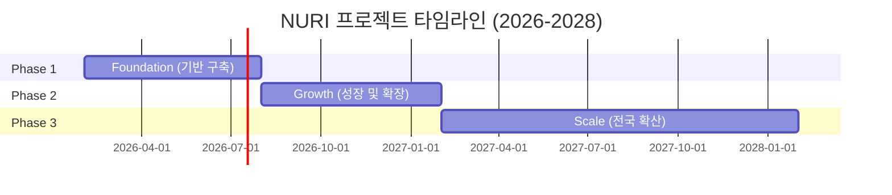

# NURI 프로젝트 Phase 기획

> **Ultra Work Mode**: BMAD 방법론 기반 심도 있는 기획
>
> 작성일: 2026-02-10
> 작성자: BMAD Elite 4 Planning Agent

---

## 🎯 프로젝트 비전

**"2030년까지 대한민국 10개 지역에 NURI 스마트팜을 구축하여, 1,000명의 장애인에게 일자리를 제공하고, AI 농업 기술을 전 세계에 수출하는 글로벌 소셜벤처로 성장한다."**

---

## 📊 Phase 전체 구조

### Phase 구분 전략

NURI 프로젝트는 **3개의 주요 Phase**로 구분하며, 각 Phase는 **6개월 단위**로 진행됩니다.

---

## Phase 1: Foundation (기반 구축)
**기간**: 2026년 2월 ~ 2026년 7월 (6개월)

### 목표
- NuriFarm 괴산점 개소 및 안정화
- 장애인표준사업장 정식 인증 획득
- 핵심 기술(BMAD Elite 4 + 누리셀) 검증
- 초기 컨소시엄 파트너 확보 (3개 기관)

### 성공 지표 (KPI)
| 지표 | 목표 | 측정 방법 |
|------|------|-----------|
| 장애인 고용 | 20명 이상 | 4대 보험 가입자 수 |
| 월 매출 | 3,000만 원 | 재무제표 |
| 생산량 | 월 2톤 | 출하 기록 |
| 컨소시엄 파트너 | 3개 기관 | 계약 체결 건수 |
| 표준사업장 인증 | 획득 | 고용노동부 인증서 |

### 주요 리스크
1. **인증 지연**: 고용노동부 심사 기간 불확실성
   - 대응: 사전 컨설팅 및 서류 완벽 준비
2. **장애인 채용 난항**: 지역 내 장애인 구직자 부족
   - 대응: 장애인 고용공단 협력, 타지역 채용
3. **초기 자금 부족**: 운영비 부족 리스크
   - 대응: 정부 지원금 적극 활용, 브릿지 론

---

## Phase 2: Growth (성장 및 확장)
**기간**: 2026년 8월 ~ 2027년 1월 (6개월)

### 목표
- 괴산점 고용 확대 (40명 달성)
- 컨소시엄 파트너 10개 기관 달성
- 2호점 부지 선정 및 착공
- 누리셀 2.0 개발 및 특허 출원

### 성공 지표 (KPI)
| 지표 | 목표 | 측정 방법 |
|------|------|-----------|
| 장애인 고용 | 40명 | 4대 보험 가입자 수 |
| 연 매출 | 5억 원 | 재무제표 |
| 컨소시엄 파트너 | 10개 기관 | 계약 체결 건수 |
| 근로자 정착률 | 85% 이상 | (재직자/채용자) × 100 |
| 특허 출원 | 1건 | 특허청 출원증 |

### 주요 리스크
1. **급격한 확장에 따른 품질 저하**: 생산량 증가 시 품질 관리 어려움
   - 대응: AI 품질 검사 시스템 강화, 단계적 확대
2. **인력 관리 부담**: 40명 규모 조직 관리
   - 대응: 중간관리자 채용, 팀 단위 조직화
3. **2호점 부지 확보 실패**: 지역 선정 어려움
   - 대응: 복수 후보지 동시 검토

---

## Phase 3: Scale (전국 확산)
**기간**: 2027년 2월 ~ 2028년 1월 (12개월)

### 목표
- 2호점 개소 및 안정화
- 3호점 기획 착수
- 누적 장애인 고용 100명 달성
- 기술 라이선싱 사업 모델 수립
- 자체 브랜드 론칭

### 성공 지표 (KPI)
| 지표 | 목표 | 측정 방법 |
|------|------|-----------|
| 사업장 수 | 2개 (괴산점, 2호점) | 운영 사업장 수 |
| 장애인 고용 | 100명 | 전체 사업장 합산 |
| 연 매출 | 20억 원 | 재무제표 |
| 컨소시엄 파트너 | 30개 기관 | 계약 체결 건수 |
| 기술 라이선싱 | 수익 모델 구축 | 라이선스 계약 1건 이상 |

### 주요 리스크
1. **멀티사이트 관리 복잡도**: 2개 이상 사업장 동시 운영
   - 대응: 통합 관리 시스템 구축, 사업장별 책임자 배치
2. **브랜드 론칭 실패**: 시장 반응 불확실성
   - 대응: 사전 시장 조사, 테스트 마케팅
3. **기술 유출 리스크**: 라이선싱 과정에서 기술 탈취
   - 대응: 특허 보호, 계약 조건 강화

---

## Phase별 투자 계획

### Phase 1: Foundation (10억 원)
- 부지 및 시설: 5억 원
- 누리셀 시스템: 2억 원
- AI 시스템 개발: 1억 원
- 운영 자금: 2억 원

### Phase 2: Growth (15억 원)
- 2호점 부지 확보: 7억 원
- 누리셀 2.0 개발: 3억 원
- 마케팅 및 브랜딩: 2억 원
- 운영 자금: 3억 원

### Phase 3: Scale (30억 원)
- 2호점 시설 완공: 10억 원
- 3호점 기획 및 착수: 10억 원
- 기술 R&D: 5억 원
- 브랜드 및 라이선싱: 5억 원

**총 투자**: 55억 원 (3년)

---

## Phase 간 전환 기준 (Gate Criteria)

### Phase 1 → Phase 2 전환 조건
✅ 장애인표준사업장 정식 인증 획득
✅ 괴산점 월 매출 3,000만 원 달성
✅ 장애인 근로자 20명 이상 고용
✅ 컨소시엄 파트너 3개 기관 확보
✅ BMAD Elite 4 시스템 안정화 (가동률 95% 이상)

### Phase 2 → Phase 3 전환 조건
✅ 괴산점 장애인 근로자 40명 달성
✅ 연 매출 5억 원 달성
✅ 2호점 부지 확보 및 인허가 완료
✅ 누리셀 2.0 프로토타입 완성
✅ 컨소시엄 파트너 10개 기관 확보

---

## 다음 단계

이 Phase 기획을 바탕으로:
1. **Epic 도출** → 각 Phase별 주요 Epic 정의
2. **User Story 작성** → Epic을 실행 가능한 스토리로 분해
3. **Sprint 계획** → 2주 단위 Sprint 백로그 생성

---

**문서 버전**: 1.0
**다음 리뷰**: 2026년 Q2 (Phase 1 완료 시점)
