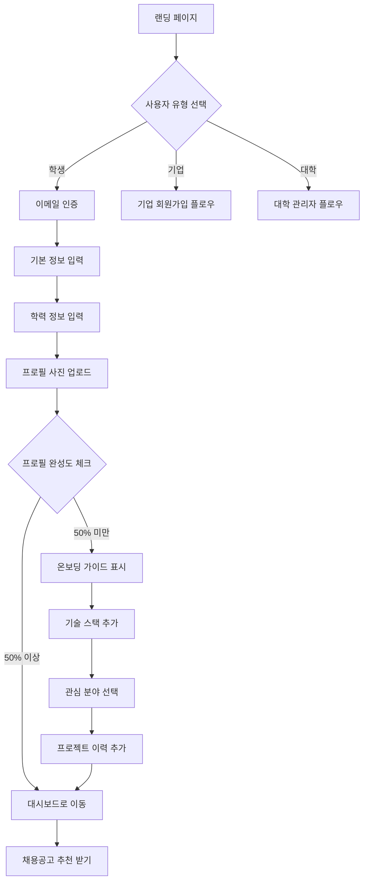
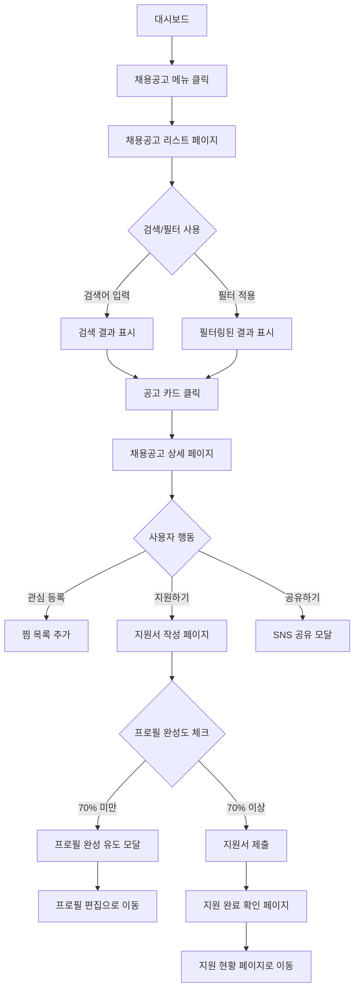
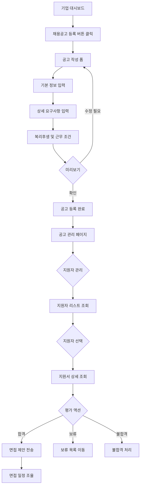
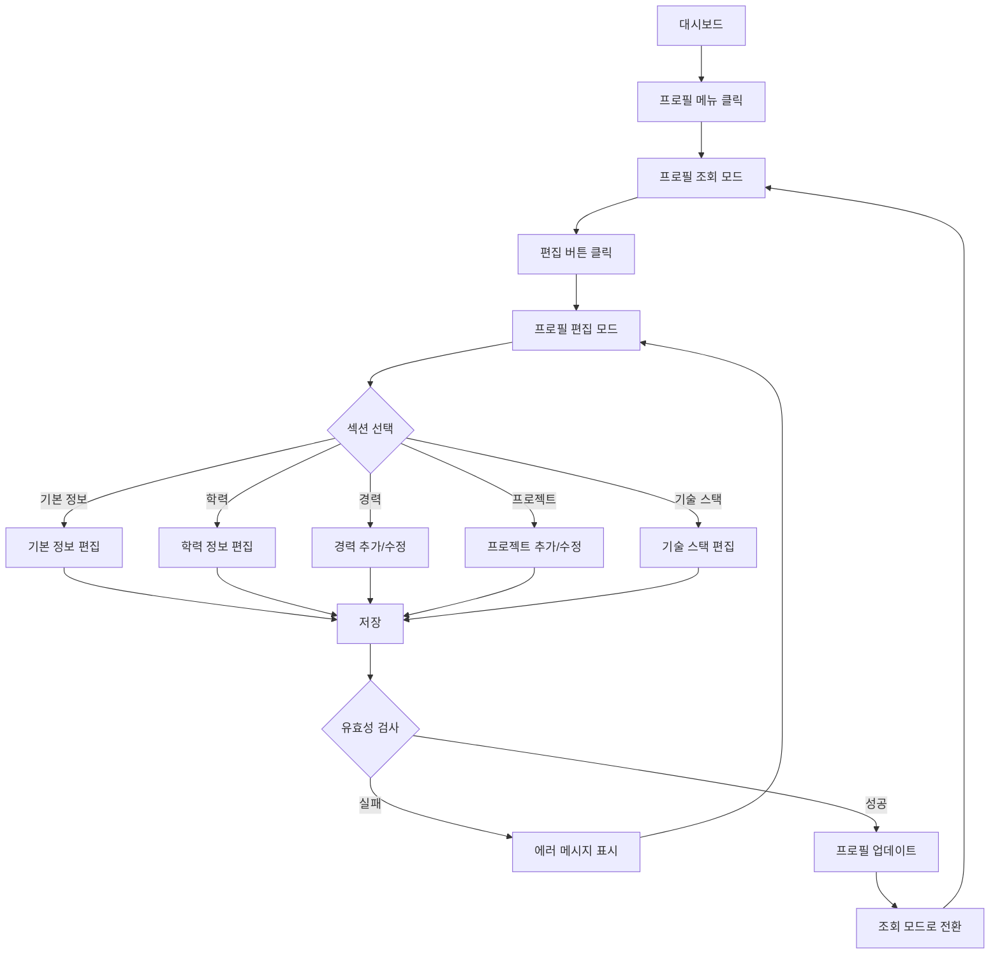
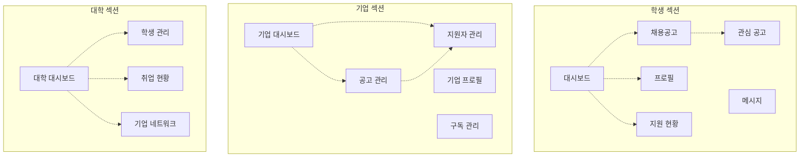
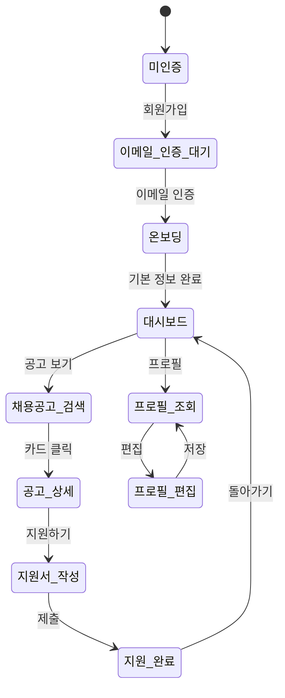
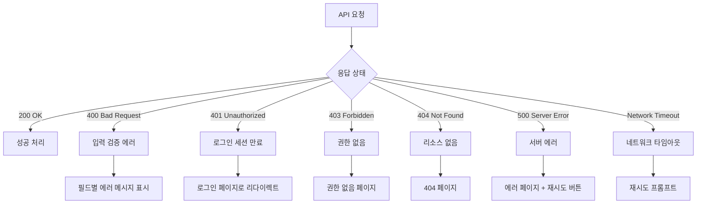
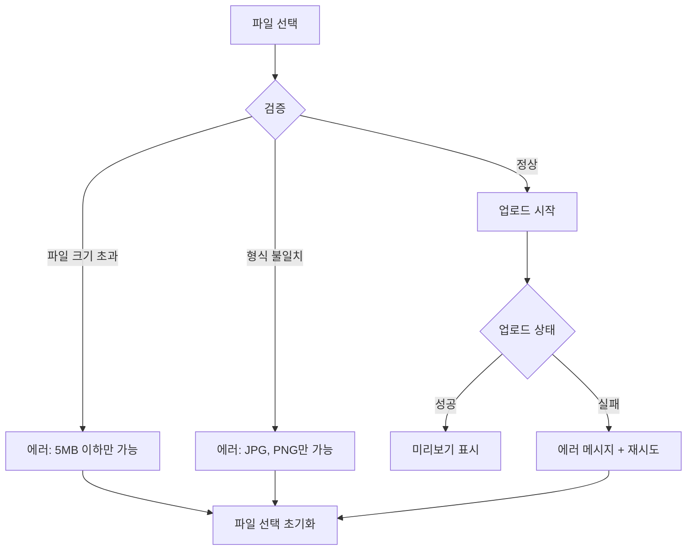

# NURI 사용자 플로우 문서

> 학생-기업 연결 및 산학 협력 플랫폼의 주요 사용자 경험 설계

**작성일**: 2026-02-10
**버전**: 1.0
**작성자**: Gagahoho, Inc. UX Team

---

## 📋 목차

1. [개요](#개요)
2. [주요 사용자 페르소나](#주요-사용자-페르소나)
3. [핵심 사용자 플로우](#핵심-사용자-플로우)
4. [화면 전환 다이어그램](#화면-전환-다이어그램)
5. [인터랙션 명세](#인터랙션-명세)
6. [에러 처리 플로우](#에러-처리-플로우)

---

## 개요

NURI 플랫폼은 세 가지 주요 사용자 그룹(학생, 기업, 대학)이 상호작용하는 복합적인 생태계입니다. 본 문서는 각 사용자 그룹의 핵심 여정(Journey)과 화면 간 전환 로직을 상세히 기술합니다.

### 설계 원칙

- **Salesforce Lightning Design System (SLDS) 스타일 준수**
- **3-Column Layout**: Navigation(좌) / Main Workspace(중) / Contextual Sidebar(우)
- **Card 기반 정보 그룹화**
- **Action-Oriented UX**: 데이터 조회 후 즉시 실행 가능한 액션 배치
- **반응형 디자인**: 모바일/태블릿/데스크톱 대응

---

## 주요 사용자 페르소나

### 페르소나 1: 김민수 (대학생)
- **프로필**: 컴퓨터공학과 3학년, 취업 준비 중
- **목표**: 인턴십 기회 탐색 및 포트폴리오 강화
- **기술 수준**: 중급 (React, Python 사용 가능)
- **주요 니즈**: 맞춤형 채용 추천, 프로젝트 이력 관리

### 페르소나 2: 박지영 (기업 채용 담당자)
- **프로필**: 테크 스타트업 HR 매니저
- **목표**: 검증된 신입 개발자 채용
- **기술 수준**: 비기술직, 플랫폼 초보
- **주요 니즈**: 간편한 채용공고 등록, 지원자 필터링

### 페르소나 3: 이교수 (대학 취업지원센터)
- **프로필**: 00대학교 취업지원센터 담당자
- **목표**: 학생 취업률 향상 및 기업 네트워크 구축
- **기술 수준**: 중급
- **주요 니즈**: 학생 취업 현황 모니터링, 기업 매칭

---

## 핵심 사용자 플로우

### 1. 학생 회원가입 및 프로필 작성 플로우

#### 상세 단계

**Step 1: 랜딩 페이지 진입**
- **URL**: `/`
- **화면 구성**: Hero Section + 주요 기능 소개 + CTA 버튼
- **CTA**: "학생으로 시작하기", "기업 회원가입"
- **전환 조건**: 버튼 클릭 → 회원가입 선택 모달

**Step 2: 사용자 유형 선택**
- **URL**: `/signup`
- **화면 구성**: 3개 카드 (학생 / 기업 / 대학)
- **선택 시**: 각 유형에 맞는 회원가입 폼으로 라우팅
- **학생 선택**: `/signup/student`

**Step 3: 이메일 인증**
- **URL**: `/signup/student`
- **입력 필드**: 이메일, 비밀번호, 비밀번호 확인
- **검증**:
  - 이메일 형식 유효성 검사
  - 비밀번호 강도 체크 (8자 이상, 특수문자 포함)
  - 중복 이메일 확인
- **전환**: 인증 이메일 발송 → 이메일 내 링크 클릭 → `/verify-email?token=xxx`
- **성공 시**: `/onboarding/basic-info`

**Step 4: 기본 정보 입력**
- **URL**: `/onboarding/basic-info`
- **레이아웃**: 좌측 진행 단계 표시 (1/5) + 중앙 입력 폼
- **필수 필드**:
  - 이름 (Text Input)
  - 생년월일 (Date Picker)
  - 연락처 (Phone Input with Format Validation)
  - 성별 (Radio Button: 남/여/선택 안 함)
- **액션 버튼**: "다음 단계" (우측 하단 Primary Button)
- **저장 로직**: Auto-save every 10 seconds
- **전환**: "다음 단계" 클릭 → `/onboarding/education`

**Step 5: 학력 정보 입력**
- **URL**: `/onboarding/education`
- **진행 표시**: 2/5
- **필수 필드**:
  - 대학명 (Autocomplete Dropdown with Search)
  - 전공 (Autocomplete Dropdown)
  - 학년 (Select: 1학년~대학원)
  - 졸업(예정)일 (Date Picker)
- **선택 필드**:
  - 복수전공/부전공
  - 학점 (GPA)
- **전환**: `/onboarding/profile-photo`

**Step 6: 프로필 사진 업로드**
- **URL**: `/onboarding/profile-photo`
- **진행 표시**: 3/5
- **업로드 영역**:
  - Drag & Drop Zone
  - 클릭하여 파일 선택
  - 미리보기 표시
- **제약 사항**:
  - 파일 형식: JPG, PNG
  - 최대 크기: 5MB
  - 권장 해상도: 400x400px
- **Skip 옵션**: "나중에 등록하기" 링크
- **전환**: `/dashboard` (첫 로그인 시 프로필 완성도 모달 표시)

**Step 7: 대시보드 진입**
- **URL**: `/dashboard`
- **화면 구성**:
  - **상단 Header**: 프로필 완성도 Progress Bar
  - **좌측 Navigation**: 홈 / 채용공고 / 프로필 / 지원 현황
  - **중앙 Main**: 추천 채용공고 카드 리스트
  - **우측 Sidebar**: 최근 활동 / 추천 기업
- **프로필 완성도 알림**:
  - 50% 미만: "프로필을 완성하고 더 많은 기회를 받으세요!" (노란색 배너)
  - 클릭 시: `/profile/edit`

---

### 2. 채용공고 검색 및 지원 플로우

#### 상세 단계

**Step 1: 채용공고 리스트 페이지**
- **URL**: `/jobs`
- **레이아웃**: 3-Column
  - **좌측 (200px)**: 필터 패널
    - 직무 카테고리 (체크박스)
    - 지역 (멀티 셀렉트)
    - 경력 요구사항 (신입/경력)
    - 기술 스택 (태그 검색)
    - 고용 형태 (정규직/인턴/계약직)
  - **중앙**: 채용공고 카드 리스트
  - **우측 (250px)**:
    - 내 관심사 기반 추천
    - 최근 본 공고
- **카드 구성**:
  - 기업 로고 (좌측 상단)
  - 채용 제목
  - 기업명, 지역
  - 기술 스택 태그
  - 마감일 (D-day 표시)
  - 관심 등록 아이콘 (하트)
- **정렬 옵션**: 최신순 / 마감임박 / 추천순
- **페이지네이션**: Infinite Scroll

**Step 2: 채용공고 상세 페이지**
- **URL**: `/jobs/:jobId`
- **화면 구성**:
  - **상단 Compact Header**:
    - 기업 로고 + 기업명
    - 채용 제목
    - D-day Badge
    - Action Buttons: "지원하기" (Primary), "관심 등록", "공유하기"
  - **본문 탭**:
    - 채용 정보 (주요 업무, 자격 요건, 우대 사항)
    - 기업 소개 (회사 규모, 업종, 복리후생)
    - 위치 정보 (지도 임베드)
  - **우측 Sidebar**:
    - 유사 채용공고 추천
    - 지원 통계 (총 지원자 수, 내 경쟁력 점수)

**Step 3: 지원서 작성**
- **URL**: `/jobs/:jobId/apply`
- **프로필 완성도 체크**:
  - 70% 미만: 경고 모달 표시
    - "프로필을 완성하면 합격 확률이 30% 증가합니다"
    - CTA: "프로필 완성하기" / "그냥 지원하기"
- **입력 필드**:
  - 이력서 선택 (플랫폼 내 프로필 / PDF 업로드)
  - 자기소개서 (Rich Text Editor)
  - 포트폴리오 링크 (선택)
- **자동 저장**: 5초마다 Draft 저장
- **전환**: "제출하기" → `/jobs/:jobId/apply/confirm`

**Step 4: 지원 완료 확인**
- **URL**: `/jobs/:jobId/apply/confirm`
- **화면 구성**:
  - 체크 아이콘 + "지원이 완료되었습니다!"
  - 지원한 공고 요약 정보
  - 다음 액션 제안:
    - "지원 현황 확인하기" → `/applications`
    - "유사 공고 더 보기" → `/jobs`

---

### 3. 기업 채용담당자 플로우 (채용공고 등록)

#### 상세 단계

**Step 1: 채용공고 작성**
- **URL**: `/employer/jobs/new`
- **진행 단계**: 1/3 - 기본 정보
- **필수 필드**:
  - 채용 제목 (Text Input)
  - 직무 카테고리 (Dropdown)
  - 고용 형태 (Radio: 정규직/계약직/인턴)
  - 경력 요구 (Checkbox: 신입/경력)
  - 모집 인원 (Number Input)
  - 마감일 (Date Picker)
- **Validation**: 모든 필수 필드 입력 전까지 "다음" 버튼 비활성화
- **전환**: `/employer/jobs/new?step=2`

**Step 2: 상세 요구사항**
- **진행 단계**: 2/3
- **Rich Text Editor**:
  - 주요 업무 (Bullet Points)
  - 자격 요건 (필수)
  - 우대 사항 (선택)
- **기술 스택 선택**: Tag Input with Autocomplete
- **전환**: `/employer/jobs/new?step=3`

**Step 3: 근무 조건 및 복리후생**
- **진행 단계**: 3/3
- **필드**:
  - 급여 범위 (Range Slider + Text Input)
  - 근무 지역 (Address Search API 연동)
  - 복리후생 (Multi-select Checkbox)
- **미리보기**: 우측 Sidebar에 실시간 미리보기 표시
- **전환**:
  - "임시 저장" → Draft 상태로 저장 → `/employer/jobs`
  - "공고 등록" → `/employer/jobs/:jobId` (등록 완료)

**Step 4: 지원자 관리**
- **URL**: `/employer/jobs/:jobId/applicants`
- **레이아웃**:
  - **상단 KPI 카드**:
    - 총 지원자 수
    - 서류 검토 대기 중
    - 면접 예정
    - 최종 합격
  - **필터 탭**: 전체 / 미검토 / 서류 합격 / 면접 진행 / 최종 합격 / 불합격
  - **지원자 카드 리스트**:
    - 프로필 사진
    - 이름, 학교, 전공
    - 주요 기술 스택 (최대 3개)
    - 지원일
    - 액션 버튼: "이력서 보기", "합격", "불합격"

**Step 5: 지원서 상세 조회**
- **URL**: `/employer/applicants/:applicantId`
- **2-Column Layout**:
  - **좌측 (60%)**:
    - 지원자 프로필
    - 학력, 경력 Timeline
    - 프로젝트 이력
    - 자기소개서
  - **우측 (40%)**:
    - 평가 노트 (Textarea)
    - 평가 점수 (5점 척도)
    - 액션 버튼:
      - "면접 제안" (Primary)
      - "보류"
      - "불합격"
- **면접 제안 플로우**:
  - 클릭 시 모달 오픈
  - 날짜/시간 선택 (Date-Time Picker)
  - 면접 방식 (대면/화상)
  - 메시지 입력
  - "전송" → 지원자에게 알림 전송

---

### 4. 프로필 편집 플로우

#### 상세 단계

**프로필 조회 모드**
- **URL**: `/profile`
- **레이아웃**: Card 기반 섹션 분리
  - 프로필 헤더 (이름, 학교, 프로필 사진, 완성도)
  - 기본 정보 카드
  - 학력 카드
  - 경력 카드 (없으면 "경력 추가하기" CTA)
  - 프로젝트 카드 (리스트)
  - 기술 스택 카드 (태그 구름)
- **우측 상단**: "편집하기" 버튼 (연필 아이콘)

**프로필 편집 모드**
- **URL**: `/profile/edit`
- **변화**:
  - 모든 섹션이 편집 가능 상태로 전환
  - 우측 상단: "저장" (Primary), "취소" (Secondary)
  - 좌측 Sticky Navigation: 섹션 바로가기 링크
- **인라인 편집**:
  - 각 카드 내부에서 직접 수정
  - 경력/프로젝트: "추가" 버튼 클릭 시 모달 오픈

**경력 추가 모달**
- **Trigger**: "경력 추가" 버튼 클릭
- **모달 크기**: Medium (600px)
- **필드**:
  - 회사명 (Text Input)
  - 직무 (Text Input)
  - 근무 기간 (Date Range Picker)
  - 업무 내용 (Textarea)
- **액션**: "저장", "취소"
- **저장 시**: 모달 닫힘 + 경력 카드에 새 항목 추가

**프로젝트 추가 모달**
- **필드**:
  - 프로젝트명
  - 역할
  - 기간
  - 사용 기술 (Multi-select Tag Input)
  - 설명
  - 링크 (GitHub, URL)
- **링크 검증**: URL 형식 체크

**저장 플로우**
- **트리거**: "저장" 버튼 클릭
- **Validation**:
  - 필수 필드 체크
  - 이메일/URL 형식 검증
- **성공 시**:
  - Toast 메시지: "프로필이 업데이트되었습니다" (초록색, 3초)
  - 조회 모드로 자동 전환
  - 프로필 완성도 재계산
- **실패 시**:
  - 에러 필드 하이라이트 (빨간색 테두리)
  - 필드 하단 에러 메시지 표시
  - 페이지 최상단 스크롤 + 에러 배너

---

## 화면 전환 다이어그램

### 전체 네비게이션 구조

### 상태 전환 (State Machine)

---

## 인터랙션 명세

### 1. 버튼 인터랙션

#### Primary Action Button
- **컬러**: Salesforce Blue (#00A1E0)
- **상태**:
  - Default: #00A1E0
  - Hover: #0078B8
  - Active: #005A8C
  - Disabled: #DDDBDA (Gray)
- **레이블**: 명확한 동작 동사 사용 (예: "저장하기", "지원하기")
- **피드백**:
  - 클릭 시 0.2초 Ripple Effect
  - 로딩 시 버튼 내 Spinner 표시

#### Secondary Action Button
- **컬러**: White with Border (#706E6B)
- **상태**:
  - Default: Border #706E6B
  - Hover: Background #F3F2F2
  - Active: Border #16325C
- **사용 예**: "취소", "나중에", "건너뛰기"

### 2. 폼 인터랙션

#### Text Input
- **Focus 상태**:
  - Border: #00A1E0 (2px)
  - Label: 상단으로 이동 (Floating Label)
- **에러 상태**:
  - Border: #EA001E (빨간색)
  - 하단에 에러 메시지 표시 (아이콘 + 텍스트)
- **성공 상태**:
  - Border: #04844B (초록색)
  - 우측에 체크 아이콘

#### Dropdown/Select
- **트리거**: 클릭 시 옵션 리스트 오픈
- **검색 기능**: 3자 이상 입력 시 자동완성
- **키보드 네비게이션**:
  - ↑↓: 옵션 이동
  - Enter: 선택
  - Esc: 닫기

#### Date Picker
- **컴포넌트**: Calendar 팝오버
- **입력 방식**: 직접 입력 또는 캘린더 선택
- **포맷**: YYYY-MM-DD
- **제약**: 과거 날짜 비활성화 (마감일 선택 시)

### 3. 카드 인터랙션

#### 채용공고 카드
- **Hover 효과**:
  - Shadow: 0 4px 12px rgba(0,0,0,0.15)
  - Transform: translateY(-4px)
  - Transition: 0.3s ease
- **클릭 영역**: 전체 카드 (단, 관심 등록 버튼 제외)
- **로딩 상태**: Skeleton Screen 표시

### 4. 모달 인터랙션

#### 모달 오픈/닫기
- **애니메이션**: Fade In + Scale Up (0.3s)
- **배경**: Overlay with Opacity 0.5
- **닫기 방법**:
  - X 버튼 클릭
  - Overlay 클릭
  - ESC 키 입력
- **포커스 트랩**: 모달 내부에만 Tab 키 이동

### 5. 알림 및 피드백

#### Toast 메시지
- **위치**: 우측 상단 (Fixed)
- **지속 시간**: 3초 (자동 사라짐)
- **타입**:
  - Success: 초록색 (#04844B)
  - Error: 빨간색 (#EA001E)
  - Info: 파란색 (#00A1E0)
  - Warning: 노란색 (#FFB75D)
- **애니메이션**: Slide In from Right

#### Progress Indicator
- **로딩**: Spinner (중앙 정렬)
- **진행률**: Progress Bar (상단 고정)
- **무한 스크롤**: 하단 로딩 스피너

---

## 에러 처리 플로우

### 1. 네트워크 에러

#### 상세 처리

**400 Bad Request (입력 검증 에러)**
- **표시 위치**: 해당 입력 필드 하단
- **메시지 예시**:
  - "이메일 형식이 올바르지 않습니다"
  - "비밀번호는 8자 이상이어야 합니다"
- **스타일**: 빨간색 텍스트 + 경고 아이콘
- **포커스**: 첫 번째 에러 필드로 자동 이동

**401 Unauthorized (인증 만료)**
- **동작**:
  1. 로컬 스토리지 토큰 삭제
  2. 현재 URL 세션에 저장
  3. 로그인 페이지로 리다이렉트
- **로그인 후**: 저장된 URL로 복귀
- **메시지**: "세션이 만료되었습니다. 다시 로그인해주세요."

**500 Server Error**
- **표시**: 전체 화면 에러 페이지
- **구성**:
  - 에러 일러스트레이션
  - 메시지: "일시적인 오류가 발생했습니다"
  - CTA: "다시 시도", "홈으로"
- **자동 재시도**: 5초 후 1회 자동 재시도

**Network Timeout**
- **표시**: Toast 메시지 또는 인라인 배너
- **메시지**: "네트워크 연결을 확인해주세요"
- **재시도 버튼**: 사용자가 수동으로 재시도

### 2. 폼 검증 에러

#### 실시간 검증
- **트리거**: onBlur (포커스 아웃 시)
- **에러 표시**: 즉시 필드 하단에 표시
- **예시**:
  - 이메일 필드: "@" 없으면 "유효한 이메일 주소를 입력하세요"
  - 비밀번호: 8자 미만 시 "비밀번호는 최소 8자 이상이어야 합니다"

#### 제출 시 검증
- **트리거**: "제출" 버튼 클릭
- **프로세스**:
  1. 모든 필수 필드 체크
  2. 포맷 검증
  3. 서버 측 검증
- **에러 시**:
  - 제출 차단
  - 페이지 최상단으로 스크롤
  - 에러 요약 배너 표시: "3개 항목을 확인해주세요"
  - 각 에러 필드 하이라이트

### 3. 파일 업로드 에러

#### 에러 메시지
- **파일 크기 초과**: "파일 크기는 5MB 이하여야 합니다. (현재: 8.2MB)"
- **형식 오류**: "JPG, PNG 형식만 업로드 가능합니다."
- **업로드 실패**: "업로드에 실패했습니다. 다시 시도해주세요."

### 4. 권한 에러

#### 403 Forbidden
- **시나리오**: 기업 전용 페이지를 학생이 접근
- **표시**:
  - 권한 없음 일러스트
  - 메시지: "접근 권한이 없습니다"
  - CTA: "홈으로 돌아가기"

#### 페이지별 권한 체크
- **방법**: Route Guard (React Router)
- **미인증 사용자**: 로그인 페이지로 리다이렉트
- **권한 없는 사용자**: 403 페이지 표시

### 5. 빈 상태 (Empty State) 처리

#### 지원 현황이 없을 때
- **표시**:
  - 일러스트 (문서 아이콘)
  - 메시지: "아직 지원한 공고가 없습니다"
  - CTA: "채용공고 둘러보기" → `/jobs`

#### 검색 결과 없음
- **표시**:
  - 일러스트 (돋보기 아이콘)
  - 메시지: "'프론트엔드'에 대한 검색 결과가 없습니다"
  - 제안: "다른 키워드로 검색해보세요"

---

## 반응형 디자인 브레이크포인트

### 디바이스별 레이아웃

| 디바이스 | 브레이크포인트 | 레이아웃 |
|----------|----------------|----------|
| 모바일 (소형) | 320px - 639px | 1-Column, 햄버거 메뉴 |
| 모바일 (대형) | 640px - 767px | 1-Column, 햄버거 메뉴 |
| 태블릿 | 768px - 1023px | 2-Column, 탭 네비게이션 |
| 데스크톱 | 1024px - 1439px | 3-Column, 풀 네비게이션 |
| 대형 데스크톱 | 1440px+ | 3-Column (최대 1440px 고정) |

### 모바일 최적화

#### 네비게이션
- **데스크톱**: 좌측 고정 사이드바
- **모바일**: 하단 고정 탭바 (5개 아이콘)
  - 홈
  - 채용공고
  - 지원 현황
  - 프로필
  - 더보기

#### 카드 레이아웃
- **데스크톱**: Grid (3 columns)
- **태블릿**: Grid (2 columns)
- **모바일**: Stack (1 column)

#### 모달
- **데스크톱**: 중앙 팝업 (최대 600px)
- **모바일**: 풀스크린 모달 (100% 높이)

---

## 키보드 네비게이션 (접근성)

### 전역 단축키

| 키 | 동작 |
|----|------|
| `Tab` | 다음 포커스 가능 요소로 이동 |
| `Shift + Tab` | 이전 포커스 가능 요소로 이동 |
| `Enter` | 버튼 클릭 / 링크 이동 |
| `Space` | 체크박스/라디오 토글 |
| `Esc` | 모달/드롭다운 닫기 |
| `/` | 검색 필드로 포커스 이동 |

### 페이지별 단축키

#### 채용공고 리스트
- `j / ↓`: 다음 공고로 이동
- `k / ↑`: 이전 공고로 이동
- `Enter`: 선택한 공고 상세 보기
- `l`: 관심 등록 토글

#### 폼 입력
- `Tab`: 다음 필드로 이동
- `Shift + Tab`: 이전 필드로 이동
- `Ctrl + Enter`: 폼 제출 (Textarea 내부)

---

## 성능 최적화 전략

### 1. 이미지 최적화
- **Lazy Loading**: 뷰포트 진입 시 로드
- **포맷**: WebP (Fallback: JPG)
- **CDN**: CloudFront 사용
- **반응형 이미지**: `srcset` 활용

### 2. 코드 스플리팅
- **Route-based Splitting**: 페이지별 청크 분리
- **Component Lazy Loading**: 모달, 무거운 컴포넌트 지연 로드

### 3. 캐싱 전략
- **API 응답**: React Query with 5분 캐싱
- **이미지**: 브라우저 캐시 1년
- **정적 자산**: Service Worker 캐싱

### 4. 로딩 상태 표시
- **초기 로딩**: Skeleton Screen
- **페이지 전환**: Top Progress Bar (NProgress)
- **무한 스크롤**: 하단 Spinner

---

## 다음 단계

1. **와이어프레임 작성**: 각 주요 화면의 상세 레이아웃 설계
2. **프로토타입 제작**: Figma에서 인터랙티브 프로토타입 구현
3. **사용자 테스트**: 5명 이상 타겟 사용자 테스트
4. **개발 핸드오프**: Figma → 개발팀 전달

---

**문서 버전**: 1.0
**마지막 업데이트**: 2026-02-10
**담당자**: Gagahoho UX Team
**검토자**: CEO 강승식
