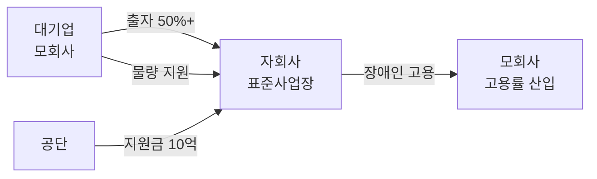
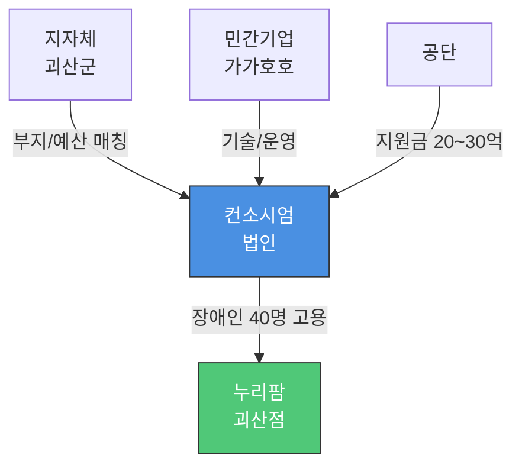
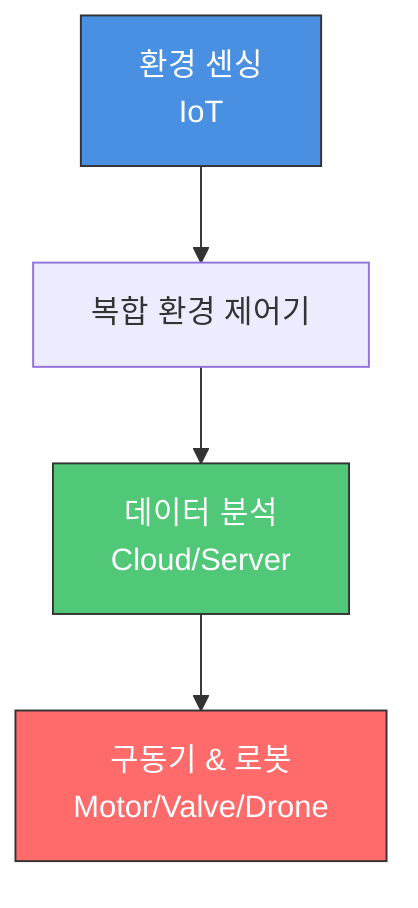

# 컨소시엄형 표준사업장 누리팜 괴산점 백서

> **누리팜 괴산점 백서 (2026.01)**
> AI 기반 장애인표준사업장 스마트팜 플랫폼

---

## 목차

1. [장애인표준사업장](#1-장애인표준사업장)
   - 1.1 [개요](#11-개요)
   - 1.2 [5가지 표준사업장](#12-5가지-표준사업장)
   - 1.3 [자회사형 표준사업장](#13-자회사형-표준사업장)
   - 1.4 [컨소시엄형 표준사업장](#14-컨소시엄형-표준사업장)
2. [스마트팜](#2-스마트팜)
   - 2.1 [스마트팜 개념 및 정책](#21-스마트팜-개념-및-정책)
3. [누리셀(NuriCell)](#3-누리셀)
4. [재배 작물](#4-재배-작물)
5. [사업부지: 누리팜 괴산점](#5-사업부지-누리팜-괴산점)
6. [진행 상황](#6-진행-상황)

---

## 1. 장애인표준사업장

### 1.1 개요

장애인 표준사업장은 장애인에게 안정된 일자리와 통합된 근로 환경을 제공하기 위해 도입된 제도로, 일정 수 이상의 장애인을 고용하고 관련 편의시설을 갖춘 사업장을 말합니다.

#### 주요 요건 (인증 기준)

| 요건 | 기준 |
|------|------|
| **장애인 고용 인원** | 최소 10명 이상 |
| **고용 비율** | 전체 상시 근로자의 30% 이상 (중증 장애인 50% 이상) |
| **최저임금** | 「최저임금법」에 따른 최저임금 이상 지급 |
| **편의시설** | 장애인 전용 작업대, 화장실, 경사로 등 법정 시설 |

#### 주요 유형

| 유형 | 특징 |
|------|------|
| **자회사형** | 대기업(모회사)이 장애인 고용을 목적으로 자회사 설립 |
| **사회적경제기업형** | 사회적 기업이나 협동조합 등이 운영 |
| **컨소시엄형** | 지자체와 민간 기업이 공동 투자하여 설립 |

#### 기업 혜택 (인센티브)

- **설립 지원금**: 최대 10억 원 (신규), **컨소시엄형은 20~30억 원**
- **세제 혜택**: 법인세/소득세 감면 (최초 3년 100%, 이후 2년 50%)
- **연계 고용 감면**: 표준사업장에 도급 시 부담금 감면 (최대 50%)
- **판로 지원**: 공공기관 우선구매제도

#### 기대 효과

- **장애인**: 안정적 소득 + 사회 통합
- **기업**: 고용 부담금 절감 + ESG 경영 실현
- **지역**: 소멸 위기 지역 활력 + 경제 순환

---

### 1.2 5가지 표준사업장

#### 1. 일반 표준사업장
- 중소·중견기업이 독자적 수익 모델로 운영
- 제조업, 서비스업 등 일반 업종

#### 2. 자회사형 표준사업장
- 대기업이 출자하여 설립 (모회사 고용률 인정)
- 예: SK하이닉스 → 행복모아(청주, 방진복 세탁)

#### 3. 사회적경제기업형 표준사업장
- 사회적기업, 협동조합이 운영
- 영리 + 지역 사회 공헌 강조

#### 4. 컨소시엄형 표준사업장 ⭐
- **지자체(토지/예산) + 민간(기술/운영) 협력**
- **지원금 규모 최대** (20~30억 원)
- 예: 여주 푸르메소셜팜, 청주 (주)정석

#### 5. 테마형 표준사업장
- 특정 직무 집중 육성 (스마트팜, 문화예술, IT 등)
- 정부 최근 장려 모델

---

### 1.3 자회사형 표준사업장

#### 핵심 구조



#### 설립 요건

- 모회사 지분 **50% 이상** 소유
- 장애인 **10명 이상** 고용 (30% 이상, 중증 50%+)
- 동일 지역/업종 제한 없음

#### 모회사 이득

- 고용 부담금 **수십~수백억 원** 절감
- 고도화된 직무 대신 자회사에서 적합 직무 제공 (카페, 세차, IT 데이터 가공 등)
- ESG 경영 이미지 제고

#### 사례: 행복모아(주) - 청주

| 항목 | 내용 |
|------|------|
| **모회사** | SK하이닉스 (지분 100%) |
| **사업** | 반도체 방진복 세탁/제조 + 베이커리 |
| **고용** | 장애인 약 400~500명 (국내 최대 규모) |
| **성공 요인** | 모회사 안정적 물량 확보 (Captive Market) |

**벤치마킹 포인트**:
- 확실한 수요처(SK하이닉스) 선점 → 영업 리스크 제로
- 발달장애인 맞춤 직무 (반복 작업)

---

### 1.4 컨소시엄형 표준사업장

#### 기본 구조 (민관 협력 모델)



#### 역할 분담

| 구분 | 지자체 (괴산군) | 민간 기업 (가가호호) |
|------|----------------|---------------------|
| **제공 자원** | • 행정 인허가 지원<br/>• 예산 매칭 (선택)<br/>• 지역 홍보/네트워크 | • **부지 4필지 확보 완료** ⭐<br/>• 누리셀 기술<br/>• Farm8 파트너십 |
| **기대 효과** | • 장애인 일자리<br/>• 유휴 부지 활용 (일반적 케이스) | • 초기 토지 비용 절감 (역전됨)<br/>• **공공 신뢰도 확보** |

#### 가장 큰 혜택: 막대한 지원금

- **일반 표준사업장**: 최대 10억 원
- **컨소시엄형**: **최대 20~30억 원** (지자체 매칭 시)
- 지원 항목: 작업장, 편의시설, 부대시설, 차량 구입비 등

#### 진행 방식 (공모 절차)

1. **컨소시엄 구성**: 누리팜 + 괴산군 협약 체결
2. **사업 제안서 제출**: 공단에 제출 (지자체 명의 선호)
3. **심사 및 선정**: 고용 창출 효과, 지역 기여도 평가
4. **법인 설립**: 약정 내용대로 법인 설립 및 투자
5. **지원금 지급**: 공사 진행 단계별 집행

#### 누리팜 전략적 분석

**강점**: 부지를 이미 보유 → **역제안(Reverse Proposal) 가능**

```
일반적 컨소시엄: "지자체야, 땅 줘"
누리팜 전략: "괴산군님, 제가 땅 있어요. 대신 예산 매칭/행정 지원 주세요"
```

**협상력 극대화**:
- 지자체는 부지 제공 부담 제로
- "스마트팜 + 장애인 고용 + 괴산 유기농 브랜드" 삼박자
- 괴산군청 일자리경제과/장애인복지과 타겟

#### 사례 분석

##### 1. 여주 푸르메소셜팜 (베스트 벤치마킹)

| 항목 | 내용 |
|------|------|
| **참여 주체** | 푸르메재단 + 여주시 + SK하이닉스(30억 기부) + 한국지역난방공사 |
| **사업** | 스마트팜 (토마토, 버섯) + 베이커리 카페 |
| **고용** | 발달장애인 청년 36명 |
| **성공 요인** | 민간 재단 + 기업 CSR + 지자체 협력 완벽 결합 |

**시사점**: 대기업 CSR 자금을 끌어와 "지역 랜드마크 스마트팜" 제안

##### 2. 청주 (주)정석 (충북 1호 컨소시엄)

| 항목 | 내용 |
|------|------|
| **참여 주체** | 청주시 (3억 출자) + (주)정석 (3억 출자) |
| **사업** | 블라인드, 롤스크린, 커튼 제조/시공 |
| **지원금** | 공단 20억 원 |
| **성공 요인** | **공공 조달 시장(B2G) 타겟** (관공서 우선구매) |

**시사점**: 확실한 판로(공공기관) 선점 전략

#### 공모 vs 수시

**팩트 체크**:
- 컨소시엄형은 **정기 공모 (연 1~2회)** 원칙
- 일반형/테마형은 **수시 접수** 가능

**왜 '수시'처럼 느껴지는가?**:
- 공모 기간(2주) 내 서류 준비 불가능 → 평소 **사전 컨설팅 필수**
- 공단 지사와 협의 완료 후 공모 시 '요식행위' 접수
- 예산 남으면 **추가 공모** 빈번

**전략**: 지금 당장 괴산군청 + 공단 청주지사와 협의 시작!

---

### 1.4.3 괴산군 현황

#### 장애인 고용 현황 (추론)

- **공무원 부문**: 법정 의무 고용률(3.8%) 달성 어려움 (지원자 부족)
- **공무직 부문**: 단기 공공근로로 숫자 채우기 (불안정)
- **예상**: 괴산군청도 매년 부담금 납부 중

#### 채용 로드맵 (단계별 확장 전략)

**5개년 인력 증원 계획**: 소규모 시작 → 안정적 확장

| 연도 | 장애인 | 작업지원인 | 관리직 | 총원 | 고용률 |
|------|--------|-----------|--------|------|--------|
| 1차년 (2027) | 5명 | 3명 | 2명 | 10명 | 50% |
| 2차년 (2028) | 15명 | 5명 | 3명 | 23명 | 65.2% |
| 3차년 (2029) | 25명 | 7명 | 4명 | 36명 | 69.4% |
| 4차년 (2030) | 35명 | 9명 | 5명 | 49명 | 71.4% |
| 5차년 (2031) | **40명** | **10명** | **5명** | **55명** | **72.7%** |

**이후 추가 채용 없음** - 안정기 운영 (55명 체제 유지)

**채용 파이프라인**:
1. **특수학교 전공과 연계**: 충북 음성군/청주시 특수학교 졸업 예정자 현장 실습형 채용
2. **성년기 장애인 부모회 협력**: 부모 간담회 → 자립 요구사항 반영
3. **신뢰 기반 장기 근속**: 커뮤니티 지향 → 이직률 최소화

---

## 2. 스마트팜

### 2.1 스마트팜 개념 및 정책

#### 개념

비닐하우스, 유리온실, 축사에 **ICT(정보통신기술)**를 접목하여 작물·가축의 생육 환경을 원격·자동으로 유지·관리하는 농장.

**핵심**: 단순 자동화 → **데이터 기반 정밀 농업**

#### 기술 발전 3단계

| 세대 | 핵심 기술 | 비유 | 누리셀 |
|------|----------|------|--------|
| **1세대** | 원격 제어 (Remote Control) | 리모컨 | ✅ 포함 |
| **2세대** | 데이터 기반 자동 제어 | 타이머/온도계 | ✅ 포함 |
| **3세대** | AI + 로봇 완전 자동화 | 자율주행차 | ✅ **핵심** |
| **3세대+** | 생성형 AI 협업 | AI 농장장 | ✅ **지향점** |

#### 핵심 기술 스택 (Tech Stack)



- **센서**: 온도, 습도, CO2, 지온, 풍향/풍속, 일사량
- **제어기**: 냉난방기, 개폐기, 양액기, 환풍기
- **분석**: 클라우드 축적 → 최적 생육 알고리즘
- **로봇**: 수확 로봇, 방제 드론

#### 정부 주요 정책 (2025~2026)

##### ① 스마트팜 혁신밸리 (4대 거점)
- 경북 상주, 전북 김제, 전남 고흥, 경남 밀양
- 기능: 임대형 스마트팜 + 기술 실증 + 청년창업

##### ② 스마트팜 ICT 융복합 확산 사업
- 대상: 기존 농가 또는 신규 진입자
- 내용: 센서, 제어기, 영상 장비 설치 비용 지원
- 비율: 국고(20~30%) + 지방비(20~30%) + 융자(30%) + 자부담(20%)

##### ③ 청년농 육성 및 임대형 스마트팜
- 대상: 만 40세 미만 청년 농업인
- 방식: 지자체가 지은 스마트팜 저렴 임대

##### ④ 노지 스마트팜 및 스마트 축산 확대
- 확장: 밭농사, 과수원, 축산 분야

##### ⑤ K-스마트팜 수출 지원
- 타겟: 중동(UAE, 사우디), 중앙아시아
- 패키지: 온실 시공 + 기자재 + 운영 소프트웨어

#### 기대 효과

- **생산성 향상**: 단위 면적당 생산량 증대
- **품질 균일화**: 고품질 농산물 안정 생산
- **노동력 절감**: 자동화로 시간 확보
- **리스크 관리**: 기후 변화 피해 최소화

---

## 3. 누리셀(NuriCell)

### 왜 3세대 이상의 스마트팜인가?

누리셀은 **Software Defined Farm (SDF)** - 소프트웨어가 정의하는 농장입니다.

#### 4대 핵심 차별화

##### 1. 규칙(Rule) → 판단(Agent) | The Brain

| 구분 | 2세대 | 누리셀 (3세대+) |
|------|-------|----------------|
| 로직 | "온도 30도면 팬 가동" | "온도 30도 + 외부 습도 높음 → 팬 대신 차광막 + 에어컨" |
| 기술 | Rule-based | **LangGraph Multi-Agent System** |

**에이전트 협업**:
- 환경 제어 에이전트
- 병해충 진단 에이전트
- 설비 관리 에이전트

##### 2. 데이터(Data) → 지식(Knowledge Graph) | The Memory

| 구분 | 2세대 | 누리셀 (3세대+) |
|------|-------|----------------|
| 저장 | 온도/습도 로그만 | 인과관계 지식 그래프 |
| 활용 | 사후 조회 | **예측 방제** |

**예시**:
```
"작년 습도 80%일 때 흰가루병 발생"
→ "오늘 패턴 유사 → 미리 방제하라" (GraphRAG)
```

##### 3. 유선 통합 → 분산형 무선망 | The Nerves

| 구분 | 2세대 | 누리셀 (3세대+) |
|------|-------|----------------|
| 구조 | 중앙 컴퓨터 + 유선 케이블 | **ESP32 + LoRa 메시 네트워크** |
| 확장성 | 기술자 방문 필요 | Plug & Play |

**기술**: IoT MSA (Micro-services Architecture) + LoRaWAN

##### 4. 사후 분석 → 실시간 프로세스 최적화 | The Efficiency

| 구분 | 2세대 | 누리셀 (3세대+) |
|------|-------|----------------|
| 분석 | 수확 후 "왜 망했지?" | **생육 과정 실시간 병목 탐지** |
| 기술 | 로그 분석 | **MLOps + Process Mining (PM4Py)** |

### FarmIoT 아키텍처

#### 1. 로컬 재배 현황 모니터링 (Edge Monitoring)

- **엣지 컴퓨팅**: 라즈베리파이(Gateway)가 ESP32 센서 데이터 1차 가공
- **실시간 시각화**: Grafana 대시보드 (구역별/선반별 히트맵)
- **이상 감지**: "환풍기 돌아가는데 온도 안 떨어짐" → 설비 고장 알림

#### 2. 작물 재배 현황 (Bio-Data Sensing)

- **양액 관리**: pH/EC 센서 → 생육 주기별 최적 레시피 자동 공급
- **VPD 제어**: 식물 증산 작용 활성도 기반 환경 조절
- **Vision AI**: 카메라로 잎 면적/색상 분석 → "성숙도 85%, 3일 후 수확"

#### 3. 식재 & 출하 예측 모델 (AI Prediction)

- **생육 모델링**: LSTM/Transformer가 과거 Best Practice 학습 → 수확량/수확일 예측
- **What-If 시뮬레이션**: "온도 1도 올리면 수확 며칠 앞당겨지나?" → ROI 최적화
- **SCM 연동**: 예측 출하일을 유통사 ERP 연동 → 선주문(Pre-order) 확정

#### 4. RWA 토큰화 (Asset Tokenization)

- **데이터 오라클**: 센서 데이터를 블록체인에 위변조 방지 기록
- **NFT**: 특정 구역(Rack A-1) 상추 1,000포기 권리 NFT 발행 (파종일/생육 데이터 포함)
- **STO**: 스마트팜 구축 비용 토큰 펀딩 → 수확 수익 배당
- **선물 거래**: "3주 뒤 A등급 상추" 예측 기반 토큰 거래

---

## 4. 재배 작물

### 포트폴리오 전략

| 작물 | 역할 | 전략 | 단가 |
|------|------|------|------|
| **상추류** | Cash Cow | B2B 대량 납품 (프랜차이즈/급식) | 기준 |
| **바질** | High Margin | 프리미엄 레스토랑 직거래 | **3~5배** |
| **허브류** | Niche Market | 소포장 온라인 구독 | 2~3배 |
| **병풀** | **Future Value** | **화장품/제약 원료 계약재배** | **10배+** |

### 1. 상추류 (유러피안 상추, 버터헤드)

**역할**: 기본 수익원

- **시장 규모**: 국내 엽채류 연간 수조 원대
- **문제점**: 여름/겨울 '금상추' 현상 (가격 3~5배 폭등)
- **경쟁력**:
  - 연중 고정 단가 → B2B 계약 유리
  - 무농약/GAP → 백화점 프리미엄 진입
- **전략**: 생산량 50% 배정 → 고정비 충당

### 2. 바질 (Basil)

**역할**: 고수익 효자상품

- **수요**: 이탈리안 레스토랑, 베이커리, 카페 필수 식자재
- **약점**: 추위 약함 + 금방 시듦 → 수입/장거리 운송 어려움
- **경쟁력**:
  - 초신선 공급 (당일 수확 배송) → 향/신선도 압도
  - 단가 상추 대비 **3~5배**
- **전략**: 지역 고급 레스토랑 직거래 계약

### 3. 허브류 (애플민트, 로즈마리, 딜, 루꼴라)

**역할**: 틈새시장

- **트렌드**: 홈카페, 홈술(하이볼) → 가정용 확대
- **특징**: 소량 다품종, 장식용(Garnish) → 외관 중요
- **경쟁력**:
  - 스마트팜 균일 품질 → A급 허브만 생산
  - 10~20g 소포장 → 부가가치 극대화
- **전략**: 바질과 '허브 패키지' 구성 → 로컬푸드/온라인 구독

### 4. 병풀 (센텔라 아시아티카 / 호랑이풀) ⭐

**역할**: 게임 체인저

#### 시장 기회

- **글로벌 시장**: 약 9,000억 원 (K-뷰티 시카 열풍)
- **국내 수입**: 연 500~600억 원 (수입 의존도 **95%**)
- **누리팜 목표**: 수입 대체 **10%** → **연 매출 50~100억 원**

#### 주요 용도

##### ① 화장품 원료 (최대 시장)

- 키워드: 시카(Cica), 피부 진정, 재생, 여드름 케어
- 제품: 앰플, 크림, 마스크팩, 토너 패드
- 트렌드: '병풀 추출물 100%' 베이스 제품 유행

##### ② 의약품 및 의약외품

- 효능: 상처 치유, 항염증, 정맥 순환 개선
- 제품: 마데카솔(동국제약), 센시아(하지정맥류)

##### ③ 식품 (새로운 트렌드)

- 건강기능식품: 인지 기능 개선, 부종 완화
- 신선 식품: 병풀 샐러드, 라떼, 떡 (쓴맛 개량종)

#### 타겟 고객사

| 분류 | 기업명 |
|------|--------|
| **1군** (화장품 대기업/ODM) | 아모레퍼시픽, LG생활건강, 한국콜마, 코스맥스 |
| **2군** (제약사) | 동국제약(마데카솔/센텔리안24), 대웅제약 |
| **3군** (건강기능식품) | KGC인삼공사, 한국야쿠르트 |

#### 핵심 영업 전략: 연계고용 감면 제도

```
병풀 원료 10억 원 구매
→ 장애인 고용 부담금 5억 원 감면 (최대 50%)
→ 실질 원료비 50% 할인 효과
```

**추가 혜택**:
- ESG 경영 실적 (S 점수 향상)
- 공공기관 우선구매 가점
- 공급망 리스크 해소 (수입 대신 괴산 당일 배송)

#### 차별화 포인트

1. **무농약 청정**: 중금속 걱정 없는 스마트팜산 생초(Fresh)
2. **성분 균일화**: AI 제어로 유효 성분(마데카소사이드) 함량 **2~3배** 향상
3. **전초(Whole Plant) 판매**: 수경재배라 뿌리까지 깨끗 → 고가 판매
4. **ESG 스토리**: "장애인이 키운 시카" 마케팅 소재

#### 예상 매출 구성 (연 50~100억 목표)

| 타겟 | 용도 | 비중 | 금액 |
|------|------|------|------|
| 제약사 | 상처 치료 연고, 정맥 순환 개선제 | 40% | 20억 |
| 화장품 | 시카 크림, 토너, 마스크팩 | 40% | 20억 |
| 식품/건기식 | 병풀 라떼, 떡, 이너뷰티 | 20% | 10억 |

---

## 5. 사업부지: 누리팜 괴산점

### 일반 현황

| 항목 | 내용 |
|------|------|
| **소재지** | 충청북도 괴산군 사리면 방축리 449, 531-1, 2, 3 |
| **부지 면적** | 총 2,000평 (4필지 집단화) |
| **소유** | 대표이사(강승식) 개인 소유 → 법인 전환 예정 |
| **지목/용도** | [전, 답, 임야] / [계획관리지역 권장] |

### 입지 환경 분석

#### 지리적 강점: "괴산의 관문, 최고의 물류 입지"

- **교통**: 증평 IC(중부고속도로) 차량 약 15~20분
- **물류**: 청주, 세종, 수도권 **당일 배송** 가능
- **지형**: '방축리' = 저수지/둑 → 농업용수 풍부
- **집단화**: 4필지 모여 있음 → 단지(Cluster) 조성 용이

#### 산업적 입지

- **괴산군 = 유기농업군(Organic Farming County)** 브랜드
- 누리팜 '무농약/GAP' + 괴산 이미지 = 브랜드 시너지 최대

### 토지 구성 및 활용 전략 (3Zone Planning)

| 구역 | 용도 | 주요 시설 | 면적 |
|------|------|----------|------|
| **Zone A<br/>(생산)** | 스마트팜 생산동 | • 누리셀 3세대 온실<br/>• 다단식 수경재배 (상추/바질/병풀) | 1,200평 |
| **Zone B<br/>(가공/물류)** | 선별 및 가공장 | • 저온 저장고<br/>• 1차 가공 (세척/포장)<br/>• 2차 가공 (건조/추출) | 500평 |
| **Zone C<br/>(커뮤니티)** | 편의/체험 시설 | • 장애인 휴게실/식당<br/>• 치유농업 체험장<br/>• 카페 (6차 산업) | 300평 |

### 기반 시설

- **용수**: 지하수 관정 개발 예정 (농업용수 확보 용이)
- **전력**: 3상 전력 인입 가능 (스마트팜 냉난방/LED/제어 시스템)
- **진입 도로**: 5톤 트럭 진입 가능 (자재 반입/출하 원활)

### 인허가 체크 포인트

#### 용도지역 확인 (최우선)

| 용도지역 | 평가 | 가능 건축물 | 건폐율 |
|----------|------|------------|--------|
| **계획관리지역** | ⭐⭐⭐ Best | 스마트팜 + 가공 공장 + 카페 + 체험장 | 40% |
| **생산관리지역** | ⭐⭐ Good | 스마트팜 + 농산물 가공 시설 | 20% |
| **농림지역<br/>(농업진흥구역)** | ⭐ Caution | 오직 농사(스마트팜)만 가능<br/>(카페/판매 시설 불가) | - |

**확인 방법**: 토지이용계획확인원 발급 (정부24 온라인)

---

## 6. 진행 상황

### 기술 파트너십

#### Farm8 (국내 1위 스마트팜 기업)

| 항목 | 내용 |
|------|------|
| **기업명** | 농업회사법인 팜에이트(주) |
| **위상** | 국내 최대 스마트팜, 예비 유니콘, 코스닥 상장 준비 |
| **매출** | 연 600~900억 원 |
| **주요 사업** | • 샐러드 생산/유통 (서브웨이, 버거킹, 쿠팡)<br/>• 메트로팜 (지하철 역사 실내 농장)<br/>• 스마트팜 플랜트 수출 (남극 세종기지, 중동) |

**협력 내용**:
- 스마트팜 환경 제어 알고리즘 공동 연구 파트너
- 논문 공동 발표 (데이터 기반 정밀 농업 실증)

**전략적 의미**:
- "업계 1위가 인정한 핵심 기술 파트너" 신뢰도
- 기술보증기금 평가 시 기술력 검증 완료
- 벤처기업 인증 '혁신성장유형' 가산점

#### Farm8 대비 누리팜 경쟁 우위

| 구분 | Farm8 | 누리팜 |
|------|-------|--------|
| **기술** | H/W 중심 (자동화) | **S/W & AI** (3세대 지능형) |
| **인력** | 일반 근로자 + 로봇 | **장애인 표준사업장** |
| **작물** | 저가 샐러드 (버터헤드) | **고가 원료** (병풀, 바질) |
| **비즈니스** | B2B 대량 유통 (박리다매) | 로컬 + 체험 + **RWA 토큰** |
| **혜택** | 일반 사업자 | **ESG + 고용부담금 감면** |

**전략**: 팜에이트가 장악한 '저가 샐러드' 피하고, '고가 원료/기능성 작물'로 수익률 승부

### 특허 출원 현황

#### 출원 완료 (2024.11.14)

1. **AI 비전 기반 스마트 식물 재배용 IOT 시스템**
   - 출원번호: 10-2024-0161602
   - 핵심: 누리셀의 Brain - AI 에이전트 자율 제어
   - 활용: 기보 평가, 벤처 인증 핵심 증거

2. **실리콘 모종 지지대**
   - 출원번호: 10-2024-0161601
   - 핵심: 유니버설 디자인 (장애인 작업 편의)
   - 전략: 시스템 + 소모품 별도 판매 (지속 수익)

#### 출원 예정

1. **AI 에이전트 및 지식 그래프 기반 자율형 스마트팜 제어 시스템**
   - LangGraph Multi-Agent
   - GraphRAG 의사결정
   - LoRa 메시 네트워크
   - 프로세스 마이닝 최적화

2. **FarmIoT - 스마트팜 데이터 자산화 시스템**
   - Edge Monitoring (Grafana)
   - Vision AI 생육 판단
   - LSTM 수확일 예측
   - RWA 토큰화 (NFT/STO)

### 추진 일정 (예상)

| 시기 | 단계 | 주요 활동 |
|------|------|----------|
| **2026 Q1** | MOU 체결 | 괴산군청 일자리경제과/장애인복지과 협의 |
| **2026 Q2** | 공모 신청 | 한국장애인고용공단 상반기 공모 대응 |
| **2026 Q3** | 법인 설립 | 컨소시엄 선정 → 조합 구성 |
| **2026 Q4** | 시설 투자 | 누리셀 스마트팜 구축 (공단 지원금 집행) |
| **2027 Q1** | 인력 채용 | 장애인 5명 + 작업지원인 3명 + 관리직 2명 (총 10명) 시작 → 시범 재배 |
| **2027 Q2** | 정식 운영 | 표준사업장 인증 → 상추/바질 출하 시작 |
| **2027 Q3** | 병풀 계약 | 화장품/제약사 원료 공급 계약 체결 |
| **2028** | 규모 확대 | 병풀 매출 본격화 (연 50억+ 목표) |

---

## 부록: 지역 경제 파급 효과

### 직접 효과

- **급여 지급** (5차년 기준): 근로자 55명 × 평균 연봉 3,000만 원 = **연 16.5억 원** 지역 소비
- **정부 인건비 지원**: 장애인 근로자 약 5억 원 + 작업지원인 3억 원 = **연 8억 원 지원**
- **세수 증대**: 법인세, 지방세 납부 (초기 감면 종료 후)

### 간접 효과

- **병풀 국산화**: "괴산 = K-뷰티 바이오 소재 메카" 브랜드화
- **관광/체험**: 치유농업 체험장 → 방문객 유입
- **공급망 연계**: 지역 포장재, 물류, 식자재 업체 동반 성장

### 행정적 가치

- **정책 성과**: 괴산군 장애인 고용률 급상승
- **부담금 절감**: 군청 자체 고용 부담금 감소 (누리팜 연계고용 활용 가능)
- **소멸 위기 해결**: 70명 상주 + 가족 이주 → 인구 유입

---

**작성**: 2026.01
**발행**: 누리팜 괴산점 (Gagahoho, Inc.)
**대표**: 강승식
**문의**: 프로젝트 관리자
